.. _job-section:

==========================================================================================
計算 Job の登録
==========================================================================================

材料計算のジョブは、必ず :ref:`Material<material-create>` か、Material が有する :ref:`Property<property-section>`
を介して作成するようになっています。いずれの場合も\ :ref:`jobdetail-section`\ が起点となります。
ここでは計算 Job の登録方法を、計算カテゴリー（Types）ごとに説明します。\
:ref:`runjob-section`\ については章を改めて説明することにします。

|
|

------------------------------------------------------------------------
計算ジョブの選択
------------------------------------------------------------------------

:ref:`jobdetail-section`\ のトップページ（左サイドメニューの「Property」が選択された状態のページ）\
にある「Create Job」をクリックすると、下図のようなジョブ選択のメニューが現れます。

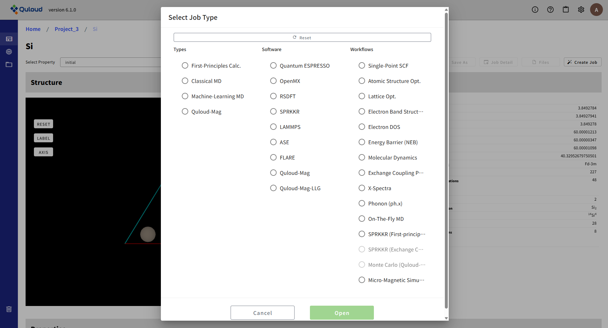

このメニューで、計算に使用するソフト（Software）と、計算したい内容（Workflows）を選びます。\
（Types は、Software と Workflows を絞り込むための補助的なものです。）
ジョブの選択をやり直したい場合は、上部にある「Reset」ボタンを押して下さい（上図の状態に戻ります）。

Software と Workflows が1つずつに決まったら、「Open」ボタンがアクティブになるので、
これをクリックすれば、各計算ジョブの入力パラメータの設定メニューが開きます。

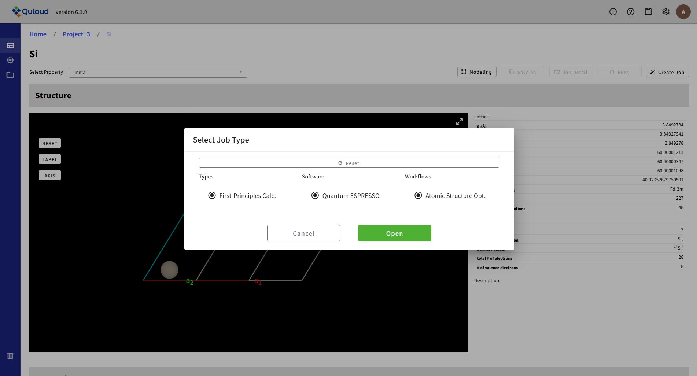

|
|

------------------------------------------------------------------------
First-Principles Calculation（第一原理計算）
------------------------------------------------------------------------

第一原理計算（First-Principles Calculation）のカテゴリに入るソフトウェアとして、現在4本が選択可能です。\

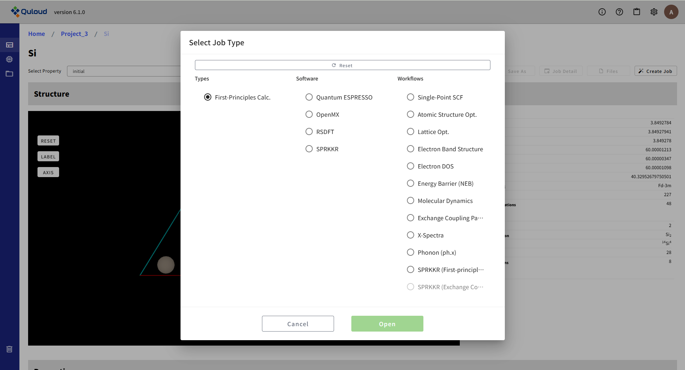

このうち SPRKKR については、磁性材料シミュレータ（Quloud-Mag）の一部として利用することが多いため、\
そちらで改めてご説明します。ここでは Quantum ESPRESSO、OpenMX、RSDFT で利用可能な計算ジョブ（Workflows）の説明を行います。
機能によっては RSDFT のみ、あるいは OpenMX や Qunatum ESPRESSO のみで実行可能となっているものがあります。

|

++++++++++++++++++++++++++++++++++++++++++++++++++++++++++++++++++++++++++++++++++++++++++++++++++++++++++++
Single-Point SCF（電子状態 SCF）、Atomic Structure Opt.（原子構造最適化）、Lattice Opt.（格子定数最適化）
++++++++++++++++++++++++++++++++++++++++++++++++++++++++++++++++++++++++++++++++++++++++++++++++++++++++++++

これらの Job は、第一原理計算の最も基本的な機能である系の基底状態の全エネルギーを計算する Job です。
これらの Workflows で利用可能な第一原理計算ソフトを選択すると、下図のようなウィンドウが現れます。

ここで設定を行った後「Create」ボタンを押すと Job が登録されます（まだこの時点では実行されません）。
設定項目は使用ソフトウェアに合わせた内容になりますが、「Detail Settings」以外は概ね同じ内容です。
「Detail Settings」にチェックを入れると下図のように、計算ソフトウェアごとの細かい設定項目が表示されます。

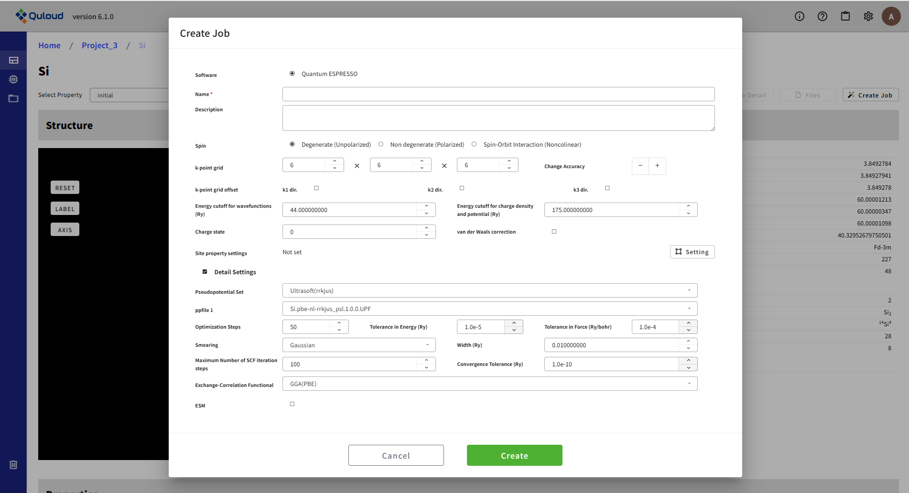

全ての項目が必須入力となっています。Job の名前（Name）も必ず付けるようにしてください。\
空欄や範囲外の入力値が与えられた場合はエラーメッセージが出るようになっており、「Create」ボタン\
をクリックしてもジョブ作成はできません。
全ての項目に正しく値を設定し、「Create」ボタンを押すと Job が登録されます。\
この段階はあくまで「計算 Job の登録」であり、\
実際に計算を実行するには、もう一段階「\ :ref:`runjob-section`\ 」という操作が必要になります。

|

++++++++++++++++++++++++++++++++++++++++++++++++++++++++++++++++++++++++++++++++++++++++++++++++++++++++++++
Site property settings
++++++++++++++++++++++++++++++++++++++++++++++++++++++++++++++++++++++++++++++++++++++++++++++++++++++++++++

計算ジョブの設定メニューの Site property settings の行にある「Setting」ボタンを押すと、\
下図のような画面が別タブとして開きます。

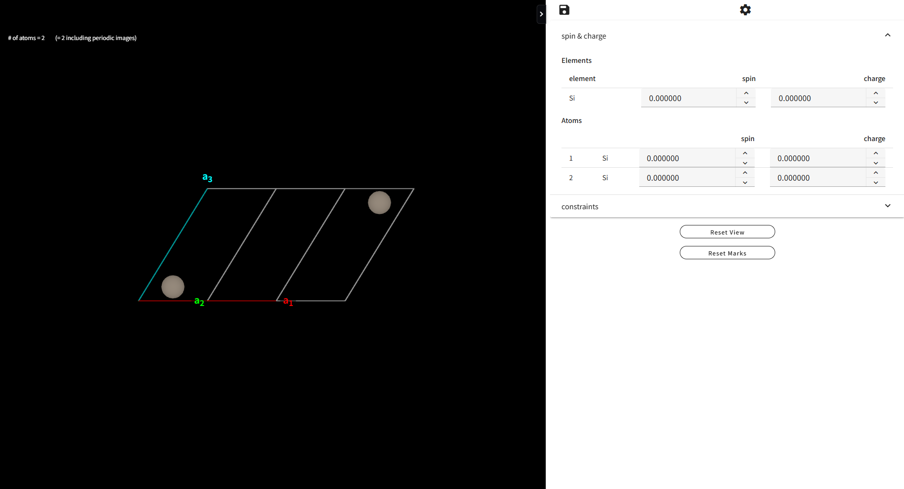

ここでは、各原子サイトごと、あるいは元素種ごとに、初期スピンの値や、\
運動の拘束（構造最適化時に原子を固定するなど）の設定を行う事ができます。

.. warning::
  原子数の多い系（> 100 原子）については、元素種ごとの設定のみ行えるようになっています。

設定後、右サイドパネル上部左側のアイコンをクリックすると、設定を完了し、\
元の計算ジョブ設定メニューに戻ります。

**※ RSDFT では、spin & charge 項目での各原子の初期スピンの設定が無効となりますので、Initial Spin Difference での設定をお願いいたします。**

**※ FLARE (On-the-Fly MD) では、constraint 項目での各原子の拘束条件の設定が無効となりますので、ご了承ください。**

|

++++++++++++++++++++++++++++++++++++++++++++++++++++++++++++++++++++++++
Electron Band Structure（電子バンド計算）
++++++++++++++++++++++++++++++++++++++++++++++++++++++++++++++++++++++++

下図は電子バンド計算 Job の設定画面の一例です。

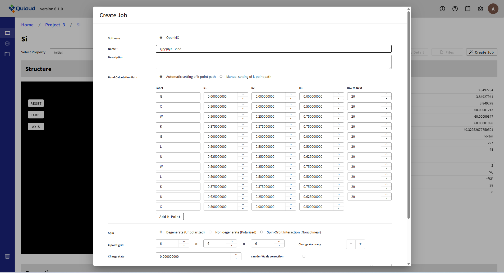

電子状態 SCF 計算等の Job とほぼ同じですが、バンドを描く Brillouin zone 内の経路の指定が必要になります。
経路の設定は、セルの形状から自動で設定するモード（Automatic setting of k-point path）と、\
ユーザーが手動で設定するモード（Manual setting of k-point path）があります。
後者の手動設定の場合は

G 0.0 0.0 0.0 20

X 0.5 0.0 0.0

のように、通過する k 点のラベルと、（逆格子ベクトルを基底とした）座標、次の（ラベル付き）k 点までの分割数\
を必要な数だけ記述します。

|

++++++++++++++++++++++++++++++++++++
Electron DOS（電子状態密度計算）
++++++++++++++++++++++++++++++++++++

これまでの Job 設定の説明と特段変わった部分はありません。
綺麗な状態密度を描くにはサンプル k 点を多く取る事が必要ですが、
大規模系で Γ 点一点サンプルのような計算を行う場合には、
各電子準位に幅を持たせて重ね合わせた状態密度を代わりに表示します。

|

++++++++++++++++++++++++++++++++++++++++++++++++++++++++++++++++++++++++
Energy Barrier (NEB)（NEB 法によるエネルギー障壁計算）
++++++++++++++++++++++++++++++++++++++++++++++++++++++++++++++++++++++++

２つの（準）安定構造間を結ぶ経路でのエネルギープロファイルを計算します。\
この機能は OpenMX と Quantum ESPRESSO のみで利用可能となっています。
この設定メニューでは、Initial と Final の\
原子構造を選択する必要があります（Pick initial/final material）。\
OpneMX の場合は下図のような設定メニューになります。

Quantum ESPRESSO の場合は下図の positions から Initial/Final の構造を設定します。

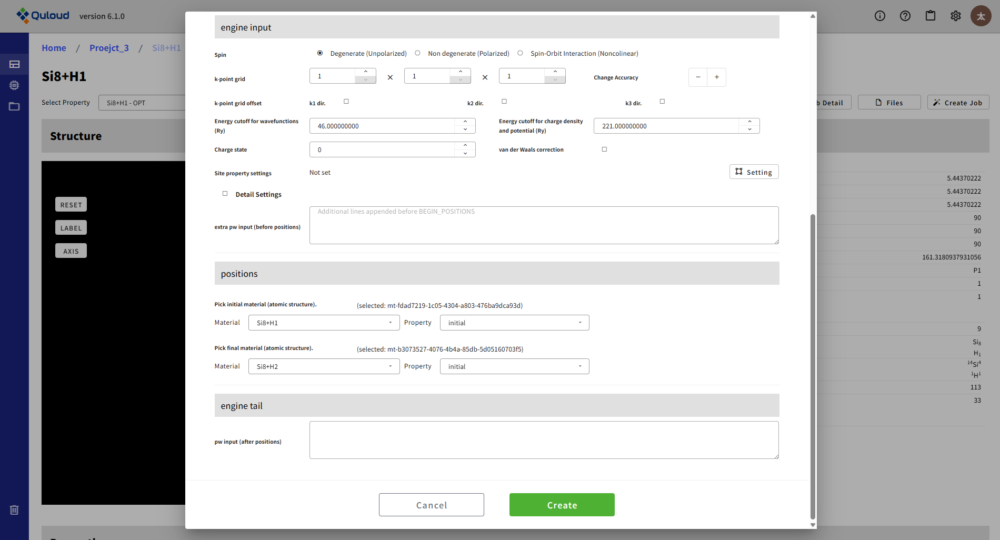

Initial の構造は、Create Job 開始時の Material に付随する構造（initial あるいは property として登録されているもの）\
から選ぶことができます。Final の構造は、Initial の Material と同じ Project に属する Material から選ぶことができます。\

その他、経路に沿って何点の構造を配置して最適化を実行するか（Num. of Images）等の指定を行います。

|

++++++++++++++++++++++++++++++++++++++++++++++++++++++++++++++++++++++++
Molecular Dynamics（分子動力学計算）
++++++++++++++++++++++++++++++++++++++++++++++++++++++++++++++++++++++++

原子に働く力を第一原理計算で求めながら分子動力学計算を行う Job です。\
この機能は RSDFT および OpenMX のみで利用可能となっています。
現在 Born-Oppenheimer（BOMD）法と
Car-Parrinello（CPMD）法（RSDFT のみ）の２つの手法が選択可能です。
いずれも NVE（エネルギー一定）または NVT（温度一定）型の MD が実行可能で、
CPMD では電子系の温度制御も行えるようになっています。

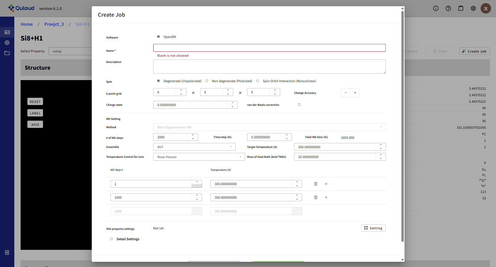

|

++++++++++++++++++++++++++++++++++++++++++++++++++++++++++++++++++++++++
Exchange Coupling Parameters（交換結合パラメータ）
++++++++++++++++++++++++++++++++++++++++++++++++++++++++++++++++++++++++

SCF 計算等の Job とほぼ同じですが、以下のパラメータを追加で設定します。

-   計算式に現れるフェルミ関数の有限極近似に対する極の数（# of Poles）
-   交換結合パラメータ計算用の k 点数（Kgrid）
-   交換結合パラメータ計算で何個先のサイトまで考慮するか（Max.Cell Id）

|

++++++++++++++++++++++++++++++++++++++++++++++++++++++++++++++++++++++++
Phonon (ph.x)（フォノン計算）
++++++++++++++++++++++++++++++++++++++++++++++++++++++++++++++++++++++++

Quantum ESPRESSO のみの機能で、フォノンのバンド分散とフォノンの状態密度の計算を行うことができます。\
設定メニューは下図のようになります。

入力ファイルが4つ（pw.in, ph.in, q2r.in, matdyn_disp.in または matdyn_dos.in）に分かれるため、\
設定メニューもタブで4つを切り替える形式になっています。pw.in は、SCF 計算等で設定する入力ファイル\
と同じものです。ph.in がフォノン計算のメイン（ph.x）の入力で、フォノン計算を行う波数の密度\
（Brillouin Zone 内の分割）を指定します（nq1/nq2/nq3）。\
状態密度の計算を行う場合は、matdyn_dos.in に対しても同様の設定を行います。\
フォノンのバンド分散の計算では、電子バンドのときと同様に、Brillouin Zone 内での経路を指定する必要があり、\
下図のような設定メニューで行います。

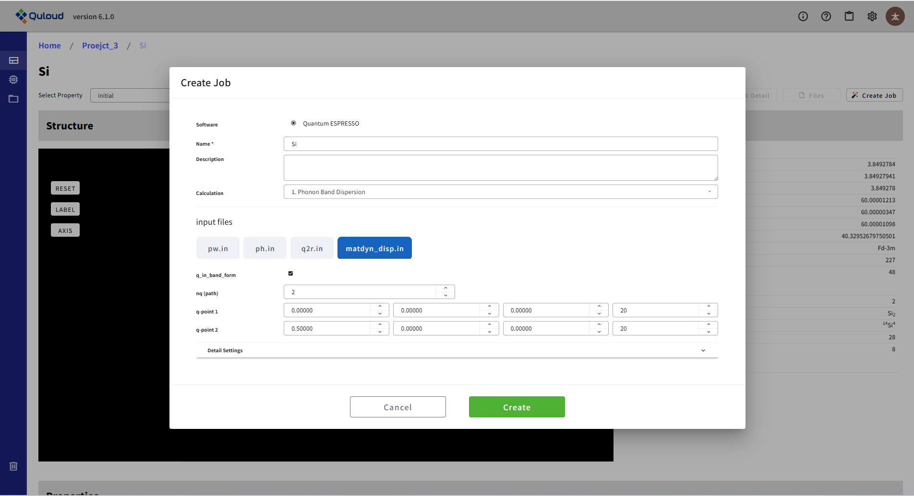

バンドを描く線分の頂点数を nq (path) で増減し、各頂点の座標と、頂点間の分割数を
q-point 1, q-point 2, \ :math:`\cdots` で与えるようになっています。

|

++++++++++++++++++++++++++++++++++++++++++++++++++++++++++++++++++++++++
X-Spectra（試験的運用）
++++++++++++++++++++++++++++++++++++++++++++++++++++++++++++++++++++++++

.. warning::
  擬ポテンシャルの組み合わせによって計算が走らないケースがあるため、当面は試験的な運用とさせていただきます。

Quantum ESPRESSO のみの機能で、X線吸収スペクトルの計算を行うことができます。\
入力ファイルが2つ必要で、入力フォームもタブで切り替えて設定するようになっています。

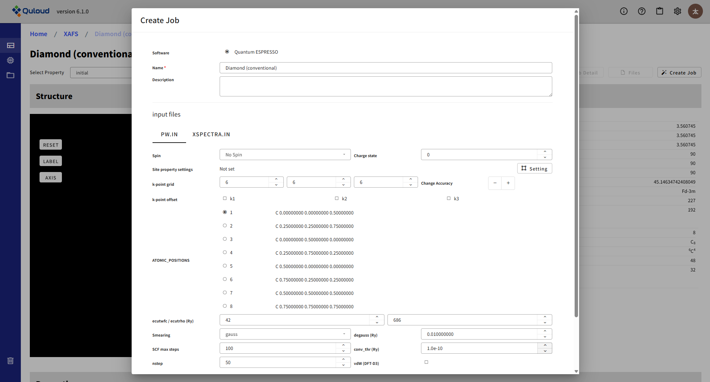

PW.IN は、SCF 計算等とほぼ同じ入力ですが、吸収サイトをどの原子にするかを選ぶラジオボタンが付いています。

XSPECTRA.INが、X-Spectraのメインの入力ファイルで、吸収端やX線の波数，偏向等を指定します。

|
|

------------------------------------------------------------------------
Classical Molecular Dynamics Simulation（古典分子動力学法）
------------------------------------------------------------------------

古典分子動力学計算ソフトは現在 LAMMPS のみが利用可能となっています。
「Create Job」をクリックし、「Classical Molecular Dynamics Simulation」を選択すると、 現在実行可能な Classical MD のメニューが現れます。

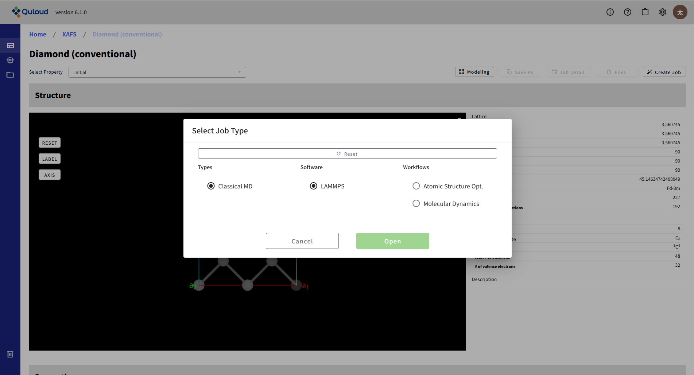

各メニューの詳細は以下の通りです。

|

++++++++++++++++++++++++++++++++++++++++++++++++++++++++++++++++++++++++
Atomic Structure Opt.（原子構造最適化）
++++++++++++++++++++++++++++++++++++++++++++++++++++++++++++++++++++++++

LAMMPS では原子構造の最適化も行うことができます。8.1.1 で述べた第一原理計算による構造最適化よりも計算が軽く、計算時間が節約できます。
構造最適化は LAMMPS で行い、第一原理計算は電子状態計算にだけ用いるという方法もあります。

原子間ポテンシャルの設定が必須項目となっていますが、
デフォルトでは学習済みの汎用機械学習力場 CHGNet を利用するようになっており、
その時は力場の設定は不要です。CHGNet 利用のチェックを外すと、
通常の原子間ポテンシャルファイルのアップロードを行うメニューが現れます。
力場の設定を含め各設定項目は次のようになっています： 

-	Name：Job の名称（後で変更可） 
-	Description：Job の説明（後で変更可） 
-	boundary：周期境界条件（Periodic）または固定境界条件（Fixed）の選択 
-	replicate (supercell)：元となる構造（メニューを開く前に選んでいた構造）のスーパーセルを作り、構造最適化を実行します
-	actions：実行する計算のタイプを選択。静的構造最適化（minimize）のみ選択可能 
-	Params (minimize)：最小化の条件設定 
-	Box Optimize：チェックを入れると、セルの最適化も行います 
-	Interatomic Potential File：原子に働く力（力場）を定義するファイルをアップロードします。例えば https://www.ctcms.nist.gov/potentials/ 等から取得できるファイルを利用できます。 
-	Detail Settings：thermo_style, thermo, dump をユーザー自身で指定できます。詳細は LAMMPS のドキュメント（https://docs.lammps.org/Commands.html）を参照してください。

|

++++++++++++++++++++++++++++++++++++++++++++++++++++++++++++++++++++++++
Molecular Dynamics（分子動力学法）
++++++++++++++++++++++++++++++++++++++++++++++++++++++++++++++++++++++++

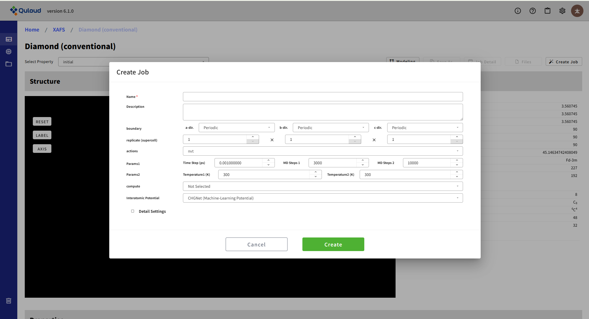

設定メニューは Atomic Structure Opt. と概ね同じです。各項目は次のようになっています。

-	Name：Job の名称（後で変更可） 
-	Description：Job の説明（後で変更可） 
-	boundary：周期境界条件（Periodic）または固定境界条件（Fixed）の選択 
-	replicate (supercell)：元となる構造（メニューを開く前に選んでいた構造）のスーパーセルを作り、MD を実行します
-	actions：実行する計算のタイプを選択。NVT, NPT, NVE の MD が選択可能 
-	Params：MD の条件設定 
-	Interatomic Potential File：原子に働く力（力場）を定義するファイルをアップロードします。例えば https://www.ctcms.nist.gov/potentials/ 等から取得できるファイルを利用できます。 
-	Detail Settings：thermo_style, thermo, dump をユーザー自身で指定できます。詳細は LAMMPS のドキュメント（https://docs.lammps.org/Commands.html）をご参照ください。

|
|

------------------------------------------------------------------------------------------------------------
Machine-Learning MD（機械学習 MD）
------------------------------------------------------------------------------------------------------------

このカテゴリのソフトウェアとして、広範な系に対して汎用的に利用可能な、大規模データ学習済\
の機械学習モデルを扱う ASE、および
On-The-Fly で MD を実行しながら、原子間ポテンシャルの機械学習モデルを更新できる FLARE が利用可能です。

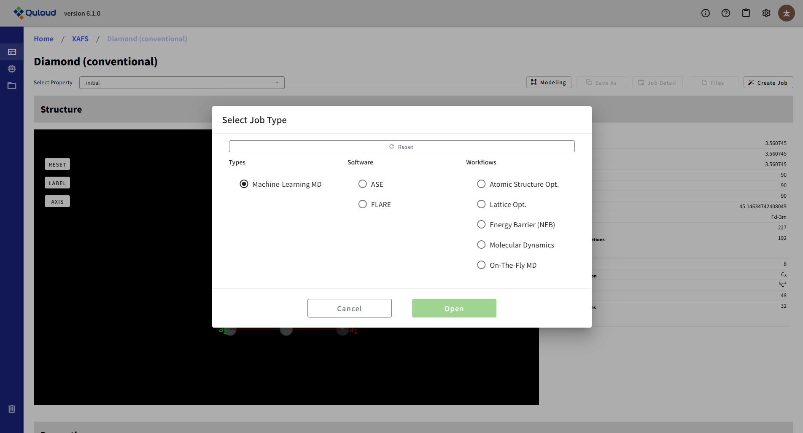

|

++++++++++++++++++++++++++++++++++++++++++++++++++++++++++++++++++++++++
ASE（Atom Opt.，Lattice Opt.，NEB，MD）
++++++++++++++++++++++++++++++++++++++++++++++++++++++++++++++++++++++++

事前に機械学習されたポテンシャルを利用して、原子構造構造最適化、NEB 計算、および MD シミュレーション等を行います。
これらは全て ASE（Atomic Structure Environment）の機能を用いて計算されます。

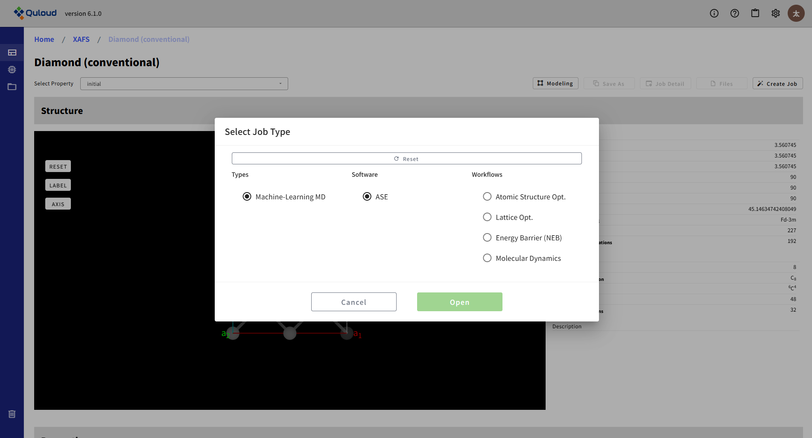

Atomic Structure Opt. および Lattice Opt. の設定メニューの内容は下記のようになります：

-   Conv. in Force Max (eV/Å)：構造最適化計算の収束条件を指定します。
-   Num. of steps：構造最適化計算のステップ数を指定します。
-   Lattice Optimization：格子定数を最適化する場合にはここにチェックが入ります。
-   Pre-trained Model Provider：機械学習ポテンシャルのプロバイダー（SevenNet あるいは fairchem）を指定します。
-   Model Name：機械学習ポテンシャルの具体的な名前が表示されます。

MD の設定メニューの内容は下記のようになります：

-   Time step (ps)：MD シミュレーションの時間ステップを指定します。
-   Num. of steps：MD シミュレーションのステップ数を指定します。
-   Ensemble：MD シミュレーションのアンサンブル法を指定します。
-   Temperature (K)：MD シミュレーションの温度を指定します。
-   Pre-trained Model Provider：機械学習ポテンシャルのプロバイダー（SevenNet あるいは fairchem）を指定します。
-   Model Name：機械学習ポテンシャルの具体的な名前が表示されます。

NEB では、2つの（準）安定構造間を結ぶ経路でのエネルギープロファイルを計算します。\
そのために、この設定メニューでは、Initial と Final の\
原子構造を選択する必要があります（Pick initial/final material）。

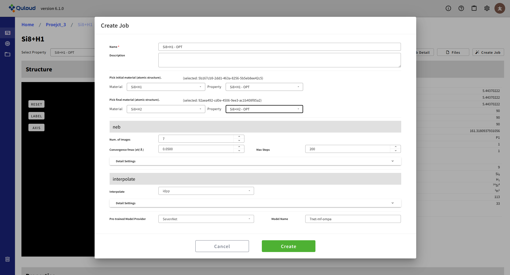

Initial の構造は、Create Job 開始時の Material に付随する構造（initial あるいは property として登録されているもの）\
から選ぶことができます。Final の構造は、Initial の Material と同じ Project に属する Material から選ぶことができます。\
その他の主要な設定パラメータの内容は下記のようになります：

-   Num. of images：Initial と Final の間に何点の構造を配置してエネルギープロファイルの計算を行うか
-   Convergence fmax：収束判定条件
-   Max steps：反復回数の上限

|

++++++++++++++++++++++++++++++++++++++++++++++++++++++++++++++++++++++++
On-The-Fly MD (FLARE)
++++++++++++++++++++++++++++++++++++++++++++++++++++++++++++++++++++++++

本カテゴリのソフトウェアとして、現在 FLARE が利用できます。
Quloud では FLARE を利用した On-the-fly（OTF）学習が可能です。
OTF は、MD 計算を実行しながら機械学習ポテンシャルの誤差評価を行い、
必要に応じて第一原理計算の教師データを追加して機械学習ポテンシャルの更新を行う方法です。
「FLARE」のボタンを押すと、以下のような画面が開きます。
タブにより「機械学習（ML）および MD の設定」と「第一原理計算の設定」のメニューが切り替わります。

*************************************************************************
Machine Learning Setting（OTF 機械学習および MD 計算の設定）
*************************************************************************

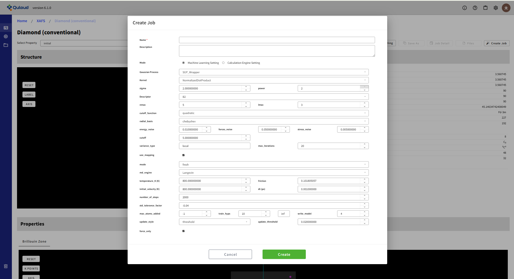

ML および MD の設定メニューの内容は下記のようになります：

-	ガウス過程のタイプ：SGP_Wrapper のみ選択できます
-	カーネル関数のタイプ：NormalizedDotProduct のみ選択できます
-	カーネル関数のハイパーパラメータ：
-	sigma　（variance）
-	power（≦2。NormalizedDotPrduct のべき）
-	記述子：B2（ACE の Formalism）
-	記述子のパラメータ
-	nmax：使用する動径関数の数
-	lmax：角度情報を担う球面調和関数の角運動量最大値
-	cutoff_function：quadratic（原子近傍を定義するための関数形）
-	radial_basis：chebyshev（動径関数の形）
-	energy_noise：エネルギーを確率分布とするためのばらつきの程度
-	force_noise：力を確率分布とするためのばらつきの程度
-	stress_noise：ストレスを確率分布とするためのばらつきの程度
-	single_atom_energy：個々の species に対応した原子のエネルギー（エネルギーの学習はこの値を原点にとって行われます）
-	cutoff：原子近傍を定義する距離
-	variance_type：local（誤差評価に local energy variance を用いる）
-	max_iterations：ハイパーパラメータ最適化のための反復計算上限
-	use_mapping：LAMMPS 用の coefficients ファイルを出力
-	mode：fresh / restart（新規計算か継続計算か）
-	md_engine：Langevin または NPT が選択できます
-	temperature_K：温度 (K)
-	friction：Langevin ダイナミクス用の摩擦パラメータ
-	initial_velocity：温度 (K) で設定
-	dt：MD の時間幅（ps）
-	number_of_steps：MD を実行するステップ数
-	std_tolerance_factor：DFT 計算を実行する誤差の閾値
-	max_atoms_added：DFT 計算後に GP モデルに追加する原子数の上限（=-1 は「上限なし」）
-	train_hyps：指定した DFT 計算のタイミングでハイパーパラメータの最適化を行います
-	write_model：ログおよびファイルの出力量。推奨値は 4
-	update_style：threshold（全ての原子が誤差の基準を超えたら DFT 計算を実行して更新）
-	update_threshold：update_style=threshold のときの誤差評価基準
-	force_only：True（Force のみで学習を行う。False ではエネルギーとストレスも学習します）

*************************************************************************
Calculation Engine Setting（第一原理計算部分の設定）
*************************************************************************

第一原理計算設定タブのメニューは 8.1.1 で説明した「SCF 電子状態計算」の項目と同じですので、
詳しくはそちらをご参照ください。

|
|

------------------------------------------------------------------------
Quloud-Mag（第一原理磁性材料シミュレーション）
------------------------------------------------------------------------

Quloud-Mag は、下図のような Workflows の一群です。第一原理計算の SPRKKR で飽和磁気モーメントや、\
磁気交換相互作用定数といったパラメータを算出し、それらをよりマクロなシミュレーション、
Heisenberg モデルによる Monte Carlo シミュレーション、
LLG 方程式に基づく Micro-Magnetic シミュレーションへと繋いでいく手法です。

|

.. _sprkkr-scf:

++++++++++++++++++++++++++++++++++++++++++++++++++++++++++++++++++++++++
SPRKKR (First-Principles SCF)（第一原理 SCF 計算）
++++++++++++++++++++++++++++++++++++++++++++++++++++++++++++++++++++++++

下図に SPRKKR による第一原理 SCF 計算の設定メニューを示します。

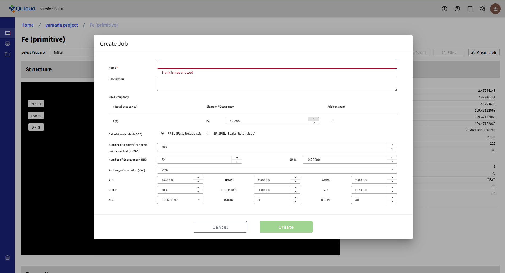

この計算は、続く磁気交換相互作用パラメータの計算など、
他の第一原理計算の入力として必要となる自己無撞着な電子状態を求めるための計算となります。
主要な設定項目は以下に説明します：

-	Site Occupancy：系に含まれるサイトの数だけ同様な行が表示され、各サイトを占有する原子種を複数指定できます（Coherent Potential Approximation　の設定）
-	Calculation Mode (MODE)：フル相対論（FREL）／スカラー相対論（SP-SREL）の選択
-	Number of k points for special points method (NKTAB)：第一 Brillouin Zone の既約部分に含まれる k 点数を指定
-	Number of Energy mesh (NE)：Energy contour 上を数値積分する際のメッシュ数
-	EMIN：Energy contour 上を数値積分する際のエネルギーの最小値
-	Exchange-Correlation (VXC)：交換相関汎関数
-	ETA, RMAX, GMAX：KKR 理論での電子ポテンシャルの計算で、孤立原子の情報を切り分けた、格子部分の和を Ewald 法で計算するためのパラメータ（十分収束するパラメータとなっていることを確認することが重要）
-	NITER, TOL ( × 10^(-5) ), MIX, ALG, ISTBRY, ITDEPT：SCF の反復回数や収束条件、収束アルゴリズムのパラメータ設定など

より詳細な情報についてはSPRKKRの本家サイト
https://www.ebert.cup.uni-muenchen.de/index.php/en/repository/SPRKKR/lang,en-gb/
をご参照ください。

|

++++++++++++++++++++++++++++++++++++++++++++++++++++++++++++++++++++++++
SPRKKR (Exchange Coupling Parameters)（磁気交換相互作用の第一原理計算）
++++++++++++++++++++++++++++++++++++++++++++++++++++++++++++++++++++++++

.. warning::
  本ジョブは、SPRKKR (First-Principles SCF) の計算結果を引き継いで作成されるため、\
  SPRKKR (First-Principles SCF) が正常終了し、Property として登録されたものをベースにする必要があります\
  （\ :ref:`jobdetail-section`\ の Select Property で\
  SPRKKR (First-Principles SCF) が選択された状態でないと、\
  Workflows 中の SPRKKR (Exchange Coupling Parameters) の選択肢がアクティブになりません）

下図に SPRKKR を用いた磁気交換相互作用パラメータ計算の設定メニューを示します。

この計算を行うには\ :ref:`sprkkr-scf`\ の自己無撞着な電子状態計算をあらかじめ完了させておく必要があり、
それを引き継いで計算の設定が行われます。設定項目は SCF と共通なものが多く、
磁気交換相互作用パラメータ特有の設定は以下になります：

-	Maximum distance from the center of the atomic site：遠方のサイトとの相互作用は当然小さくなるため、何格子分離れたところまで計算するかの指定

|

++++++++++++++++++++++++++++++++++++++++++++++++++++++++++++++++++++++++
Monte Carlo (Quloud-Mag)
++++++++++++++++++++++++++++++++++++++++++++++++++++++++++++++++++++++++

.. warning::
  本ジョブは、SPRKKR (Exchange Coupling Parameters) の計算結果を引き継いで作成されるため、\
  SPRKKR (Exchange Coupling Parameters) が正常終了し、Property として登録されたものをベースにする必要があります\
  （\ :ref:`jobdetail-section`\ の Select Property で\
  SPRKKR (Exchange Coupling Parameters) が選択された状態でないと、\
  Workflows 中の Monte Carlo (Quloud-Mag) の選択肢がアクティブになりません）

第一原理計算により求められた磁気交換相互作用パラメータ Jij を用いて、
ハイゼンベルグモデルに基づくモンテカルロ（MC）
シミュレーションを実行する Quloud-Mag のメインの計算の設定メニューを下図に示します。

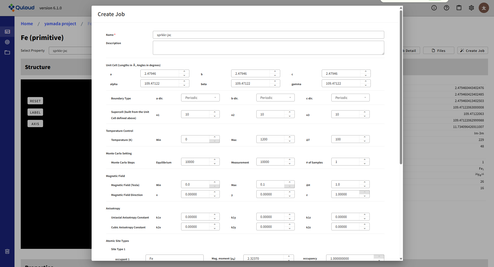

入力パラメータとして Jij が必要であるため、
この計算は基本的には 8.4.2 の計算結果を引き継いで行うことになります。Jij 計算 Job の詳細画面から、
左メニューを開いてMonte Carlo (Quloud-Mag-MC) の設定メニューを開くと、
Jij を含む各パラメータが適切に設定された状態でメニューが開きます。
各設定項目は以下のようになっています：

-	Cell：単位となる格子の情報、3次元各方向の境界条件（Periodic / Free）、スーパーセル、の設定を行います
-	Temperature Control：温度制御。開始と終了の温度、その間の増分
-	Monte Carlo Setting：モンテカルロ計算のステップ数。平衡化、測定に分けて指定します。またサンプルを複数用意してシミュレーションを行うことも可能です。
-	Magnetic Fields：外部磁場の設定。最小、最大値と、その間の増分、磁場の方向を指定します。磁場の大きさは複数指定できますが、方向は一つだけです。
-	Anisotropy：一軸および立方磁気異方性パラメータを設定
-	Atomic Site Types：Cell で設定する単位格子中のサイトの磁気モーメントや占有数を指定
-	Atomic Site Coordinates：単位格子内の各サイトの座標
-	Exchange Coupling Parameters：磁気交換相互作用パラメータ。Quloud-Mag の第一原理計算（SPRKKR）の結果を引き継げば自動で設定されます。
-	Initial State Parameter：初期スピンの準備方法。下記 3 つの方法が選べます。
-	平衡化（Searching Equiribrium）
-	Random Start
-	Atomic Site Coordinates で指定可能な FM/AM の設定に従う
-	Algorithm：Metropolis / Heat Bath

|

++++++++++++++++++++++++++++++++++++++++++++++++++++++++++++++++++++++++++++++++++++++++++++++++
Micro-Magnetic Simulation (Quloud-Mag-LLG)
++++++++++++++++++++++++++++++++++++++++++++++++++++++++++++++++++++++++++++++++++++++++++++++++

下図に Quloud-Mag によるマイクロマグネティックシミュレーションの設定メニューを示します。

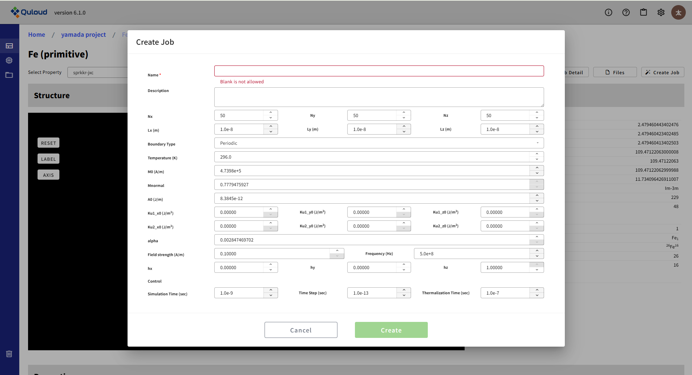

各設定項目の内容は下記の通りです：

-	Nx, Ny, Nz：空間グリッド
-	lx, ly, lz：空間領域の大きさ（単位：m）
-	境界条件：Periodic / Free
-	Temperature：温度（単位：K）
-	M0：飽和磁化@0K (単位：Ampere/m)
-	Mnormal：規格化された磁化@有限温度
-	A0：Exchange Stiffness@0K（単位：J/m）
-	Ku1_x0, Ku1_y0, Ku1_z0：一軸異方性パラメータ@0K
-	Ku2_x0, Ku2_y0, Ku2_z0：立方異方性パラメータ@0K
-	alpha：Gilbert 減衰定数
-	Field strength：磁場強度 (A/m)
-	Frequency：振動数 (Hz)
-	hx, hy, hz：磁場の方向
-	Simulation Time：（単位：秒）
-	Time Step：（単位：秒）
-	Thermalization Time：（単位：秒）

|
|

------------------------------------------------------------------------
入力ファイルの直接アップロードによる計算 Job の登録
------------------------------------------------------------------------

ユーザー自身で用意した入力ファイルを直接アップロードして Job を登録することも可能です。上述した方法とは異なり、操作はダッシュボード（トップ画面）で行います。

まず、新規 Project（ここでは "File_Upload"）を作成し、Project を選択した状態で Materials タブに切り替え、右側にある「＋」アイコンをクリックします。

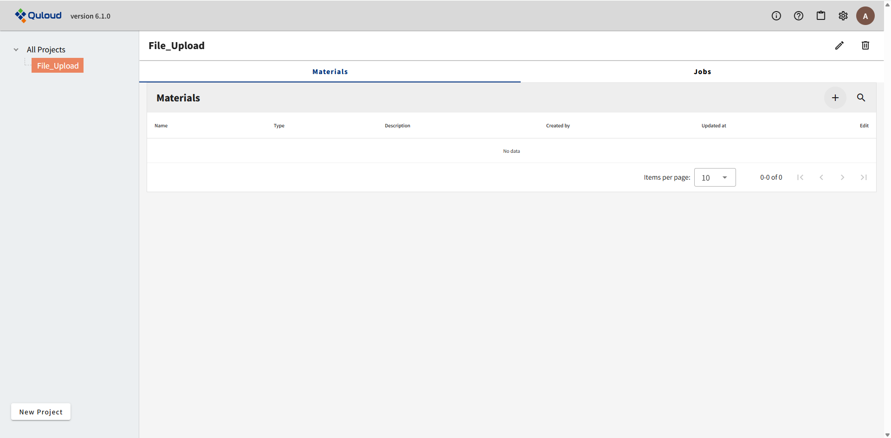

すると次のようなダイアログが開きます。

次に Software 選択欄で、使用する Software を選択します。ここで選択可能な Software は、

-   FLARE
-   LAMMPS
-   LAMMPS+CHGNet
-   OpenMX
-   Quantum ESPRESSO (PW)
-   Quantum ESPRESSO (DOS)
-   Quantum ESPRESSO (BAND)
-   Quantum ESPRESSO (BAND with spin)
-   RSDFT

です。ここでは OpenMX を選択します。

「File Upload」のボタンをクリックすると、下図のようなファイルを選択するウィンドウが現れます。

例として、OpenMX のウェブサイト（https://www.openmx-square.org/openmx_man3.9jp/node20.html）に載っている入力ファイル「Methane.dat」をアップロードしてみます。

「Upload」をクリックすると、ウィンドウが閉じ、入力ファイル「Methane.dat」が表示された状態で一つ前のウィンドウ（下図）に戻ります。

Material の名前（ここでは "Methane.dat_OpenMX" とする）を入力し、「Create」をクリックします。

すると、入力ファイルで指定された構造をもつ Material と、入力ファイルで指定された計算内容の Job が、同時に Quloud に登録されます。 登録が完了すると、トップ画面に戻ります。 

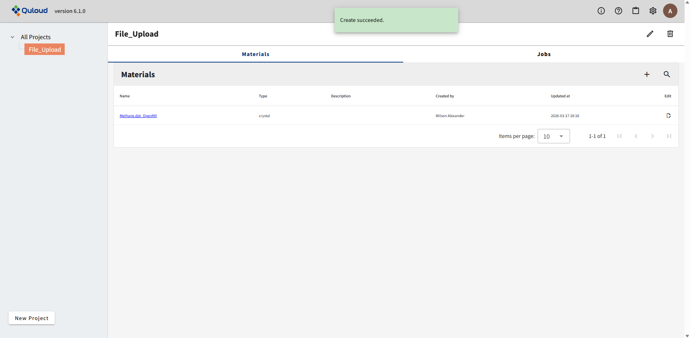

上図のように、Materials タブに新規 Material が追加され、下図のように Jobs タブにも新規 Job が追加されます。Job の名前は、Material 名 と Software 名の組合せに、ID 番号 を追加して作成されます。

Job 名をクリックすると、登録した Material の詳細画面に遷移します。\ :ref:`runjob-section`\ については章を改めて説明します。

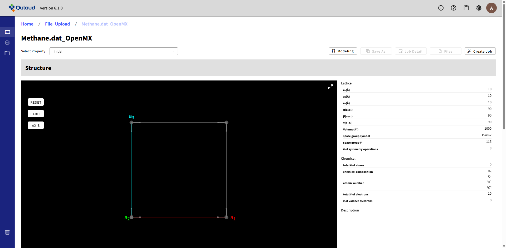