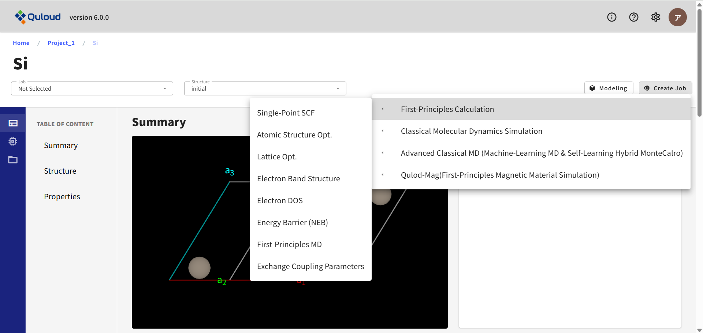

==========================================================================================
計算 Job の登録
==========================================================================================

------------------------------------------------------------------------
First-Principles Calculation（第一原理計算）
------------------------------------------------------------------------

Material 詳細画面で、左サイドメニューの「Property」を選択した状態で「Create Job」をクリックし、「First-Principles Calculation」を選択すると、
現在実行可能な第一原理計算のメニューが現れます。

ここから実行したい計算を選択すると、各計算の設定ウィンドウが表示されます。
計算に使用するエンジンの選択も設定ウィンドウで選択可能です（後述）。
機能によっては RSDFT のみ、あるいは OpenMX や Qunatum ESPRESSO のみで実行可能となっているものがあります。

++++++++++++++++++++++++++++++++++++++++++++++++++++++++++++++++++++++++++++++++++++++++++++++++++++++++++++
Single-Point SCF（電子状態 SCF）、Atomic Structure Opt.（原子構造最適化）、Lattice Opt.（格子定数最適化）
++++++++++++++++++++++++++++++++++++++++++++++++++++++++++++++++++++++++++++++++++++++++++++++++++++++++++++

これらの Job は、第一原理計算の最も基本的な機能である系の基底状態の全エネルギーを計算する Job です。
上図に示したメニューからいずれかを選択すると、下図のようなウィンドウが現れます。

ここで設定を行った後「Submit」ボタンを押すと Job が登録されます（まだこの時点では実行されません）。
上図の「Software」項目から、計算に使用するソフトウェアを選択することができます。
設定項目は使用ソフトウェアに合わせた内容に変わります。
また計算メニューによっては特定のソフトウェアでのみ実行可能なものもあり、
その場合は、実行可能なソフトウェアのみ選択肢に現れます。
さらに「Detail Settings」にチェックを入れると下図のように、さらに細かい設定項目が表示されます。

ここで計算の細かな設定を行いますが、必須の入力は Job の名前（Name）のみです。他は入力しなければデフォルト値が設定されます。
Job の名前が与えられていれば「Submit」ボタンがアクティブになります。
ボタンを押すと Job が登録されますが、この段階はあくまで「Job 登録」であり、
実際に計算を実行するには、もう一段階「Job の実行」という操作が必要になります。

++++++++++++++++++++++++++++++++++++++++++++++++++++++++++++++++++++++++
Electron Band Structure（電子バンド計算）
++++++++++++++++++++++++++++++++++++++++++++++++++++++++++++++++++++++++

下図は電子バンド計算 Job の設定画面の一例です。

電子状態 SCF 計算等の Job とほぼ同じですが、バンドを描く Brillouin zone 内の経路の指定が必要になります。
経路の設定は、セルの形状から自動で設定するモードと、ユーザーが手動で設定するモードがあります。
後者の手動設定の場合は

G 0.0 0.0 0.0
X 0.5 0.0 0.0

のように、通過する k 点のラベルと（逆格子ベクトルを基底とした）座標を必要な数だけ記述します。
計算結果（電子バンド構造）は、詳細画面左上の「Job」タブで当該 Job を選択し、右隣の「Structure」タブで final を選択し、
さらに左のサイドメニューで「Property」をクリックして下にスクロールすれば確認することができます。

++++++++++++++++++++++++++++++++++++
Electron DOS（電子状態密度計算）
++++++++++++++++++++++++++++++++++++

これまでの Job 設定の説明と特段変わった部分はありません。
綺麗な状態密度を描くにはサンプル k 点を多く取る事が必要ですが、
大規模系で Γ 点一点サンプルのような計算を行う場合には、
各電子準位に幅を持たせて重ね合わせた状態密度を代わりに表示します。

++++++++++++++++++++++++++++++++++++++++++++++++++++++++++++++++++++++++
Energy Barrier (NEB)（NEB 法によるエネルギー障壁計算）
++++++++++++++++++++++++++++++++++++++++++++++++++++++++++++++++++++++++

２つの（準）安定構造間を結ぶ経路でのエネルギープロファイルを計算します。
１つの構造を選択した状態で、エネルギー障壁計算ジョブの設定ウィンドウを開き、
「Pick a bulk crystal structure from existing jobs.」と記されている箇所で
もう１つの構造を選択して、経路に沿った何点で最適化を実行するか等の指定を行います。

最終的な計算結果として 図 25 のように経路に沿ったエネルギープロファイルおよび各ステップでの原子構造が得られます。
また原子構造の変化をアニメーションとして可視化することも可能です。
経路上で最もエネルギーの大きい点が化学反応の障壁（遷移状態）の推定値となります。

++++++++++++++++++++++++++++++++++++++++++++++++++++++++++++++++++++++++
First-Principles MD（第一原理分子動力学計算）
++++++++++++++++++++++++++++++++++++++++++++++++++++++++++++++++++++++++

第一原理分子動力学計算は、原子に働く力を第一原理計算で求めながら分子動力学計算を行う Job です。
現在 Born-Oppenheimer（BOMD）法と
Car-Parrinello（CPMD）法（RSDFT のみ）の２つの手法が選択可能です。
いずれも NVE（エネルギー一定）または NVT（温度一定）型の MD が実行可能で、
CPMD では電子系の温度制御も行えるようになっています。

.. image:: images/screenshot_0145.png

------------------------------------------------------------------------
Classical Molecular Dynamics Simulation（古典分子動力学法）
------------------------------------------------------------------------

古典分子動力学計算ソフトは現在 LAMMPS のみが利用可能となっています。
「Create Job」をクリックし、「Classical MD」を選択すると、 現在実行可能な Classical MD のメニューが現れます。

.. image:: images/screenshot_0158.png

各メニューの詳細は以下の通りです。

++++++++++++++++++++++++++++++++++++++++++++++++++++++++++++++++++++++++
Atomic Structure Opt.（原子構造最適化）
++++++++++++++++++++++++++++++++++++++++++++++++++++++++++++++++++++++++

LAMMPS では原子構造の最適化も行うことができます。5.1.1 で述べた第一原理計算による構造最適化よりも計算が軽く、計算時間が節約できます。
構造最適化は LAMMPS で行い、第一原理計算は電子状態計算にだけ用いるという方法もあります。

.. image:: images/screenshot_0159.png

原子間ポテンシャルの設定が必須項目となっていますが、
デフォルトでは学習済みの汎用機械学習力場 CHGNet を利用するようになっており、
その時は力場の設定は不要です。CHGNet 利用のチェックを外すと、
通常の原子間ポテンシャルファイルのアップロードを行うメニューが現れます。
力場の設定を含め各設定項目は次のようになっています： 

-	Name：Job の名称（後で変更可） 
-	Description：Job の説明（後で変更可） 
-	boundary：周期境界条件（Periodic）または固定境界条件（Fixed）の選択 
-	replicate (supercell)：元となる構造（メニューを開く前に選んでいた構造）のスーパーセルを作り、構造最適化を実行します
-	actions：実行する計算のタイプを選択。静的構造最適化（minimize）のみ選択可能 
-	Params (minimize)：最小化の条件設定 
-	Box Optimize：チェックを入れると、セルの最適化も行います 
-	Interatomic Potential File：原子に働く力（力場）を定義するファイルをアップロードします。例えば https://www.ctcms.nist.gov/potentials/ 等から取得できるファイルを利用できます。 
-	Detail Settings：thermo_style, thermo, dump をユーザー自身で指定できます。詳細は LAMMPS のドキュメント（https://docs.lammps.org/Commands.html）を参照してください。

++++++++++++++++++++++++++++++++++++++++++++++++++++++++++++++++++++++++
Molecular Dynamics（分子動力学法）
++++++++++++++++++++++++++++++++++++++++++++++++++++++++++++++++++++++++

.. image:: images/screenshot_0160.png

設定メニューは Atomic Structure Opt. と概ね同じです。各項目は次のようになっています。

-	Name：Job の名称（後で変更可） 
-	Description：Job の説明（後で変更可） 
-	boundary：周期境界条件（Periodic）または固定境界条件（Fixed）の選択 
-	replicate (supercell)：元となる構造（メニューを開く前に選んでいた構造）のスーパーセルを作り、MD を実行します
-	actions：実行する計算のタイプを選択。NVT, NPT, NVE の MD が選択可能 
-	Params：MD の条件設定 
-	Interatomic Potential File：原子に働く力（力場）を定義するファイルをアップロードします。例えば https://www.ctcms.nist.gov/potentials/ 等から取得できるファイルを利用できます。 
-	Detail Settings：thermo_style, thermo, dump をユーザー自身で指定できます。詳細は LAMMPS のドキュメント（https://docs.lammps.org/Commands.html）をご参照ください。

------------------------------------------------------------------------------------------------------------
Advanced Classical MD（機械学習 MD）
------------------------------------------------------------------------------------------------------------

++++++++++++++++++++++++++++++++++++++++++++++++++++++++++++++++++++++++
On-The-Fly MD (FLARE)
++++++++++++++++++++++++++++++++++++++++++++++++++++++++++++++++++++++++

本カテゴリのソフトウェアとして、現在 FLARE が利用できます。
Quloud では FLARE を利用した On-the-fly（OTF）学習が可能です。
OTF は、MD 計算を実行しながら機械学習ポテンシャルの誤差評価を行い、
必要に応じて第一原理計算の教師データを追加して機械学習ポテンシャルの更新を行う方法です。
「FLARE」のボタンを押すと、図 29および図 30のような画面が開きます。
タブにより「機械学習（ML）および MD の設定」と「第一原理計算の設定」のメニューが切り替わります。

*************************************************************************
Machine Learning Setting（OTF 機械学習および MD 計算の設定）
*************************************************************************

.. image:: images/screenshot_0161.png

ML および MD の設定メニューの内容は下記のようになります：

-	ガウス過程のタイプ：SGP_Wrapper のみ選択できます
-	カーネル関数のタイプ：NormalizedDotProduct のみ選択できます
-	カーネル関数のハイパーパラメータ：
-	sigma　（variance）
-	power（≦2。NormalizedDotPrduct のべき）
-	記述子：B2（ACE の Formalism）
-	記述子のパラメータ
-	nmax：使用する動径関数の数
-	lmax：角度情報を担う球面調和関数の角運動量最大値
-	cutoff_function：quadratic（原子近傍を定義するための関数形）
-	radial_basis：chebyshev（動径関数の形）
-	energy_noise：エネルギーを確率分布とするためのばらつきの程度
-	force_noise：力を確率分布とするためのばらつきの程度
-	stress_noise：ストレスを確率分布とするためのばらつきの程度
-	single_atom_energy：個々の species に対応した原子のエネルギー（エネルギーの学習はこの値を原点にとって行われます）
-	cutoff：原子近傍を定義する距離
-	variance_type：local（誤差評価に local energy variance を用いる）
-	max_iterations：ハイパーパラメータ最適化のための反復計算上限
-	use_mapping：LAMMPS 用の coefficients ファイルを出力
-	mode：fresh / restart（新規計算か継続計算か）
-	md_engine：Langevin または NPT が選択できます
-	temperature_K：温度 (K)
-	friction：Langevin ダイナミクス用の摩擦パラメータ
-	initial_velocity：温度 (K) で設定
-	dt：MD の時間幅（ps）
-	number_of_steps：MD を実行するステップ数
-	std_tolerance_factor：DFT 計算を実行する誤差の閾値
-	max_atoms_added：DFT 計算後に GP モデルに追加する原子数の上限（=-1 は「上限なし」）
-	train_hyps：指定した DFT 計算のタイミングでハイパーパラメータの最適化を行います
-	write_model：ログおよびファイルの出力量。推奨値は 4
-	update_style：threshold（全ての原子が誤差の基準を超えたら DFT 計算を実行して更新）
-	update_threshold：update_style=threshold のときの誤差評価基準
-	force_only：True（Force のみで学習を行う。False ではエネルギーとストレスも学習します）

*************************************************************************
Calculation Engine Setting（第一原理計算部分の設定）
*************************************************************************

.. image:: images/screenshot_0162.png

第一原理計算設定タブのメニューは 5.1.1 で説明した「SCF 電子状態計算」の項目と同じですので、
詳しくはそちらをご参照ください。

++++++++++++++++++++++++++++++++++++++++++++++++++++++++++++++++++++++++
Machine-Learning MD (Pretrained Potential)
++++++++++++++++++++++++++++++++++++++++++++++++++++++++++++++++++++++++

------------------------------------------------------------------------
Quloud-Mag（第一原理磁性材料シミュレーション）
------------------------------------------------------------------------

++++++++++++++++++++++++++++++++++++++++++++++++++++++++++++++++++++++++
SPRKKR (First-Principles SCF)（第一原理 SCF 計算）
++++++++++++++++++++++++++++++++++++++++++++++++++++++++++++++++++++++++

下図に SPRKKR による第一原理 SCF 計算の設定メニューを示します。

.. image:: images/screenshot_0163.png

この計算は、続く磁気交換相互作用パラメータの計算など、
他の第一原理計算の入力として必要となる自己無撞着な電子状態を求めるための計算となります。
主要な設定項目は以下に説明します：

-	Site Occupancy：系に含まれるサイトの数だけ同様な行が表示され、各サイトを占有する原子種を複数指定できます（Coherent Potential Approximation　の設定）
-	Calculation Mode (MODE)：フル相対論（FREL）／スカラー相対論（SP-SREL）の選択
-	Number of k points for special points method (NKTAB)：第一 Brillouin Zone の既約部分に含まれる k 点数を指定
-	Number of Energy mesh (NE)：Energy contour 上を数値積分する際のメッシュ数
-	EMIN：Energy contour 上を数値積分する際のエネルギーの最小値
-	Exchange-Correlation (VXC)：交換相関汎関数
-	ETA, RMAX, GMAX：KKR 理論での電子ポテンシャルの計算で、孤立原子の情報を切り分けた、格子部分の和を Ewald 法で計算するためのパラメータ（十分収束するパラメータとなっていることを確認することが重要）
-	NITER, TOL ( × 10^(-5) ), MIX, ALG, ISTBRY, ITDEPT：SCF の反復回数や収束条件、収束アルゴリズムのパラメータ設定など

より詳細な情報についてはSPRKKRの本家サイト
https://www.ebert.cup.uni-muenchen.de/index.php/en/repository/SPRKKR/lang,en-gb/
をご参照ください。

++++++++++++++++++++++++++++++++++++++++++++++++++++++++++++++++++++++++
SPRKKR (Exchange Coupling Parameters)（磁気交換相互作用の第一原理計算）
++++++++++++++++++++++++++++++++++++++++++++++++++++++++++++++++++++++++

下図に SPRKKR を用いた磁気交換相互作用パラメータ計算の設定メニューを示します。

この計算を行うには 5.4.1 の自己無撞着な電子状態計算をあらかじめ完了させておく必要があり、
それを引き継いで計算の設定が行われます。設定項目は SCF と共通なものが多く、
磁気交換相互作用パラメータ特有の設定は以下になります：

-	Maximum distance from the center of the atomic site：遠方のサイトとの相互作用は当然小さくなるため、何格子分離れたところまで計算するかの指定

++++++++++++++++++++++++++++++++++++++++++++++++++++++++++++++++++++++++
Monte Carlo（モンテカルロ）
++++++++++++++++++++++++++++++++++++++++++++++++++++++++++++++++++++++++

第一原理計算により求められた磁気交換相互作用パラメータ Jij を用いて、
ハイゼンベルグモデルに基づくモンテカルロ（MC）
シミュレーションを実行する Quloud-Mag のメインの計算の設定メニューを下図に示します。

入力パラメータとして Jij が必要であるため、
この計算は基本的には 5.4.2 の計算結果を引き継いで行うことになります。Jij 計算 Job の詳細画面から、
左メニューを開いてMonte Carlo (Quloud-Mag-MC) の設定メニューを開くと、
Jij を含む各パラメータが適切に設定された状態でメニューが開きます。
各設定項目は以下のようになっています：

-	Cell：単位となる格子の情報、3次元各方向の境界条件（Periodic / Free）、スーパーセル、の設定を行います
-	Temperature Control：温度制御。開始と終了の温度、その間の増分
-	Monte Carlo Setting：モンテカルロ計算のステップ数。平衡化、測定に分けて指定します。またサンプルを複数用意してシミュレーションを行うことも可能です。
-	Magnetic Fields：外部磁場の設定。最小、最大値と、その間の増分、磁場の方向を指定します。磁場の大きさは複数指定できますが、方向は一つだけです。
-	Anisotropy：一軸および立方磁気異方性パラメータを設定
-	Atomic Site Types：Cell で設定する単位格子中のサイトの磁気モーメントや占有数を指定
-	Atomic Site Coordinates：単位格子内の各サイトの座標
-	Exchange Coupling Parameters：磁気交換相互作用パラメータ。Quloud-Mag の第一原理計算（SPRKKR）の結果を引き継げば自動で設定されます。
-	Initial State Parameter：初期スピンの準備方法。下記 3 つの方法が選べます。
-	平衡化（Searching Equiribrium）
-	Random Start
-	Atomic Site Coordinates で指定可能な FM/AM の設定に従う
-	Algorithm：Metropolis / Heat Bath

++++++++++++++++++++++++++++++++++++++++++++++++++++++++++++++++++++++++++++++++++++++++++++++++
Micro-Magnetic Simulation (Quloud-Mag-LLG)（マイクロマグネティックシミュレーション）
++++++++++++++++++++++++++++++++++++++++++++++++++++++++++++++++++++++++++++++++++++++++++++++++

下図に Quloud-Mag によるマイクロマグネティックシミュレーションの設定メニューを示します。

.. image:: images/screenshot_0164.png

各設定項目の内容は下記の通りです：

-	Nx, Ny, Nz：空間グリッド
-	lx, ly, lz：空間領域の大きさ（単位：m）
-	境界条件：Periodic / Free
-	Temperature：温度（単位：K）
-	M0：飽和磁化@0K (単位：Ampere/m)
-	Mnormal：規格化された磁化@有限温度
-	A0：Exchange Stiffness@0K（単位：J/m）
-	Ku1_x0, Ku1_y0, Ku1_z0：一軸異方性パラメータ@0K
-	Ku2_x0, Ku2_y0, Ku2_z0：立方異方性パラメータ@0K
-	alpha：Gilbert 減衰定数
-	Field strength：磁場強度 (A/m)
-	Frequency：振動数 (Hz)
-	hx, hy, hz：磁場の方向
-	Simulation Time：（単位：秒）
-	Time Step：（単位：秒）
-	Thermalization Time：（単位：秒）
