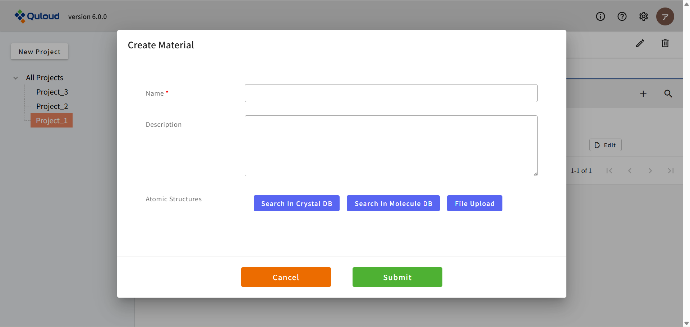

==============================
ダッシュボード（トップ画面）
==============================

下図は Quloud のログイン直後の画面です。これから計算を始めていくにあたって重要な要素として、
Project，Material，Job があります。

.. image:: images/screenshot_0001.png

|
|

-----------------------
Project
-----------------------

Quloud では、材料のモデリングやシミュレーションは Project の中で行われます。そしてそれぞれの Project の中に、Material や Job が配置されます。
Material はモデリングを行うための要素、Job はシミュレーションを行うための要素です。

|
|

++++++++++++++++++++++++++++++++++++++++++++++++++++++++++++++++++++++++++++++++++++++++++++++++++++++++++++
Project の作成・共有
++++++++++++++++++++++++++++++++++++++++++++++++++++++++++++++++++++++++++++++++++++++++++++++++++++++++++++

画面左上にある「New Project」をクリックすると、下図のようなメニューが開きます。

.. image:: images/screenshot_0181.png

管理ユーザー（Owner）の場合、作成した Project を Tenant 内のメンバーと共有することができます。
「Name」に新しい Project の名前（ここでは "Project_1"）を入力し、Project を共有するメンバー（ここでは "Planck Nicolas"）にチェックを入れます。

.. image:: images/screenshot_0182.png

「Submit」をクリックすると、トップ画面左の Project 一覧に Project_1 が追加されていることが分かります。

.. image:: images/screenshot_0183.png

Project を共有した Planck Nicolas のアカウントからサインインすると、先ほど作成した Project_1 がここでも表示されています。

.. image:: images/screenshot_0002.png

Project が増えると、画面左上の「All Projects」をクリックしたとき、例えば下図のように Project の一覧が表示されるので、
使用したい Project をクリックすれば、その Project に切り替わるようになっています。
Project を切り替えると、画面上部に選択中の Project の名前（ここでは "Project_1"）が表示されます。
このとき、Material や Job は、
その Project に登録されているものだけが表示されるようになるので、データの整理等に利用できます。

.. image:: images/screenshot_0003.png

Project の重要な機能として、例えば Project 内の Material から Job を作ると、
その Job も自動的に Project のメンバーとして登録されるというものがあります。
（ただし元になった Material が複数の Project に属していたとしても、そこから派生した Job は、
現在選択中の Project にのみ、自動的に登録されます。）

|
|

++++++++++++++++++++++++++++++++++++++++++++++++++++++++++++++++++++++++++++++++++++++++++++++++++++++++++++
Project の削除
++++++++++++++++++++++++++++++++++++++++++++++++++++++++++++++++++++++++++++++++++++++++++++++++++++++++++++

**まず、Project を削除すると、配下にある Material や Job もすべて削除されてしまいますのでご注意ください。**

トップ画面左の Project 一覧で、削除する Project（ここでは "Project_1"）をクリックします。

.. image:: images/screenshot_0184.png

画面右上にゴミ箱のマークが現れるので、それをクリックすると、次のようなダイアログが出ます。

.. image:: images/screenshot_0185.png

警告メッセージを読み、削除に問題がなければチェックを入れます。すると、「Submit」ボタンがアクティブになります。

.. image:: images/screenshot_0186.png

「Submit」ボタンを押すと、トップ画面から Project_1 が消えます。

|
|

------------------------------------
Material
------------------------------------

Project の名前の下にある「Materials」と「Jobs」のうち、左の「Materials」をクリックし、
右側の「＋」のアイコンをクリックすると、次のようなメニューが開きます。

ここでは計算したい物質の原子座標ファイルを登録します。
「Atomic Structures」のメニュー内には３つのボタンがあり、それぞれ

- 結晶構造データベース（Materials Project）で検索＆取得
- 分子構造データベース（PubChem）で検索＆取得
- 手持ちのファイルをアップロードする

という登録方法に対応しています。データベース検索の方法等については後述することにして、
とにかく原子座標ファイルが登録できたら、下記のように、
最初の画面の「Materials」の欄に登録した情報が追加されます。

.. image:: images/screenshot_0005.png

登録した Material をクリックすると、
次のような、その Material の詳細画面に移動することができます。

.. image:: images/screenshot_0059.png

この画面から、Material のモデリングを行ったり、各種計算を行ったりすることができます。
Quloud では、モデリングの結果も「Material」というデータとして登録されます。
また、計算結果は「Job」というデータとして登録されます。

具体的なモデリングの方法については後述することにして、ここでは例として、
Si のコンベンショナルセル（立方体セル）にするモデリングを実行したとします。
すると、以下のように、最初の画面の「Materials」の欄にデータが追加されるのがわかります。

.. image:: images/screenshot_0060.png

|
|

-----------------------
Job
-----------------------

Project の名前の下にある「Materials」と「Jobs」のうち、右の「Jobs」をクリックすると、
次のような画面になります。

.. image:: images/screenshot_0061.png

Material 詳細画面から Job を作成すると、そのデータが追加されます。

具体的な計算設定の方法については後述することにして、ここでは例として、
Si のバンド計算の Job を作成したとします。
すると、以下のように、最初の画面の「Jobs」の欄にデータが追加されるのがわかります。

.. image:: images/screenshot_0062.png

