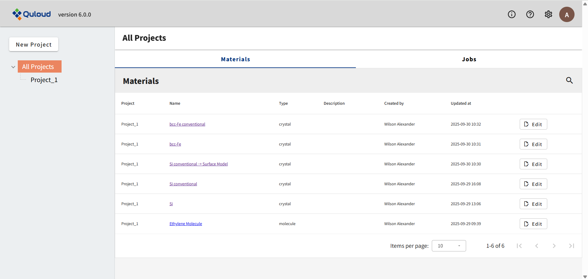
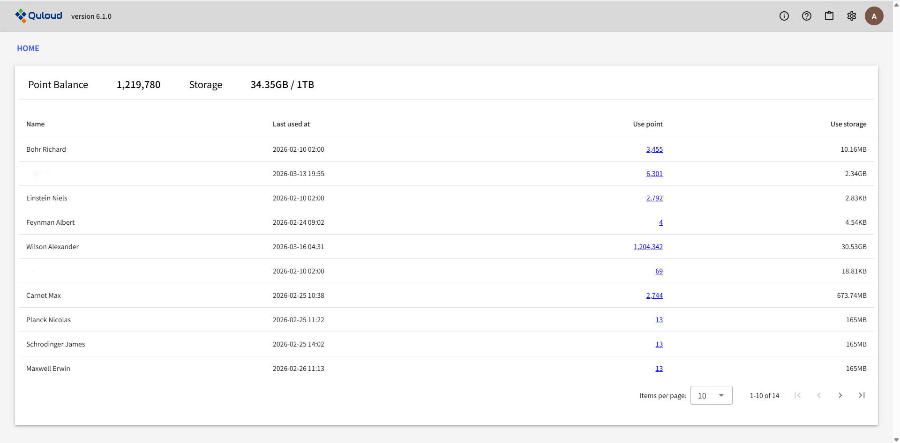
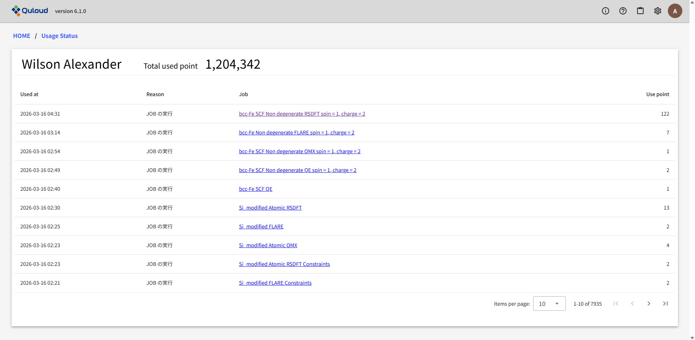
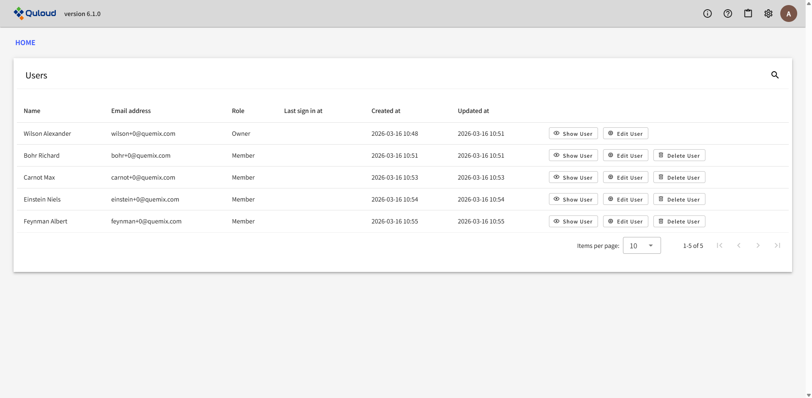
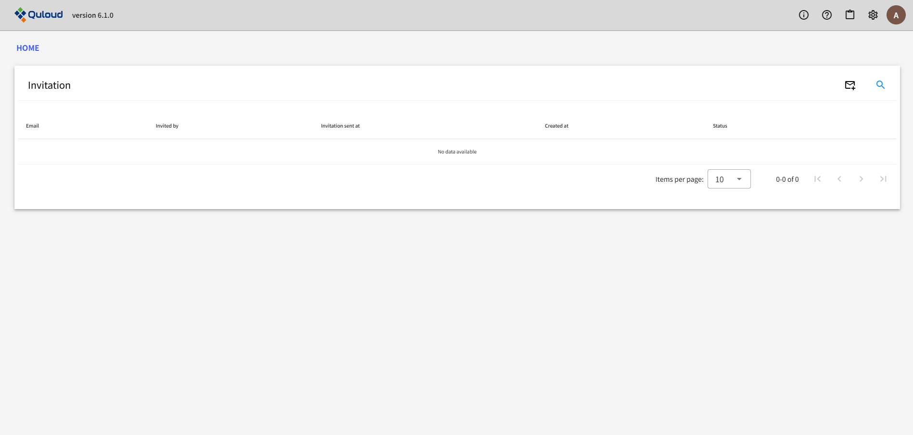
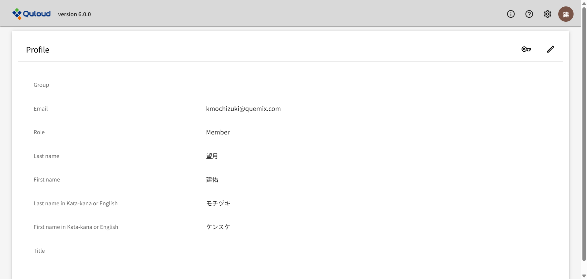
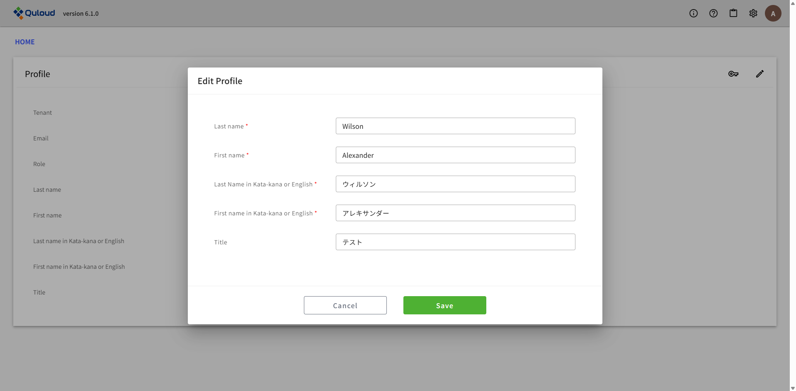
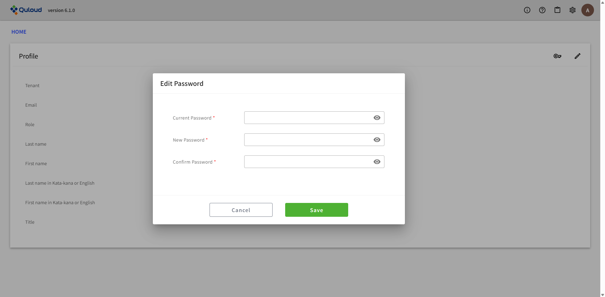
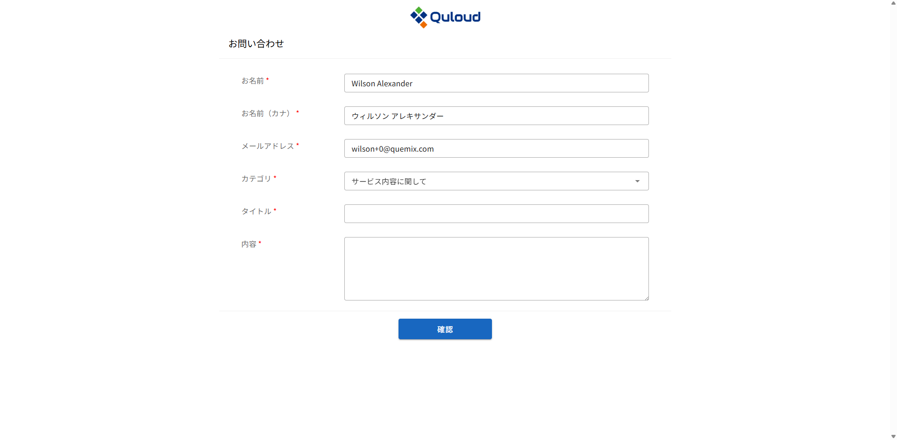
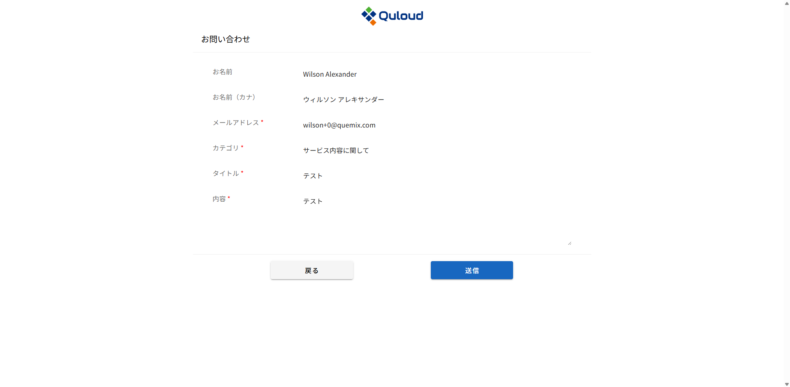

========================================
ヘッダーメニュー（各種管理）
========================================

下図のように、Quloud の画面右上には常時４つのアイコンが表示されており、それぞれ

-	「ｉ」：		お知らせ
-	「？」：	このドキュメント
-	歯車：	メンバー一覧、招待、計算ポイント＆ストレージ
-	ユーザー：	ユーザー情報、お問い合わせ、サインアウト

という機能に対応しています。

------------------------------------------------------------
ポイント・ストレージの利用状況確認
------------------------------------------------------------

ヘッダー部の歯車のアイコンをクリックし、「Usage Status」をクリックすると、下図のような画面が表示されます。
この画面では、現在の（グループ全体の）保有計算ポイントと、各ユーザーのポイント・ストレージ利用状況を確認することができます。

ポイントをクリックすると、そのユーザーのポイント消費の履歴を確認することができます。

------------------------------
グループ管理
------------------------------

歯車のアイコンをクリックすると、

-	グループメンバー一覧（Users）
-	グループへの招待（Invitation）

という機能が選択できます。それぞれの機能を以下に説明します。

グループメンバーの一覧画面を示します。「Show User」ボタンで各メンバーの詳細情報を確認できます。

また管理ユーザー（Owner）は詳細情報画面からメンバーをグループから削除することも可能です。
グループからメンバーを外す際に、そのメンバーに属している Job 等を他のメンバーに引き継ぐか、
あるいは Quloud 上から完全に削除するかを選ぶ必要があります。

管理ユーザーは新たなユーザーをグループのメンバーとして招待することができます。
下図で招待したいユーザーのメールアドレスを入力し「Submit」を押すと、追加したいメンバーのメールアドレスを登録することができます。

.. image:: images/screenshot_0021.png

登録後「Approve」ボタンを押したタイミングで、実際に招待メールが登録したアドレスに送付されます。「Resend」ボタンを押すと、招待メールがもう一度送付されます。

------------------------------
ユーザー管理
------------------------------

ヘッダー部のユーザーのアイコンをクリックし、「Profile」をクリックすると、下図のような画面が表示されます。

ここで、ユーザー情報の確認や編集、パスワードの変更が行えます。

右の鉛筆のマークをクリックすると、ユーザー情報の編集画面に移ります。

情報を編集し、「Submit」をクリックすると、変更した内容が反映されます。

また、右の鍵のマークをクリックすると、パスワード変更画面に移ります。

現在のパスワードと、新しいパスワード（２か所）を入力し、「Submit」をクリックすると、パスワード変更が反映されます。

------------------------------
お問い合わせ
------------------------------

ヘッダー部のユーザーのアイコンをクリックし、「Inquiry」をクリックすると、下図のような画面が表示されます。

お問い合わせのカテゴリを選択し、タイトル・内容を記入後、「確認」ボタンを押すと、お問い合わせ内容の確認画面に移ります。

内容を確認後、「送信」ボタンを押すと、お問い合わせ完了画面が表示され、入力したメールアドレスに確認メールが送信されます。