==============================
Material 詳細画面
==============================

ダッシュボードの一覧から項目名をクリックすることで、下図のような Material 詳細画面に遷移します。

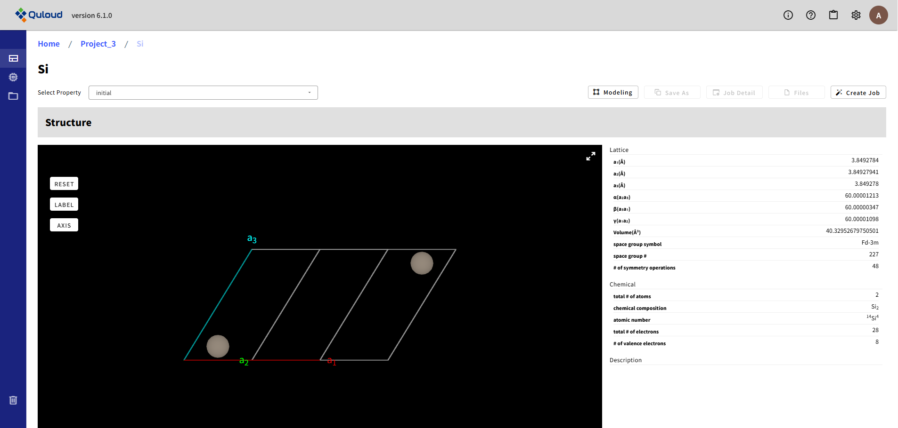

ここでは各 Material/Job の詳細な情報や、
計算終了後は、その計算の結果等を確認することができます。またサイドメニューから、
登録情報をベースにした新たな Job の作成やモデリングを行うこともできます。
詳細画面からの Job 作成は全て GUI 形式で行うため、
直感的な操作で材料計算を実行することができます。

Material 詳細画面は、左サイドメニューで「Property」「Job」「File」「Delete」の４つのパートに分かれています。

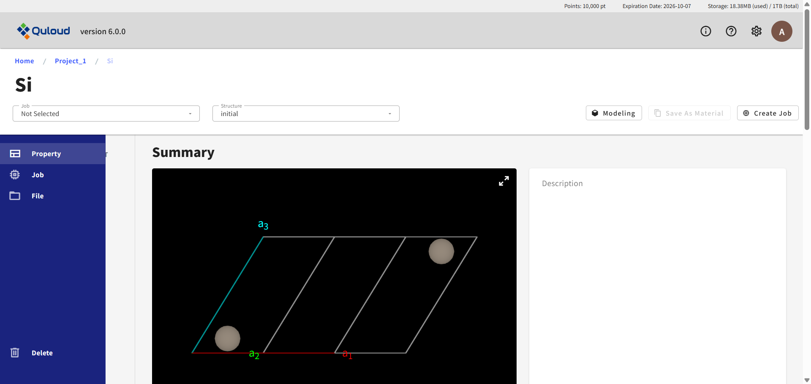

------------------------------------
Property
------------------------------------

左サイドメニューの「Property」を選択すると、 Material の原子構造を確認できます。
「Property」はさらに、「Summary」「Structure」「Properties」の３つのパートに分かれています。

「Summary」では、一番上の図のように、原子構造の図が示されています。ドラッグすれば向きを変えることもできます。
また、マウスホイールやタッチパッドで拡大・縮小もできます。
図の右上のアイコンをクリックすれば、ポップアップ表示させることもできます。

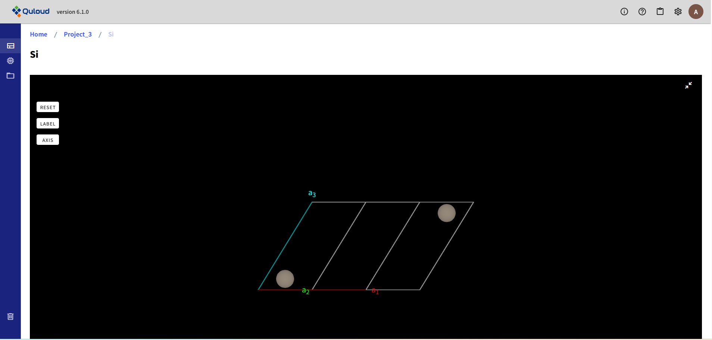

「Structure」では、下図のようにユニットセルの情報や、含まれる原子の種類や原子数の情報が示されています。

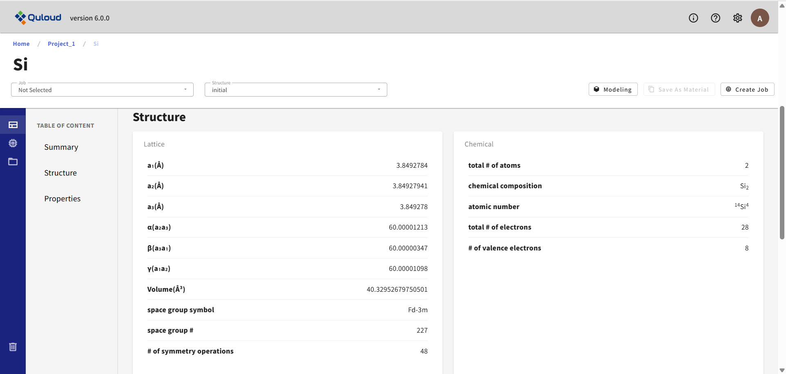

「Properties」では、下図のようにブリルアン・ゾーンの図が示されています。

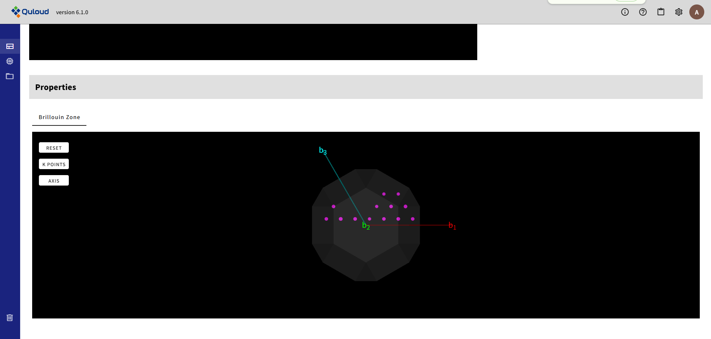

計算済みの Job が存在する場合、ここでは計算結果も確認できます。
まず、画面左上の「Job」タブで当該 Job を選択します。

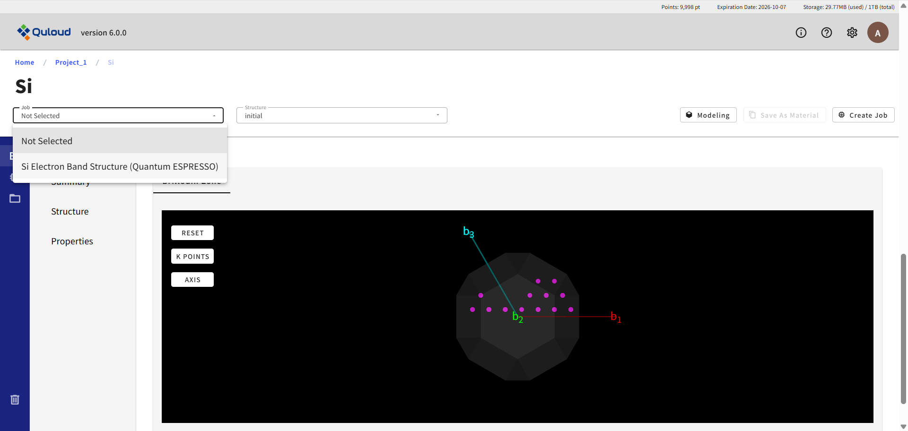

次に、「Structure」タブで「final」が選択されていることを確認します。

.. image:: images/screenshot_0139.png

下にスクロールすると、計算で出てきた物質の様々な情報が確認できます。

.. image:: images/screenshot_0140.png

画面右上の「Modeling」ボタンをクリックすると、モデリングのタイプを選択するメニューが表示されます。

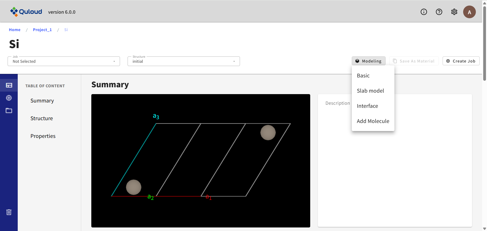

現在

-	Basic（セル変形、スーパーセル、原子削除、置換、移動）
-	Slab model（表面スラブモデル）
-	Interface（界面モデル）
-	Add Molecule（表面分子吸着）
-	Add Cell（孤立分子からスーパーセルモデルを作る）

という選択肢があります。モデリング機能および各メニューの詳細については章を改めて説明します。

画面右上の「Create Job」ボタンをクリックすると、
材料計算のカテゴリーを選択するメニューが表示されます。

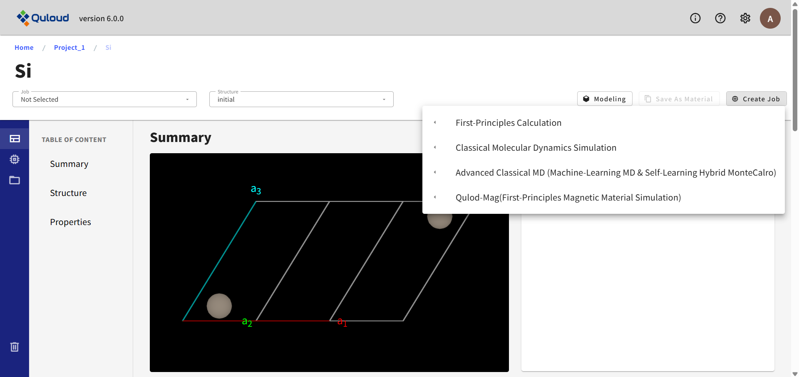

現在

-	First-Principles Calculation（第一原理計算）
-	Classical Molecular Dynamics Simulation（古典分子動力学法）
-	Advanced Classical MD（機械学習 MD & 自己学習ハイブリッドモンテカルロ法）
-	Quloud-Mag（第一原理磁性材料シミュレーション）

が選択可能です。カテゴリーを選択すると、各カテゴリーごとのさらに詳細な計算機能の一覧が表示されます。
各カテゴリーの計算機能の詳細については章を改めて説明します。

----------------------------------------------
Job
----------------------------------------------

左サイドメニューの「Job」を選択すると、 次のように表示されます。

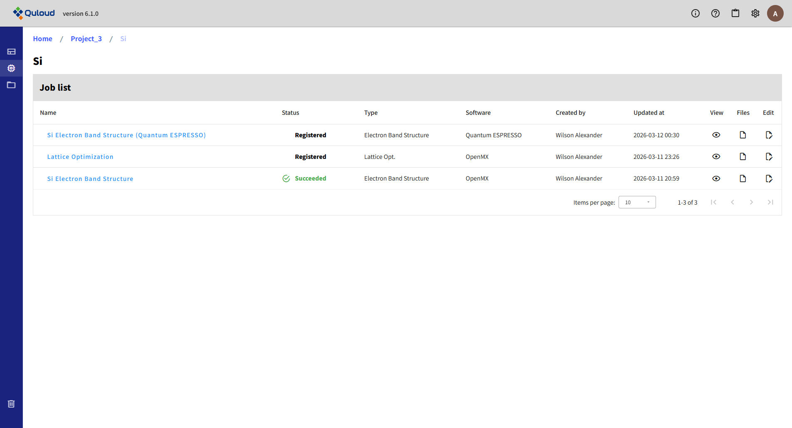

ここでは、作成した Job が存在する場合、Job の実行、編集、コピー、削除、キャンセルを行うことができます。
その前にまず、画面左上の「Job」タブで Job を選択する必要があります。

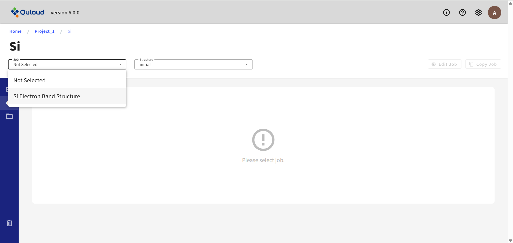

例として、「Si Electron Band Structure (Quantum ESPRESSO)」を選択すると、Job の設定が表示され、
画面右上に「Edit Job」「Copy Job」「Delete Job」ボタンが現れます。
実行していない Job の場合は、「Run Job」ボタンも現れます。

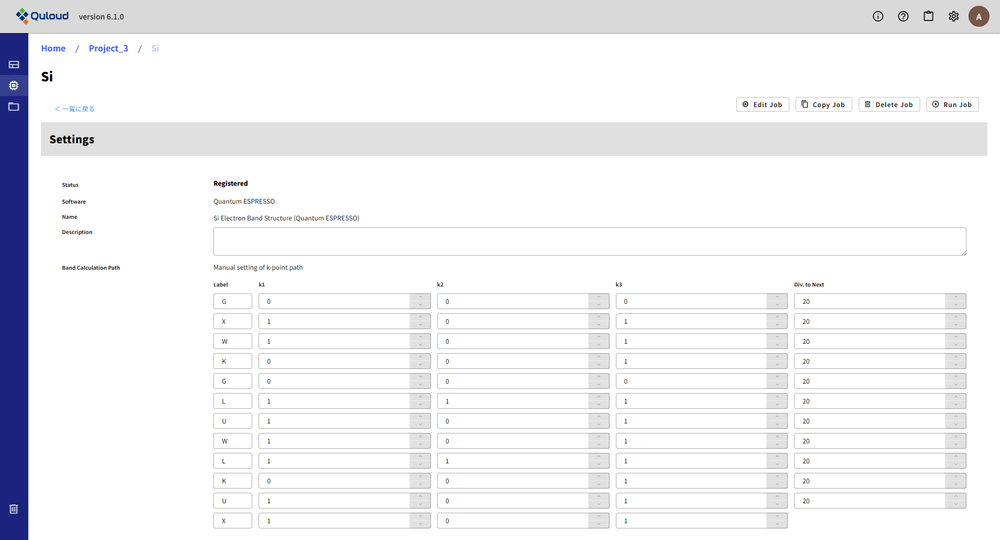

実行中の Job の場合は「Cancel Job」ボタンが現れます。

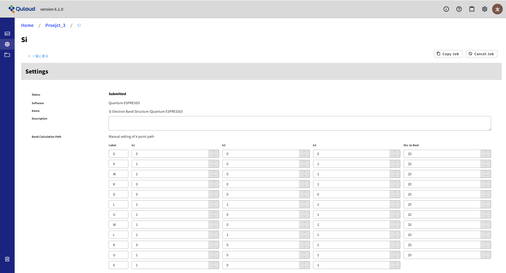

「Job」はさらに、「Settings」「Computation」の２つのパートに分かれています。
実行中または実行済みの Job の場合は、３つ目の「Log」パートも存在します。

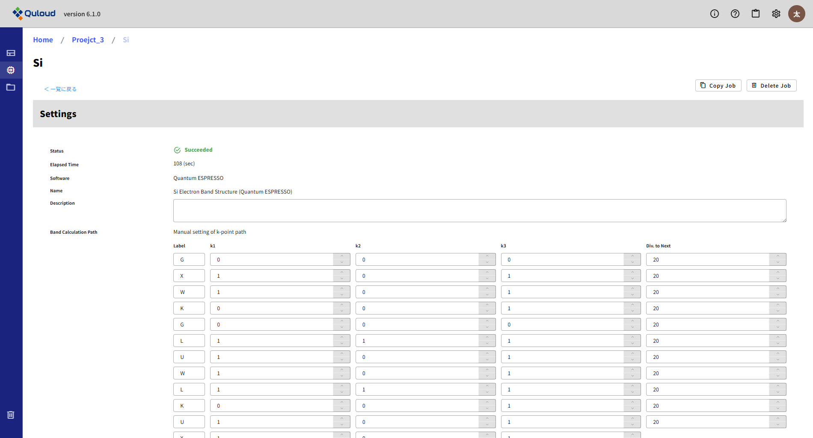

「Settings」では、Job 作成時に設定した計算条件が表示されます。

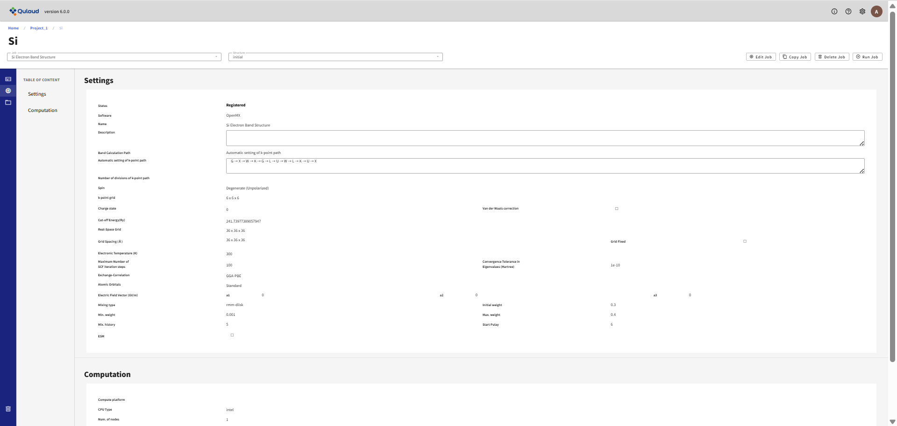

「Computation」では、計算リソースや計算時間などの設定が表示されます。

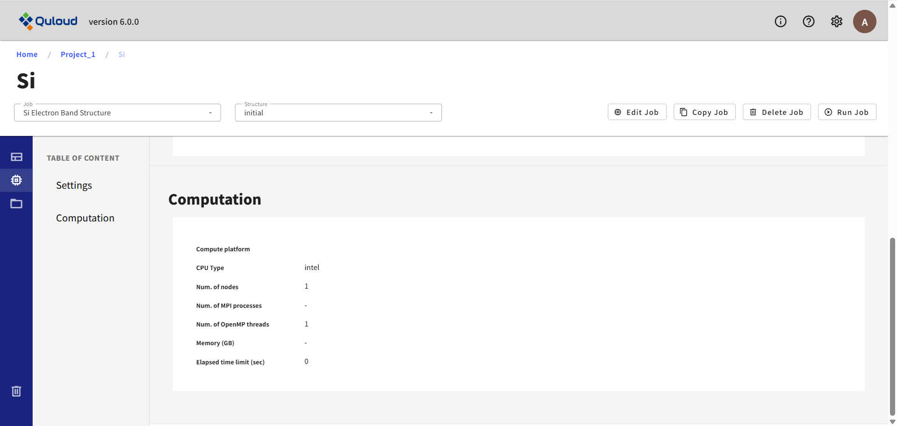

「Log」では、計算ログファイルの確認およびダウンロードが可能です。

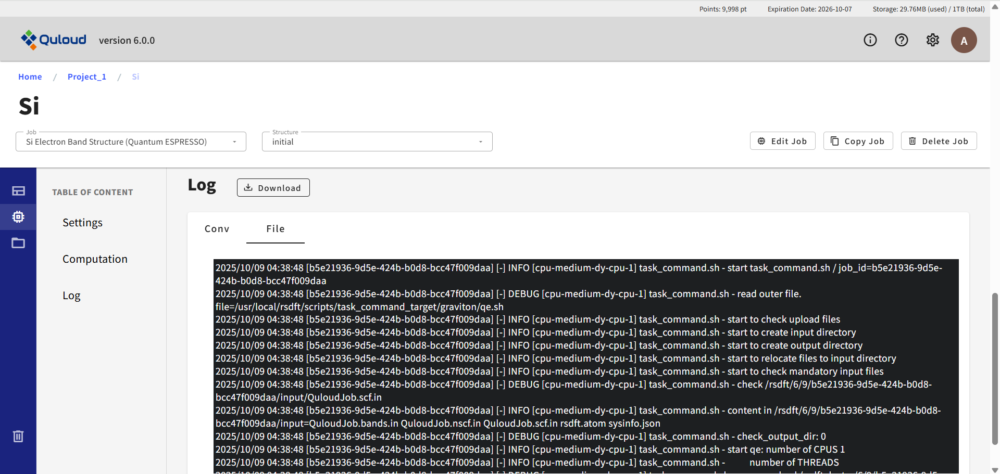

画面左上の「Structure」タブで「final」を選択すると、計算の収束状況も確認できます。

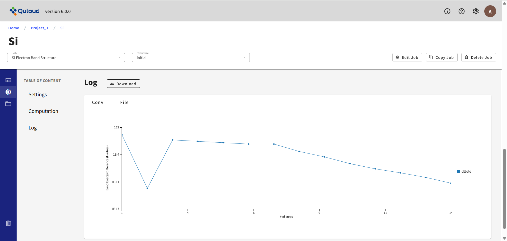

----------------------------------------------
File
----------------------------------------------

左サイドメニューの「File」を選択すると、各 Job の入力ファイル、
出力ファイルのダウンロードが可能です。

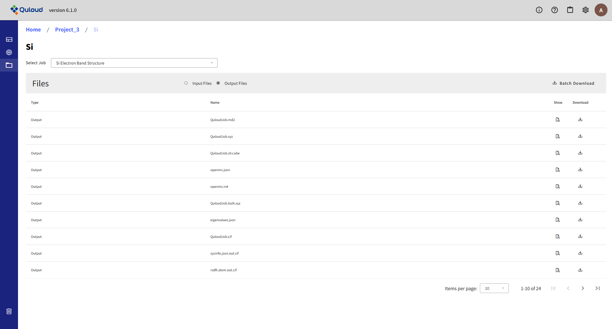

Job が実行前の場合（Status が Registered の場合）、
入力ファイルについては、「Edit」ボタンをクリックすると、
テキストファイルであれば、その内容を確認することができ、さらに編集も可能です。

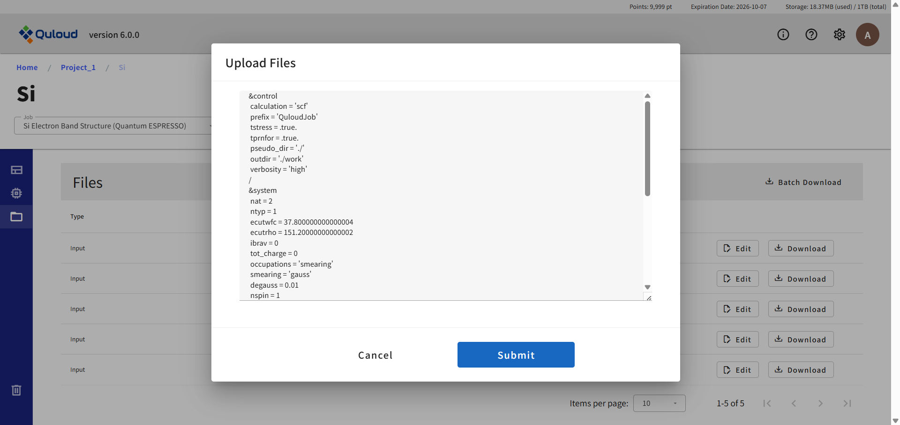

この機能を用いて、GUI で提供していない、各計算ソフトの設定を行うことが可能です。

----------------------------------------------
Delete
----------------------------------------------

左サイドメニューの「Delete」を選択すると、 次のように表示されます。

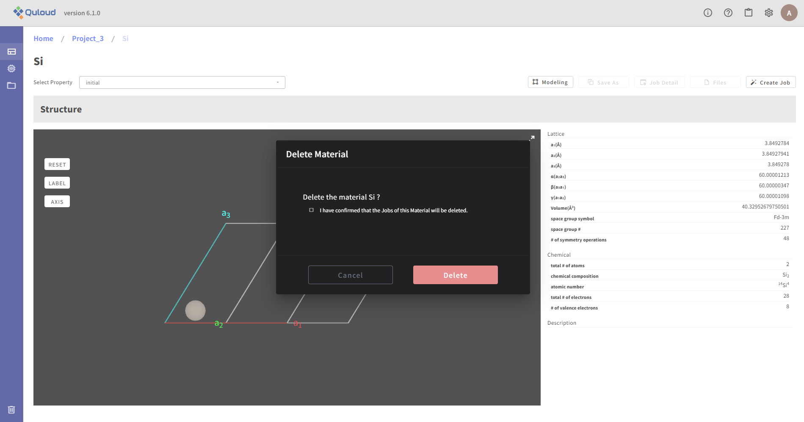

ここでは、Material の削除を行うことができます。関連する Job が存在する場合は、Job も含めて削除されます。
「配下の Job が削除されることを確認しました」にチェックを入れると、「Submit」ボタンがアクティブになります。

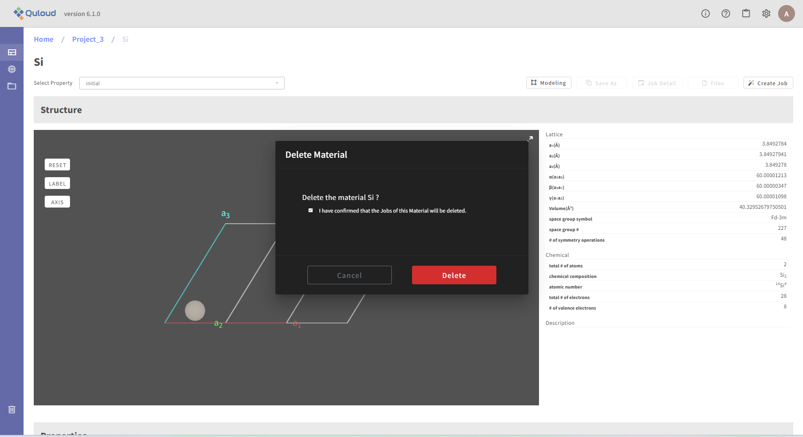

「Submit」ボタンをクリックすると、Material が削除され、TOP 画面に移ります。

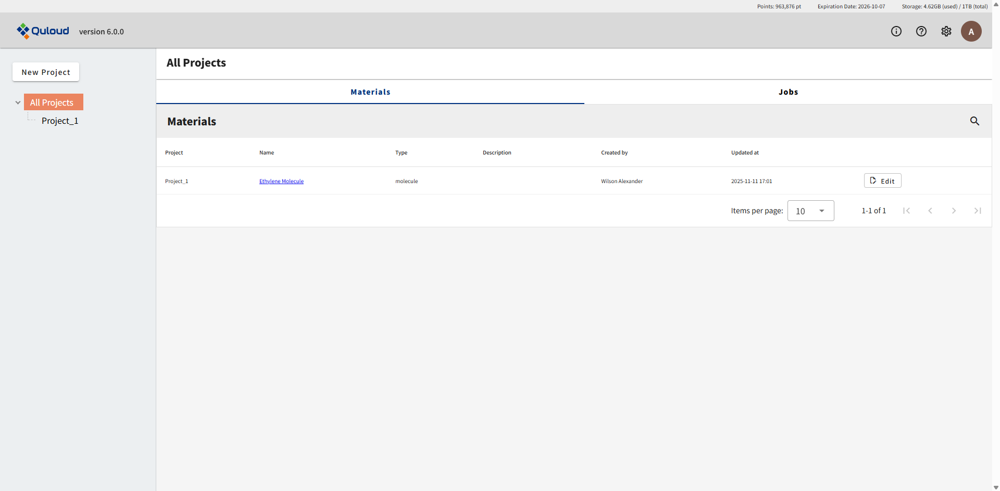

また、関連する Job も削除されています。

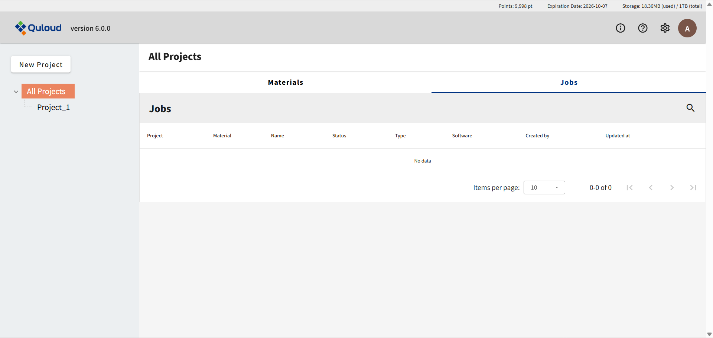