==============================
Material 詳細画面
==============================

ダッシュボードの Material 一覧から項目名をクリックすることで、下図のような Material 詳細画面に遷移します。

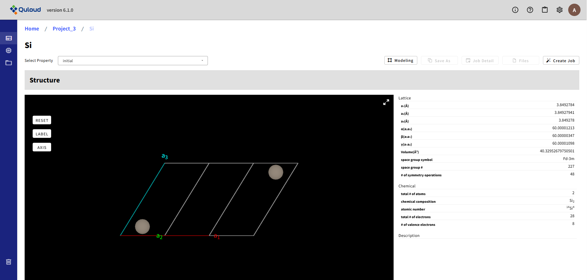

ここでは Material の詳細な情報や、その Material に対する計算結果（「Property」と呼ぶ）などを確認することができます。
Material から別の Material を作る「モデリング」や、Property を作るための「計算ジョブの作成」などは、
この画面の上部にある「Modeling」および「Create Job」ボタンから行うことができます。
これらについては改めて\ :ref:`modeling-section`\ および\ :ref:`job-section`\ で説明します。

Material 詳細画面の左サイドメニューは「Property」「Job」「File」「Delete」の４つのパートに分かれています。
以下で順に説明します。

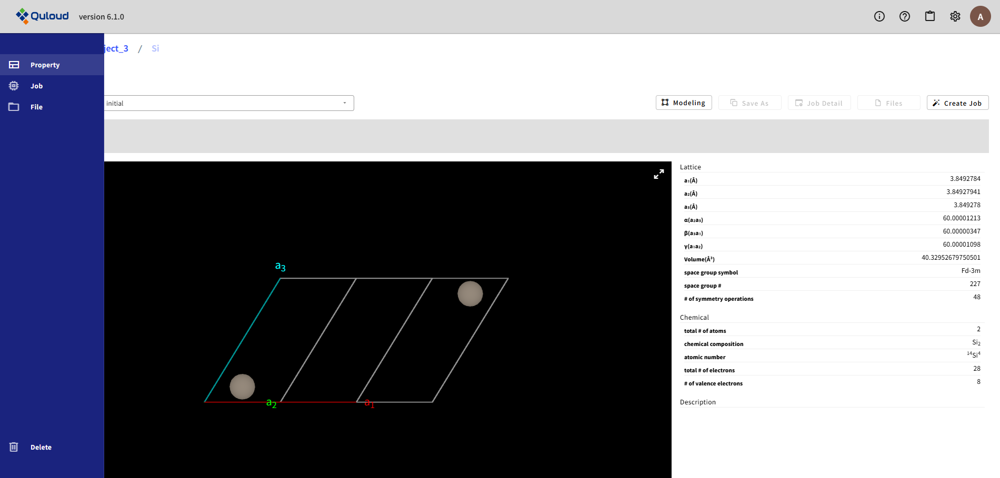

|
|

------------------------------------
Property
------------------------------------

左サイドメニューの「Property」を選択すると、 Material 詳細画面のトップページに戻ります。
画面構成は、上部にある「Structure」と、スクロールしていった下部にある「Properties」からなっています。

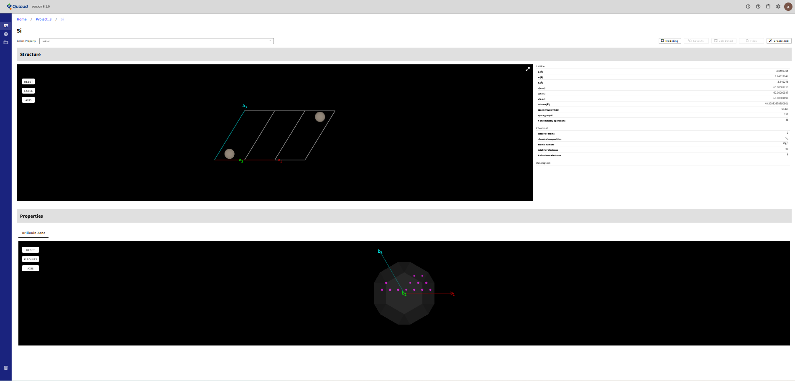

Property 画面の上部、「Structure」の直上にある「Select Property」メニューで、initialn の原子構造（登録した Material）や、
その他の Property（計算の結果得られた構造や物性値）を切り替えて表示させる事ができます。

「Structure」にある原子構造の可視化部分は、ドラッグすれば向きを変えることもできます。
また、マウスホイールやタッチパッドで拡大・縮小もできます。
右上の拡大アイコンをクリックすれば、原子構造を画面一杯に表示させることもできます。

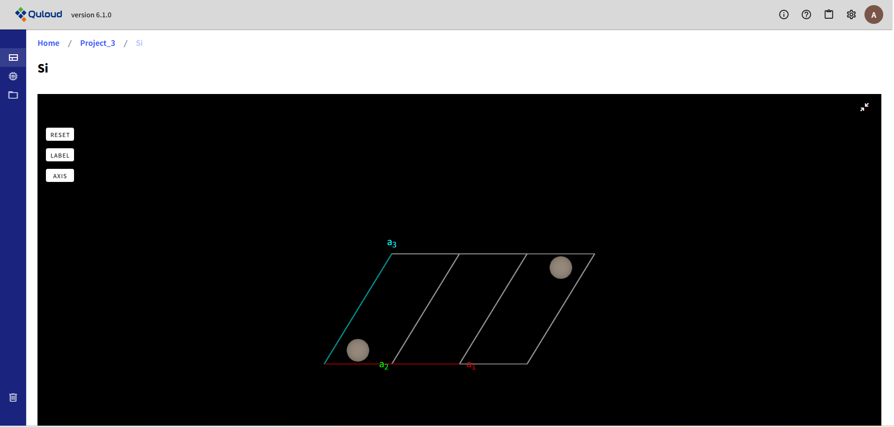

「Properties」では、initial が選択されている状態では、下図のようにブリルアン・ゾーンの可視化が表示されます。

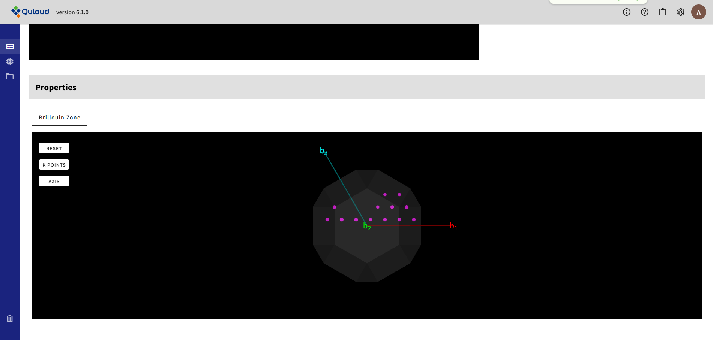

計算ジョブの結果が Property として登録されていれば、「Select Property」メニューで、initial 以外の Property を選択することもできます。

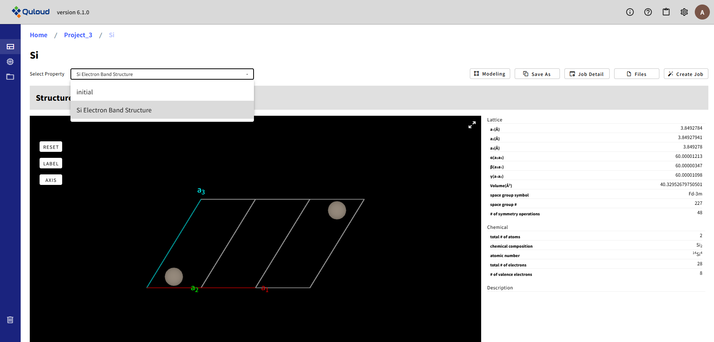

このとき、Properties の内容は、計算ジョブの種類により様々に変わります。例えば、電子バンド構造計算結果の場合は下図のようになります。

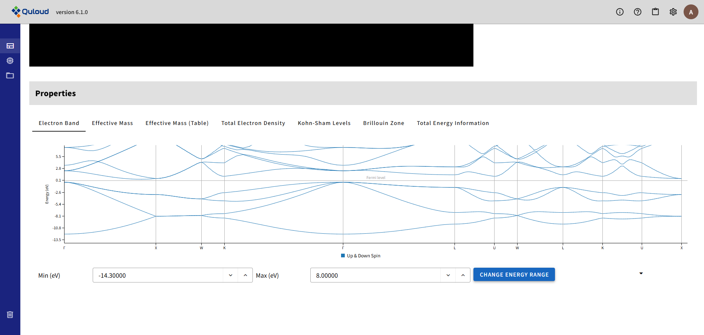

.. Job が存在する場合、ここでは計算結果も確認できます。
.. まず、画面左上の「Job」タブで当該 Job を選択します。

.. .. image:: images/screenshot_0138.png

.. 次に、「Structure」タブで「final」が選択されていることを確認します。

.. .. image:: images/screenshot_0139.png

.. 下にスクロールすると、計算で出てきた物質の様々な情報が確認できます。

.. .. image:: images/screenshot_0140.png

.. 画面右上の「Modeling」ボタンをクリックすると、モデリングのタイプを選択するメニューが表示されます。

.. .. image:: images/screenshot_0063.png

.. 現在

.. -	Basic（セル変形、スーパーセル、原子削除、置換、移動）
.. -	Slab model（表面スラブモデル）
.. -	Interface（界面モデル）
.. -	Add Molecule（表面分子吸着）
.. -	Add Cell（孤立分子からスーパーセルモデルを作る）

.. という選択肢があります。モデリング機能および各メニューの詳細については章を改めて説明します。

.. 画面右上の「Create Job」ボタンをクリックすると、
.. 材料計算のカテゴリーを選択するメニューが表示されます。

.. .. image:: images/screenshot_0064.png

.. 現在

.. -	First-Principles Calculation（第一原理計算）
.. -	Classical Molecular Dynamics Simulation（古典分子動力学法）
.. -	Advanced Classical MD（機械学習 MD）
.. -	Quloud-Mag（第一原理磁性材料シミュレーション）

.. が選択可能です。カテゴリーを選択すると、各カテゴリーごとのさらに詳細な計算機能の一覧が表示されます。
.. 各カテゴリーの計算機能の詳細については章を改めて説明します。

|
|

----------------------------------------------
Job
----------------------------------------------

左サイドメニューの「Job」を選択すると、 下図のような、その Material から作られた Job の一覧が表示されます。
（Material の Property を元に作られた Job も、この一覧に追加されていきます）

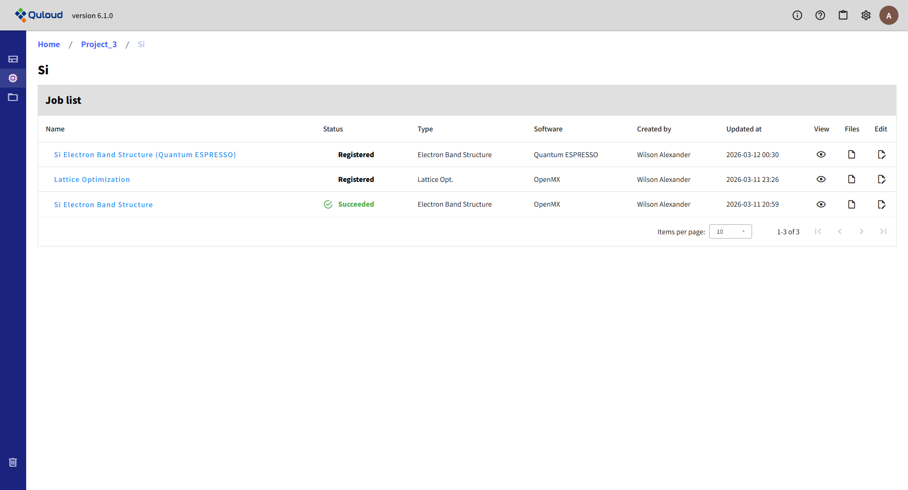

一覧にある Job 名（Name）をクリックすると、その Job の詳細な設定（入力パラメータや計算リソースなど）を確認・編集するための画面が表示されます。
例として、「Si Electron Band Structure (Quantum ESPRESSO)」を選択すると、下図のような画面に遷移します。

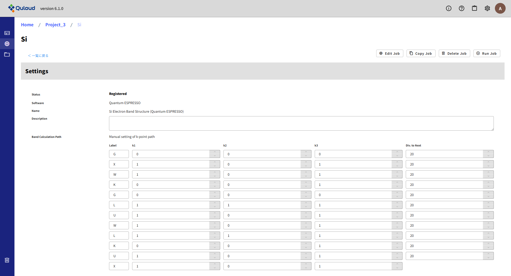

画面右上には Job の進行状況（Status）に応じて、いくつかのボタンが現れます。
Job 実行前（Status = Registered）であれば、上図のように「Edit Job」「Copy Job」「Delete Job」と、実際にジョブを走らせるための「Run Job」ボタンが現れます。
実行中（Status = Running, Submitted）であれば、下図のように「Copy Job」と「Cancel Job」が現れます。

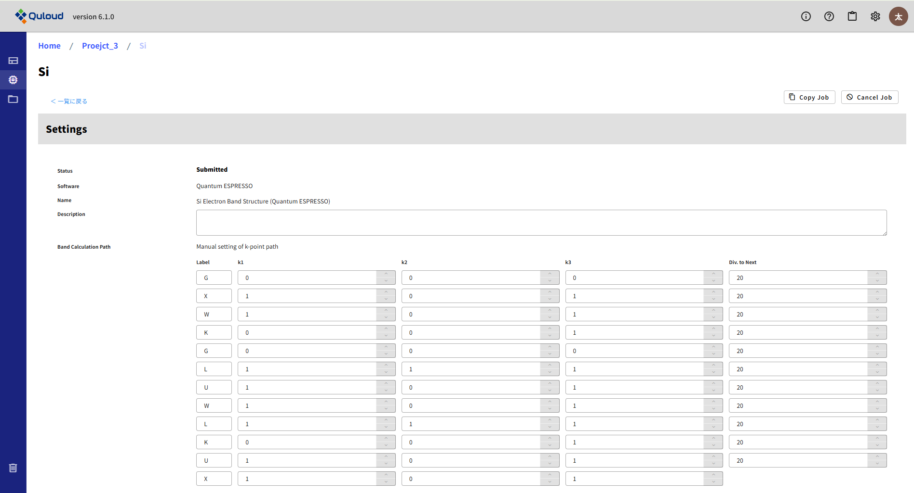

そして実行後（Status = Succeeded，他）の画面では、下図のように「Copy Job」と「Delete Job」ボタンが現れます。

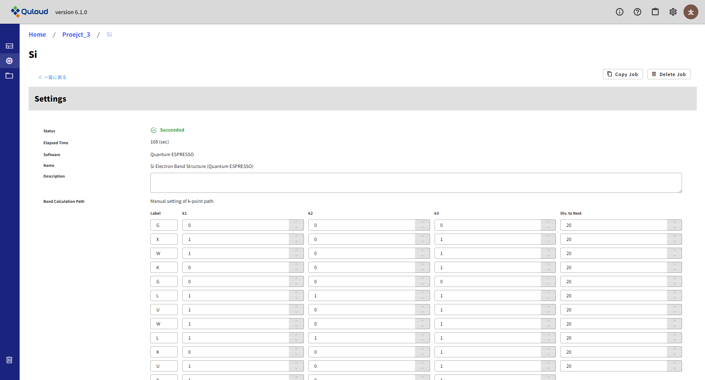

Job 詳細画面は、さらに「Settings」「Computation」というパートに分かれており、
さらに実行中、または実行済みの Job の場合は、「Log」というパートも現れます。

「Settings」では、Job 作成時に設定した計算条件が表示されます。

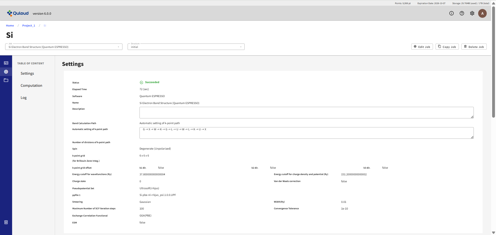

「Computation」では、計算リソースや計算時間などの設定が表示されます。

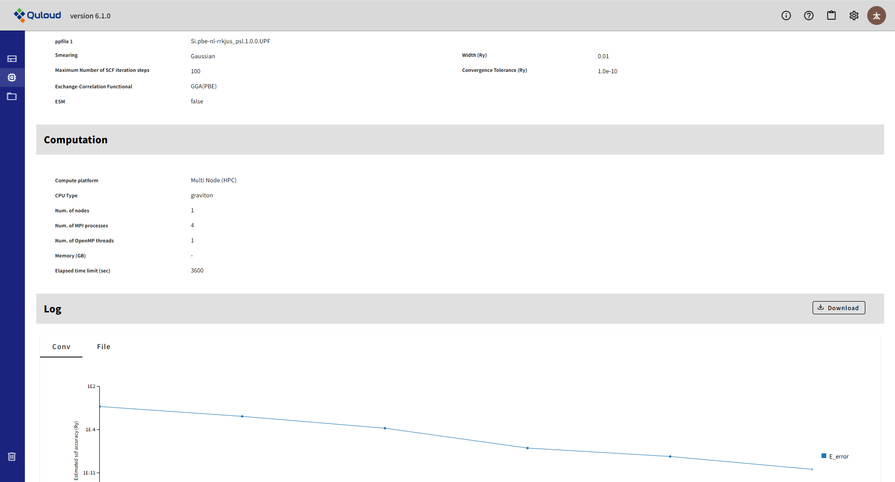

「Log」では、計算のログファイルの確認およびダウンロードが可能です。
また Job の種類によっては、計算の収束状況が確認できるグラフが表示されます。

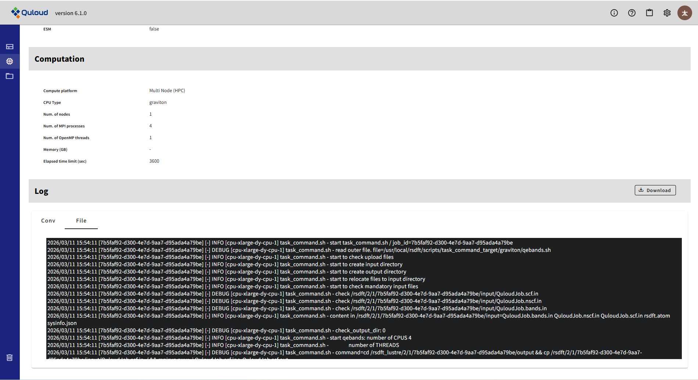

|
|

----------------------------------------------
File
----------------------------------------------

左サイドメニューの「File」を選択すると、initial の Material と、
そこから作られた Job に関連するファイル（Input Files／Output Files）の一覧が表示されます。
ここでは、ファイル内容の確認・編集およびダウンロードが可能です。

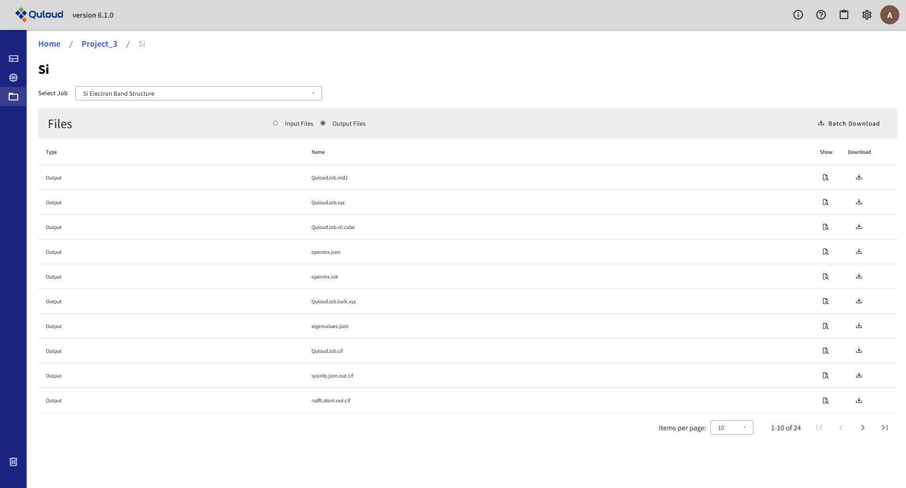

Job 実行前の状態（Status = Registered）であれば、
「Edit」ボタンをクリックすると、そのファイルの内容を確認することができ、さらに編集も可能です（ただしテキストファイルに限ります）。

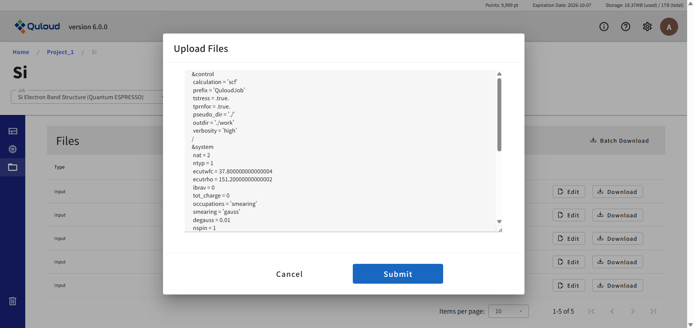

このファイルを直接編集する機能を用いれば、Quloud の GUI で提供していない、各計算ソフトの詳細な設定を記述して、計算を実行するといった事も可能です。

Job 実行後の状態（Status = Succeeded, 他）では、ファイル内容の確認だけができるようになっています。

|
|

----------------------------------------------
Delete
----------------------------------------------

左サイドメニューの「Delete」を選択すると、Material の削除を行うことができます。

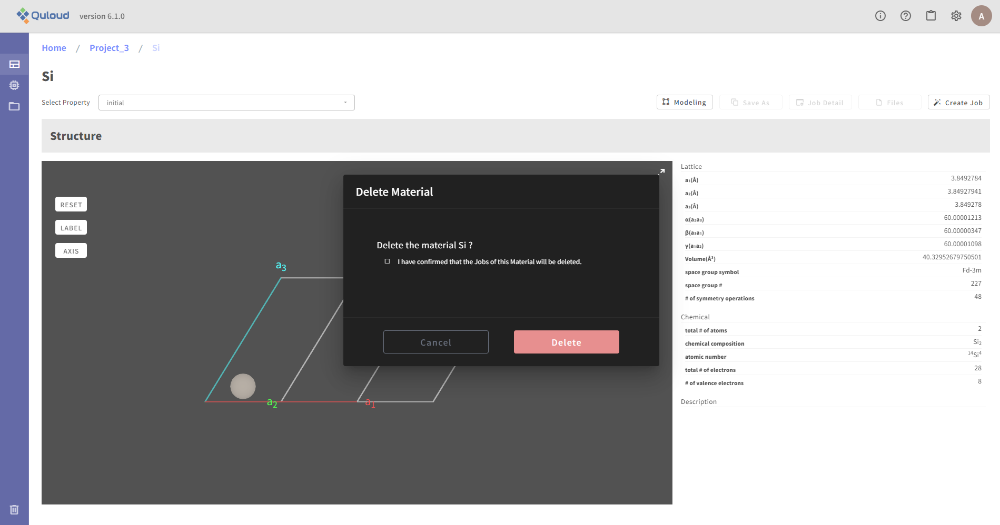

関連する Job が存在する場合には、
「配下の Job も一緒に削除されることを確認しました」にチェックを入れると、「Delete」ボタンがアクティブになります。

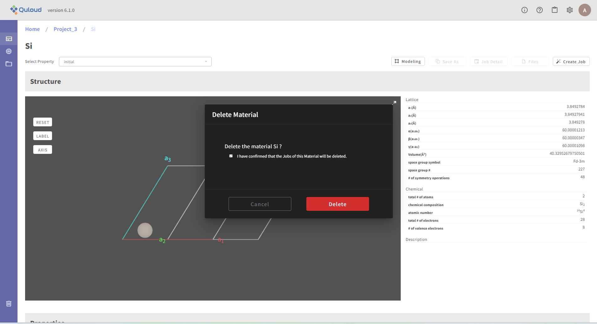

「Delete」ボタンをクリックすると、Material が削除され、TOP 画面に戻ります。
