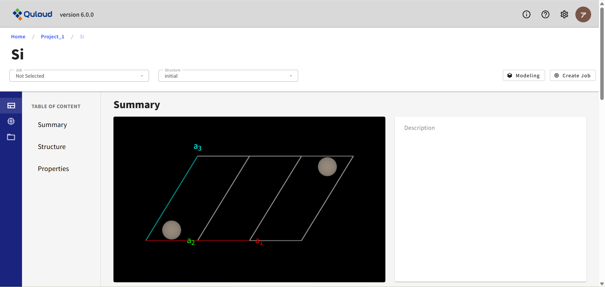

==============================
Material 詳細画面
==============================

ダッシュボードの一覧から項目名をクリックすることで、下図のような Material 詳細画面に遷移します。

ここでは各 Material/Job の詳細な情報や、
計算終了後は、その計算の結果等を確認することができます。またサイドメニューから、
登録情報をベースにした新たな Job の作成やモデリングを行うこともできます。
詳細画面からの Job 作成は全て GUI 形式で行うため、
直感的な操作で材料計算を実行することができます。

Material 詳細画面は、左サイドメニューで「Property」「Job」「File」「Delete」の４つのパートに分かれています。

.. image:: images/screenshot_0058.png

------------------------------------
Property
------------------------------------

左サイドメニューの「Property」を選択すると、 Material の原子構造を確認できます。
「Property」はさらに、「Summary」「Structure」「Properties」の３つのパートに分かれています。

「Summary」では、一番上の図のように、原子構造の図が示されています。ドラッグすれば向きを変えることもできます。
また、マウスホイールやタッチパッドで拡大・縮小もできます。
図の右上のアイコンをクリックすれば、ポップアップ表示させることもできます。

.. image:: images/screenshot_0136.png

「Structure」では、下図のようにユニットセルの情報や、含まれる原子の種類や原子数の情報が示されています。

.. image:: images/screenshot_0012.png

「Properties」では、下図のようにブリルアン・ゾーンの図が示されています。

.. image:: images/screenshot_0057.png

計算済みの Job が存在する場合、ここでは計算結果も確認できます。
まず、画面左上の「Job」タブで当該 Job を選択します。

.. image:: images/screenshot_0138.png

次に、「Structure」タブで「final」が選択されていることを確認します。

.. image:: images/screenshot_0139.png

下にスクロールすると、計算で出てきた物質の様々な情報が確認できます。

.. image:: images/screenshot_0140.png

画面右上の「Modeling」ボタンをクリックすると、モデリングのタイプを選択するメニューが表示されます。

.. image:: images/screenshot_0063.png

現在

-	Basic（セル変形、スーパーセル、原子削除、置換、移動）
-	Slab model（表面スラブモデル）
-	Interface（界面モデル）
-	Add Molecule（表面分子吸着）
-	Add Cell（孤立分子からスーパーセルモデルを作る）

という選択肢があります。モデリング機能および各メニューの詳細については章を改めて説明します。

画面右上の「Create Job」ボタンをクリックすると、
材料計算のカテゴリーを選択するメニューが表示されます。

.. image:: images/screenshot_0064.png

現在

-	First-Principles Calculation（第一原理計算）
-	Classical Molecular Dynamics Simulation（古典分子動力学法）
-	Advanced Classical MD（機械学習 MD & 自己学習ハイブリッドモンテカルロ法）
-	Quloud-Mag（第一原理磁性材料シミュレーション）

が選択可能です。カテゴリーを選択すると、各カテゴリーごとのさらに詳細な計算機能の一覧が表示されます。
各カテゴリーの計算機能の詳細については章を改めて説明します。

----------------------------------------------
Job
----------------------------------------------

左サイドメニューの「Job」を選択すると、 次のように表示されます。

.. image:: images/screenshot_0065.png

ここでは、作成した Job が存在する場合、Job の実行、編集、コピー、削除、キャンセルを行うことができます。
その前にまず、画面左上の「Job」タブで Job を選択する必要があります。

.. image:: images/screenshot_0066.png

例として、「Si Electron Band Structure (Quantum ESPRESSO)」を選択すると、Job の設定が表示され、
画面右上に「Edit Job」「Copy Job」「Delete Job」ボタンが現れます。
実行していない Job の場合は、「Run Job」ボタンも現れます。

.. image:: images/screenshot_0067.png

実行中の Job の場合は「Cancel Job」ボタンが現れます。

.. image:: images/screenshot_0071.png

「Job」はさらに、「Settings」「Computation」の２つのパートに分かれています。
実行中または実行済みの Job の場合は、３つ目の「Log」パートも存在します。

.. image:: images/screenshot_0072.png

「Settings」では、Job 作成時に設定した計算条件が表示されます。

.. image:: images/screenshot_0068.png

「Computation」では、計算リソースや計算時間などの設定が表示されます。

.. image:: images/screenshot_0069.png

「Log」では、計算ログファイルの確認およびダウンロードが可能です。

.. image:: images/screenshot_0074.png

画面左上の「Structure」タブで「final」を選択すると、計算の収束状況も確認できます。

.. image:: images/screenshot_0073.png

----------------------------------------------
File
----------------------------------------------

左サイドメニューの「File」を選択すると、各 Job の入力ファイル、
出力ファイルのダウンロードが可能です。

.. image:: images/screenshot_0070.png

Job が実行前の場合（Status が Registered の場合）、
入力ファイルについては、「Edit」ボタンをクリックすると、
テキストファイルであれば、その内容を確認することができ、さらに編集も可能です。

.. image:: images/screenshot_0137.png

この機能を用いて、GUI で提供していない、各計算ソフトの設定を行うことが可能です。

----------------------------------------------
Delete
----------------------------------------------

左サイドメニューの「Delete」を選択すると、 次のように表示されます。

.. image:: images/screenshot_0075.png

ここでは、Material の削除を行うことができます。関連する Job が存在する場合は、Job も含めて削除されます。
「配下の Job が削除されることを確認しました」にチェックを入れると、「Submit」ボタンがアクティブになります。

.. image:: images/screenshot_0076.png

「Submit」ボタンをクリックすると、Material が削除され、TOP 画面に移ります。

.. image:: images/screenshot_0077.png

また、関連する Job も削除されています。

.. image:: images/screenshot_0078.png