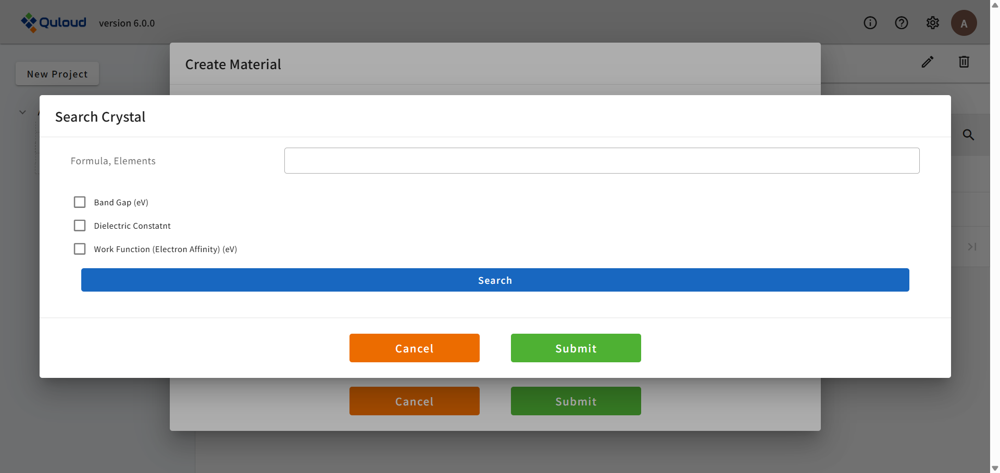
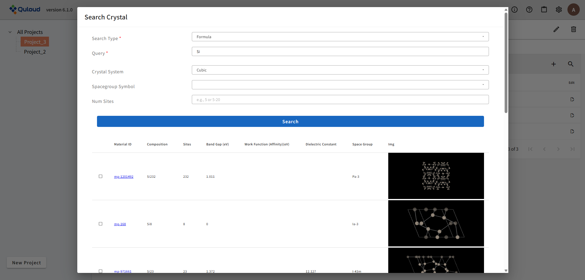
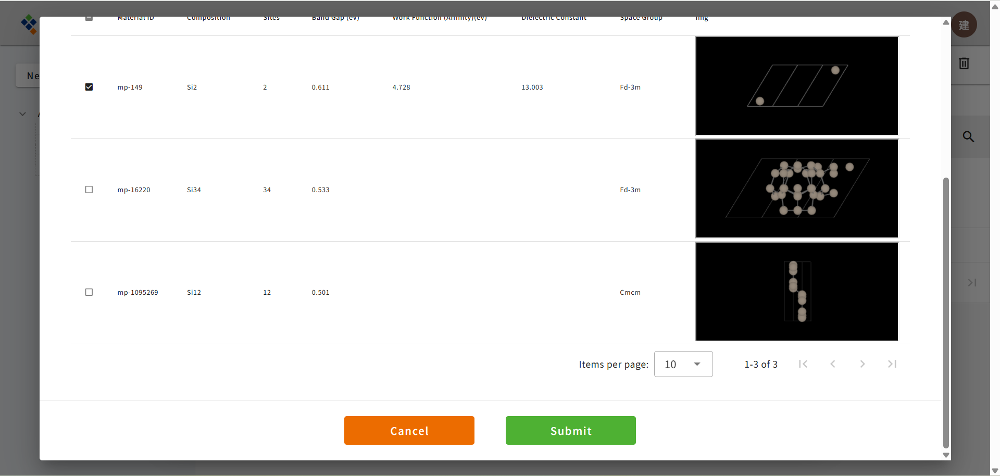
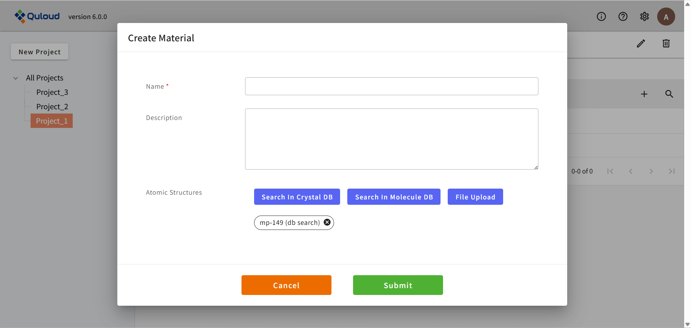
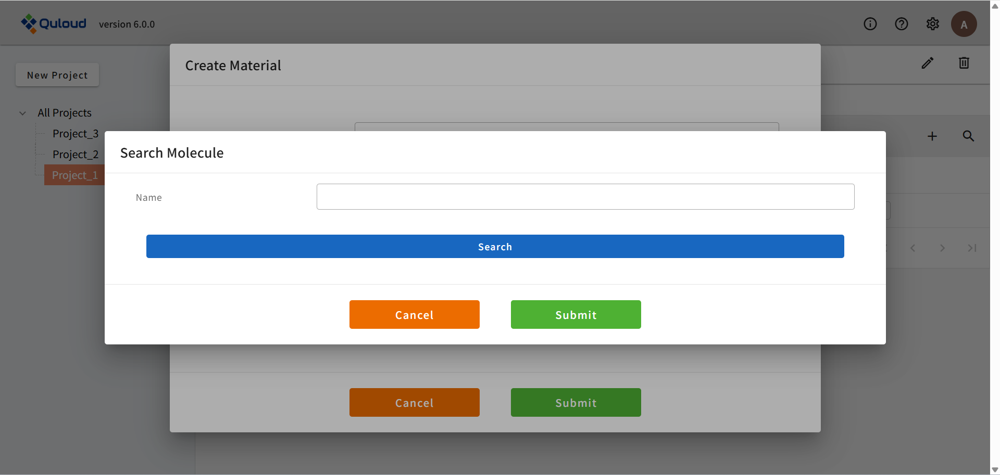
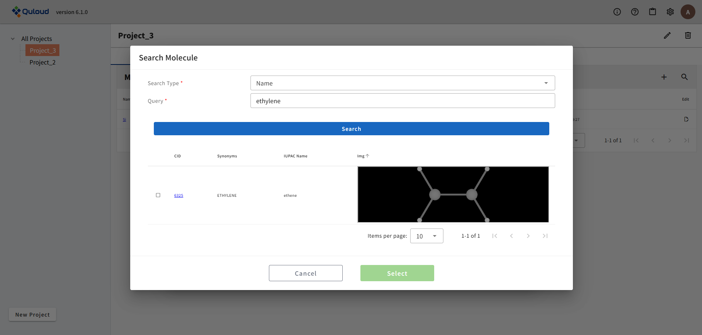
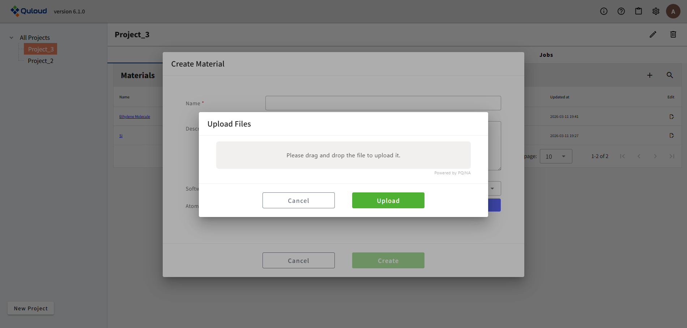
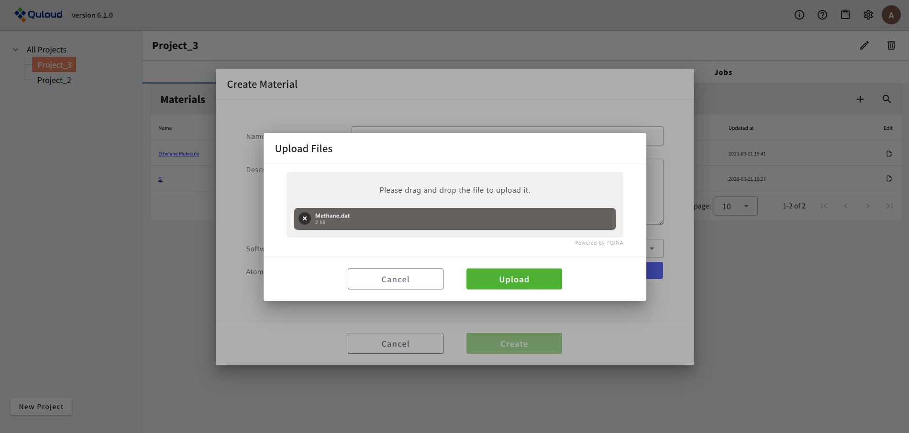
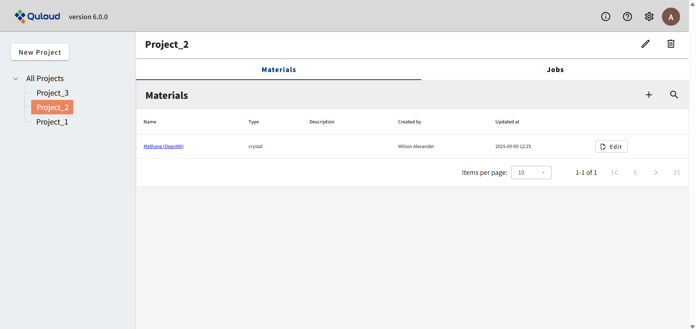

==============================
原子構造の登録
==============================

------------------------------------
外部データベースからの登録
------------------------------------

++++++++++++++++++++++++++++++++++
結晶構造（Materials Project）
++++++++++++++++++++++++++++++++++

「Search in Crystal DB」のボタンをクリックすると、下図のようなデータベース検索のウィンドウが現れます。

ここで元素名や組成、バンドギャップ等の物性値を入力し「Search」をクリックすると、
条件に合致する物質の原子構造が一覧で表示されます（下図）。

登録したい原子構造にチェックを入れ、
ウィンドウの下部にある「Submit」をクリックします。

すると、検索ウィンドウが閉じて、原子構造（ここでは "mp-149" ）が表示された状態で登録画面に戻ります。

Material の名前（ここでは "Si" ）を設定し、「Submit」をクリックすれば、原子構造が登録された状態でトップ画面に戻ります。

.. image:: images/screenshot_0003.png

++++++++++++++++++++++++++++++
分子構造（PubChem）
++++++++++++++++++++++++++++++

「Search in Molecule DB」をクリックすると、分子の名前や化学式で分子の座標データを検索するモードとなります。
（現在、分子構造をそのまま計算できるソフトは搭載されておらず、
結晶や表面といった周期系と組み合わせたモデルを作成する目的でのみ利用できます。）

分子の名前や化学式を入力して「Search」をクリックすると、
条件に合致する物質の原子構造が一覧で表示されます。

登録したい原子構造にチェックを入れ、
ウィンドウの下部にある「Submit」をクリックすると、検索ウィンドウが閉じて、
原子構造（ここでは "6325" ）が表示された状態で登録画面に戻ります。

Material の名前（ここでは "Ethylene Molecule" ）を設定し、「Submit」をクリックすれば、原子構造が登録された状態でトップ画面に戻ります。

.. image:: images/screenshot_0005.png

---------------------------------
ファイルアップロードによる登録
---------------------------------

「File Upload」のボタンをクリックすると、下図のようなファイルを選択するウィンドウが現れます。

複数のファイルをアップロードする事も可能です。アップロード可能な原子構造のフォーマットは、現在

-	CIF
-	XYZ
-	POSCAR（VASP 形式）
-	OpenMX 入力ファイル
-	Quantum ESPRESSO 入力ファイル

となっています。ファイル選択後「Submit」ボタンをクリックすると、
アップロードした原子構造が Quloud に登録されます。

例として、OpenMX のウェブサイト（https://www.openmx-square.org/openmx_man3.9jp/node20.html）
に載っているメタン分子の構造ファイル「Methane.dat」をアップロードしてみます。

「Submit」をクリックすると、ウィンドウが閉じて、入力ファイル「Methane.dat」が表示された状態で登録画面に戻ります。

.. image:: images/screenshot_0055.png

Material の名前（ここでは "Methane (OpenMX)" ）を設定し、「Submit」をクリックすれば、原子構造が登録された状態でトップ画面に戻ります。

