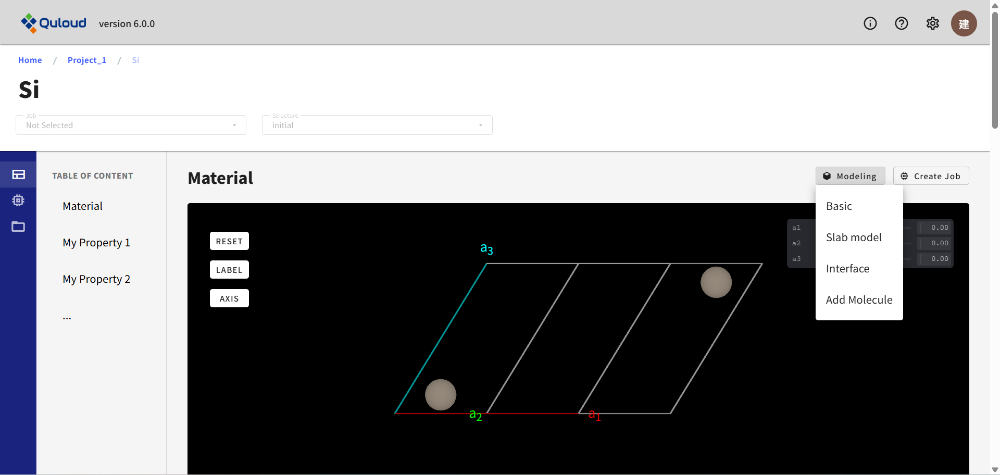
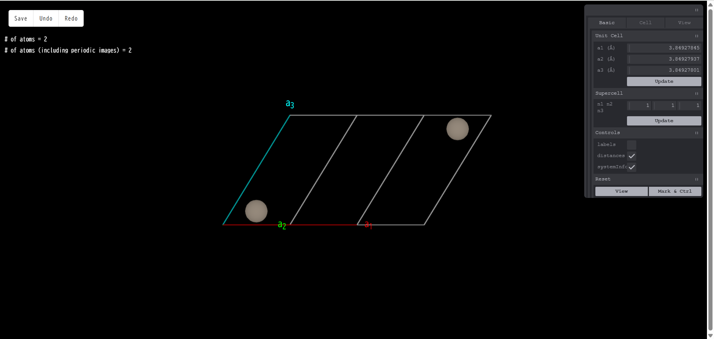
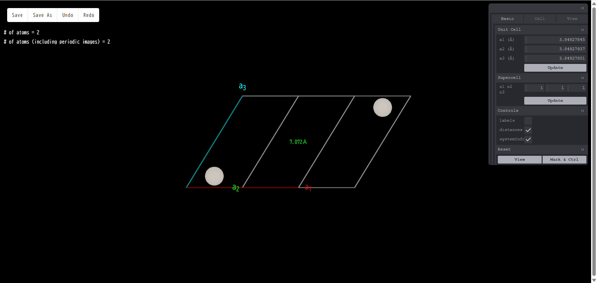
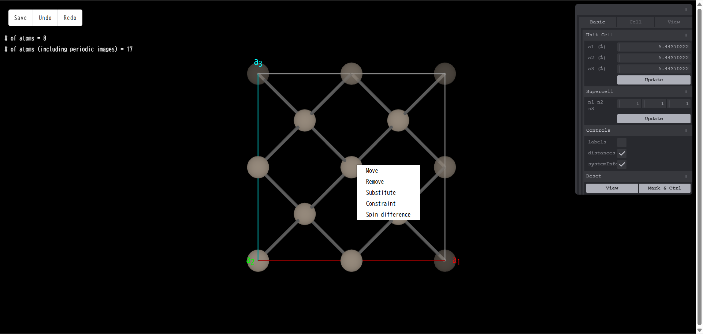
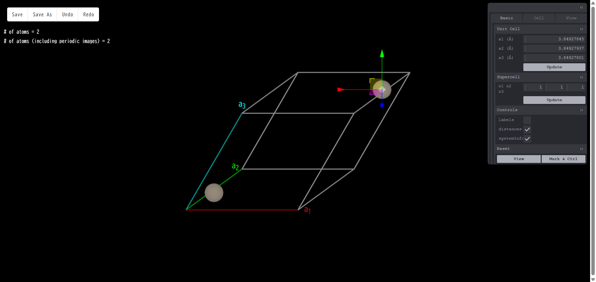
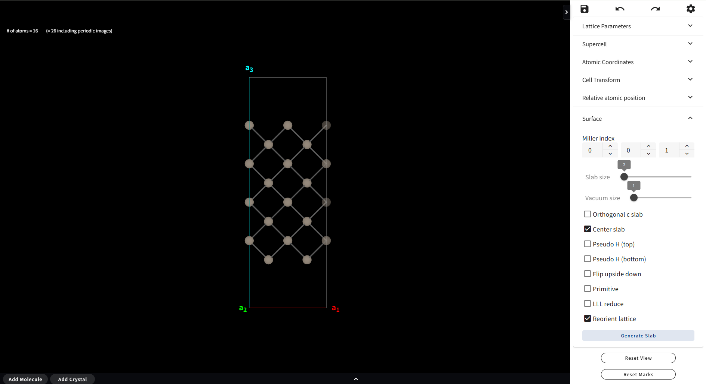

==============================
原子構造モデリング
==============================
右側のメニューの「Modeling」をクリックすると、モデリングのタイプを選択するメニューが現れます。
現在

-	Basic（セル変形、スーパーセル、原子削除、置換、移動）
-	Slab model（表面スラブモデル）
-	Interface（界面モデル）
-	Add Molecule（表面分子吸着）
-	Add Cell（孤立分子からスーパーセルモデルを作る）

というタイプのモデリングが可能です。以下で各モデリング機能の説明を行います。

------------------------------------
基本モデリング（Basic）
------------------------------------

下図はモデリングの基本画面です。こちらはBasicモデリングに限らず、
他のモデリングでも基本的な操作は同様の画面で行います。表示されている原子モデルは、
標準的なマウス操作により、回転、拡大・縮小、平行移動が可能です。右側にあるツール群を使って、
原子の追加、削除、置換、スーパーセルの作成、表面スラブモデルの作成等を行い、
最後に左上にある「Save」ボタンを押すと、作成した原子モデルが一つのジョブとして登録されます。
以下で、モデリング画面にあるツール群やボタンの説明を行います。

原子をクリック（左クリック）すると、
クリックした原子の色が変わりマーキングされます。2 個以上の原子をマーキングすると、
マーキングされた原子間の距離が表示されます。

原子上で右クリックをした場合、選択した原子を削除するか、
または別の元素に置換するかの選択メニューが現れます。

「削除 (Remove)」を選択した場合はその原子がモデルから消え、
「置換 (Substitute)」を選択した場合は周期律表が現れ、その中から選んだ元素に置換されます。
さらに、初期スピン差、構造最適化時の原子移動の拘束条件
（動く方向を制限したり、完全に動かさないようにしたり）といった設定も可能です。
また表面スラブモデル作成（後述）で付加できる終端用の擬水素原子については、上記に加えて、
結合長と電荷の設定も可能になります。
「移動 (Move)」を選択すると、選択した原子の上に赤、青、緑の３本の矢印が表示されます。
いずれかの矢印をドラッグすると、その矢印の方向に原子を動かすことができます。
また、原子をドラッグすると、方向に関係なく自由に原子を動かすことができます。

画面右側にあるモデリングのツール群について説明します。ツールのメニューには３つのタブがあり、
それぞれ

-	Basic：　基本的な操作
-	Cell：　Primitive cell ⇔ Conventional Cellの変換を行う
-	View：　原子球のボンドの太さなど、表示に関する設定

といった機能がまとめられています。以下は全てのタブについての機能の説明となっています。

Unit Cell

単位胞の長さを変更できます。変更したい数値を入力した後「Update」
ボタンを押すと新しい格子定数のモデルになります。モデリング開始時点の単位胞の長さの変更であり、
スーパーセルモデルの単位胞の長さではないことに注意してください。

Supercell

モデリング開始時点の単位胞を基準にして、a1,a2,a3 方向の単位胞の数がそれぞれ n1,n2,n3 
倍となるようなスーパーセルモデルを作成します。n1,n2,n3 を指定した後「Update」
ボタンを押すとスーパーセルが生成されます。

Controls

- labels：元素名＋通し番号の表示/非表示切り替え
- distances：マーキングされた原子間の距離の表示/非表示切り替え
- systemInfo：モデルに含まれる原子数の表示/非表示切り替え

View Setting

- AtomSphere：原子の球のサイズ変更
- BondThickness：ボンドの太さの変更
- show axis：座標軸の表示/非表示切り替え

Reset

- View：回転、拡大・縮小、平行移動されたモデルの見た目を初期値に戻します
- Mark & Ctrl：原子のマーキングを全て解除します

**********
ボタン
**********

画面左上に「Save」「Undo」「Redo」の４つのボタンがあります。
Save は作成したモデルを最後に保存するボタンです。Undo および Redo はモデリング途中の操作を戻したり、
戻すのをやめたりするボタンです。例えば、原子を 1 個追加したとき、Undo すると追加前の状態に戻ります。
追加前の状態に戻った後 Redo を押すと、再び原子が１個追加された状態になります。Undo されていない状態で 
Redo を押した場合は何も起こりません。

------------------------------------
表面スラブモデル（Slab model）
------------------------------------

このモデリングモードではツール群に「Surface」のタブが加わります。
これに切り替えると、表面スラブモデル作成のツールが現れます。制御可能なパラメータは以下の通りです。

-	Miller index（ミラー指数）
-	slab size（元になるバルク構造のユニットセルを単位とする）
-	vacuum size（単位はスラブサイズと同じ）
-	orthogonal c slab（表面に垂直な軸を c 軸とするセルを取る）
-	center slab（スラブ領域をセルの中央に配置）
-	pseudo H（表面の上部または下部を水素終端する。Z=1 以外の電荷を設定したり、表面原子との結合距離を設定することが可能）
-	flip upside down（スラブの上下を反転させる）

その他にもいくつかのパラメータが設定可能ですが、それらはすべて pymatgen（https://pymatgen.org）の 
SlabGenerator の機能に準じていますので詳しくはpymatgenのドキュメントをご参照ください。
各種設定を行なったのち「Generate Slab」ボタンを押すと、
ミラー指数だけで一意に決まらない面の選択ができる他、指定したミラー指数に対応する、
スラブモデルの構成単位となるバルク構造のいずれか一つが選択できるようになっています。

選択後、「select」ボタンを押すと、通常のモデリングに戻ります。
終端用の擬水素原子の結合長や電荷の設定は、この通常モデリングのモードで行うことができます。

-----------------------------------------
界面モデリング（Interface）（未改訂）
-----------------------------------------

.. image:: images/modeling/スクリーンショット\ 2025-03-25\ 084025.png

モデリングタイプ「Interface」を選択すると上図のような設定メニューが現れます。
詳細画面で見ている物質を基板（Substrate）として、その上でフィルム（Film）となる物質の結晶構造を、
外部ファイルよりアップロードするという作成法になります。
格子定数なるべくマッチさせるように界面構造の候補を探すため、
探索範囲を面積で指定する必要もあります。設定メニューでは

-	フィルムを構成する結晶構造ファイルのアップロードまたは既存のJOBあるいはMATERIALの選択
-	フィルムおよび基板のミラー指数、および膜厚の指定
-	界面間の初期ギャップ
-	真空領域のサイズ
-	界面構造の候補を探索する面積の範囲

といった設定が可能です。設定後「GENERATE」ボタンを押すと界面構造の候補が一覧表示されます
（サイズの小さいモデルから順に表示されます）。
この中からターゲットとする構造を選択し（複数選択可）「REGISTER」を押すと、
選択した界面構造が一つのジョブとして登録されます。

-----------------------------------------------------
分子挿入（Add Molecule）（未改訂）
-----------------------------------------------------

モデリングタイプ「Add Molecule」
を選択するとバルクやスラブといった周期構造に孤立分子を挿入したモデルを作成することが可能です。
「Add Molecule」を選択すると図 48のようなメニューが現れ、
ここでは孤立分子の構造ファイルをアップロードする、あるいはQuloudに登録されている孤立分子の構造から選ぶ、
という方法で作成が可能です。分子構造を選択し「ADD」を押すとモデリング画面に遷移します。
図 49ではSiスラブモデルに窒素分子を追加するモデリングの例を示します。
追加した分子に矢印が表示されており、この矢印に沿って分子をモデル内で平行移動させることができます。
また画面左上の「Rotate Molecule」のボタンを押すと、今度は分子を回転させるモードになります。
「Translate Molecule」を押すと再び平行移動モードに戻ります。

-----------------------------------------------------
孤立分子のスーパーセル（Add Cell）（未改訂）
-----------------------------------------------------

モデリングタイプ「Add Cell」を選択するとモデリング画面が開きます。
ここでは、例えばxyz形式のような、ユニットセルの情報を持たない孤立分子の構造に、
ユニットセルの情報を追加してスーパーセルモデルを作成することができます。スーパーセルモデルにすると、
周期系専用の第一原理計算ソフト等を用いて、分子に対する計算が可能になります。
