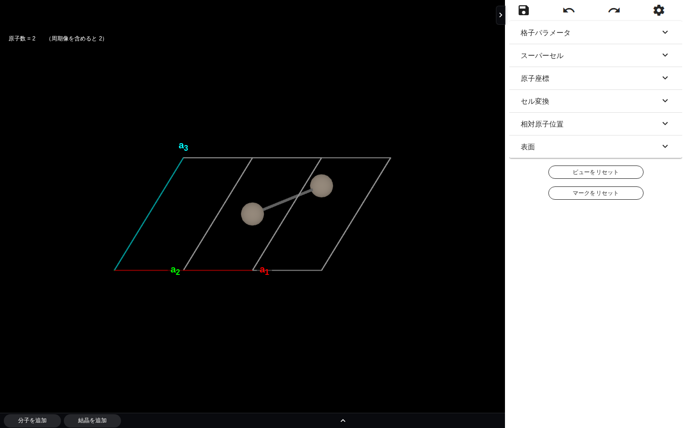
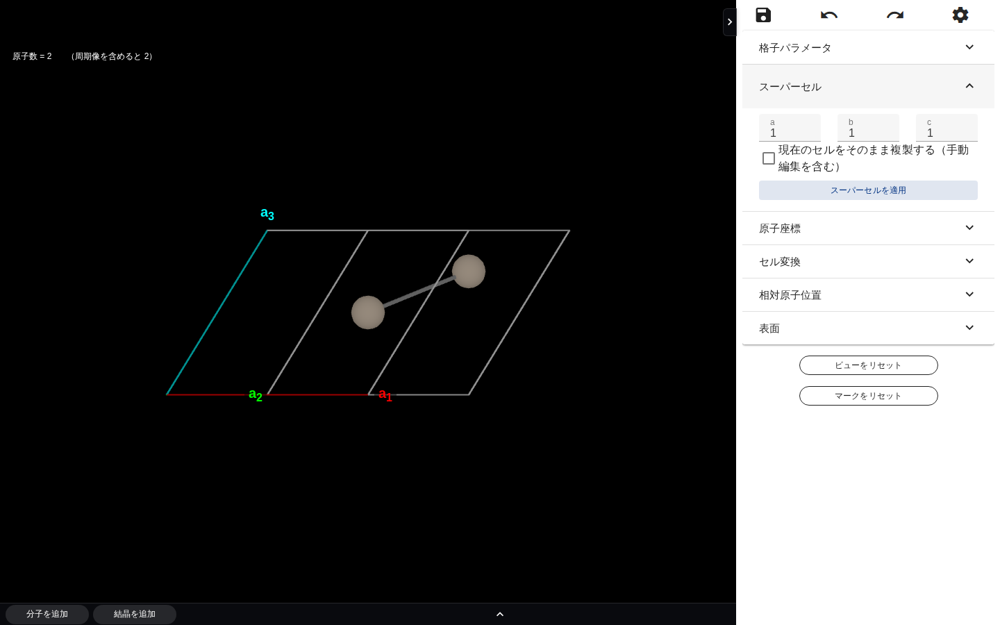
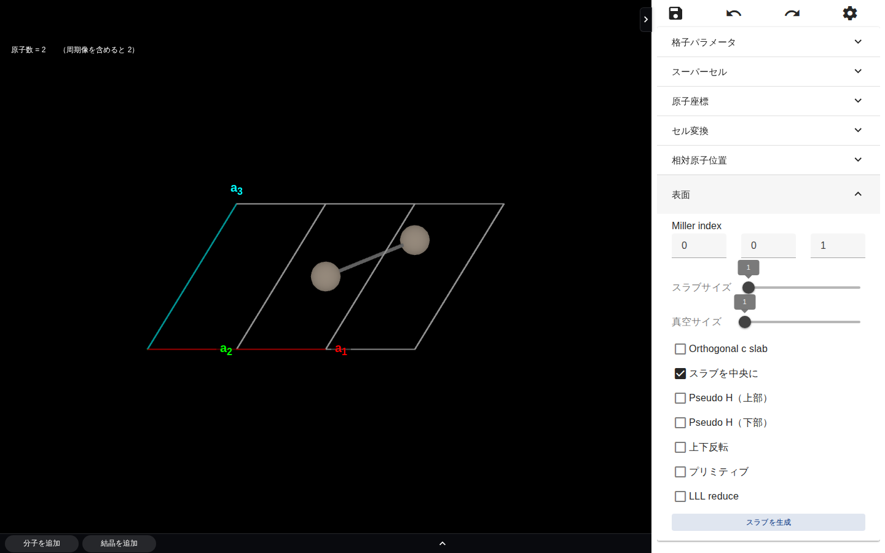
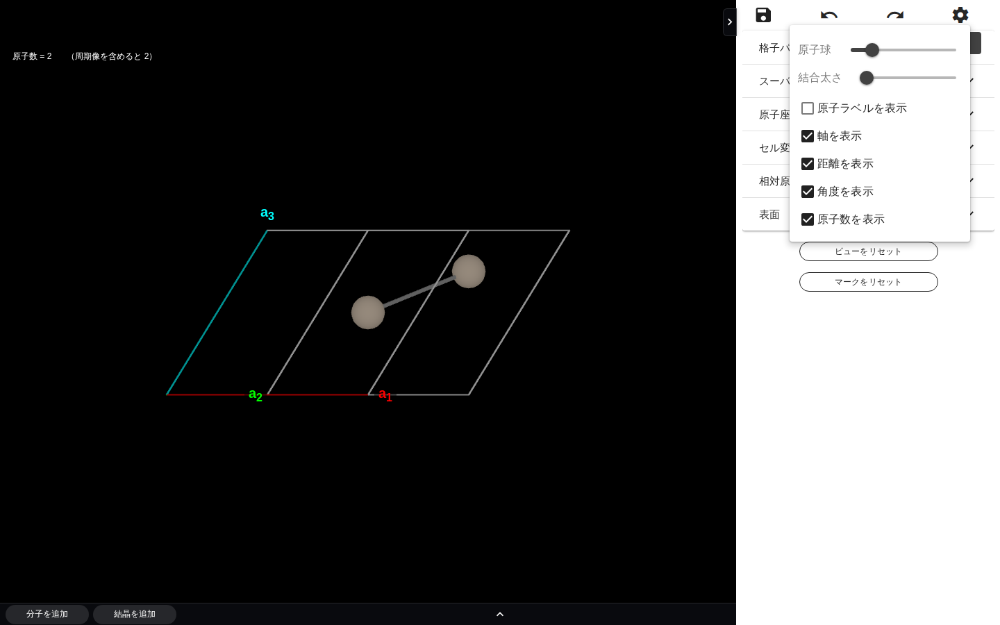
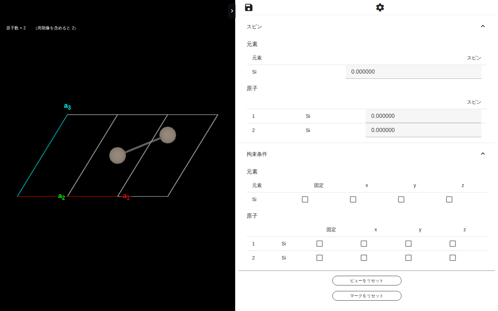

.. _modeling-section:

==============================
モデリング
==============================

.. note::

   本章は Quloud Ver.7.0 を対象としています。記載内容の確認日は 2026 年 9 月 14 日です。

|
|

------------------------------
概要
------------------------------

モデラーは、登録済みの Material の原子構造を加工して**別の Material を作る**画面です。
スーパーセルの作成、表面（スラブ）の切り出し、原子の置換・削除、分子や結晶の追加などが
行えます。

モデラーは**別のタブで開きます。** 加工した結果は「保存」で Material として登録され、
元の Material はそのまま残ります（上書きも選べます）。

|
|

------------------------------
前提
------------------------------

-   加工したい Material が登録されていること（:doc:`jobs_and_models_atom` の章）
-   テナントが利用制限中でないこと（:doc:`runjob` の章）

|
|

------------------------------
操作手順
------------------------------

|

##############################################
1. モデラーを開く
##############################################

Material 詳細画面の「プロパティ」で、「Initial Structure」の右にある「モデリング」を
押します（:doc:`jobdetail` の章）。**別のタブでモデラーが開きます。**

   モデラー（結晶を開いた状態）

-   **左の領域**\ が 3D ビューです。ドラッグで回転、マウスホイールで拡大・縮小します
-   **右のパネル**\ が操作パネルです。見出しを押すと開きます
-   **下部**\ に「分子を追加」「結晶を追加」があります（結晶を開いたときのみ両方）

|

##############################################
2. 構造を加工する
##############################################

右のパネルの各項目で構造を変えます。項目は開いた構造の種類によって変わります。

.. list-table::
   :header-rows: 1
   :widths: 24 76

   * - 項目
     - できること
   * - 格子パラメータ
     - 格子定数と角度を変えます。「原子を固定」を選ぶと、セルを変えても原子の
       絶対座標を保ちます。
   * - スーパーセル
     - 単位セルに対する a・b・c 方向の倍率を指定してセルを拡張します。原子の追加・
       削除やセルの変更を行うと、その時点の構造が新しい単位セルになります。
   * - 原子座標
     - 原子ごとの座標を数値で編集します。
   * - スピン
     - 元素ごと・原子ごとの初期スピンを指定します。
   * - 拘束条件
     - 元素ごと・原子ごとに、動かさない方向（x / y / z）を指定します。
   * - セル変換
     - プリミティブセルと慣用セルを切り替えます。
   * - 相対原子位置
     - セル内の原子全体を a1 / a2 / a3 方向にずらします。
   * - 表面
     - Miller 指数とスラブ・真空のサイズを指定してスラブを切り出します。
   * - 分子を追加 / 界面 / セルを追加 / Packmol
     - 別の構造を組み合わせます。開いた構造や追加した内容によって現れます。

|

++++++++++++++++++++++++++++++
スーパーセルを作る
++++++++++++++++++++++++++++++

   スーパーセル

a・b・c に**単位セルに対する倍率**\ を入れて「スーパーセルを適用」を押します。
最初は読み込んだ構造そのものが単位セルで、a・b・c にはいずれも 1 が入っています。

原子の追加・削除・置換や格子パラメータの変更など、構造に手を加えると、**その時点の
構造が新しい単位セル**\ になり、a・b・c の表示は 1 に戻ります。そこから改めて倍率を
指定すると、手を加えたあとの構造を単位として複製されます。

すでに適用済みの倍率と同じ数字を指定した場合、「スーパーセルを適用」は押せません。
より小さい倍率を指定すれば単位セル側へ縮小することもできます（たとえば 3×3×3 の
状態から 1×1×1 を指定すると、単位セルそのものに戻ります）。

|

++++++++++++++++++++++++++++++
表面（スラブ）を切り出す
++++++++++++++++++++++++++++++

   表面（スラブ生成）

Miller 指数とスラブサイズ・真空サイズを指定して「スラブを生成」を押します。
条件に合う候補が複数見つかった場合は「スラブ候補」のツールバーが現れ、
「前へ」「次へ」で切り替えてから「選択を確定」を押します。

|

++++++++++++++++++++++++++++++
原子を個別に操作する
++++++++++++++++++++++++++++++

3D ビューで原子を右クリックすると、「移動」「削除」「置換」のメニューが出ます。
複数の原子にまとめて適用することもできます。

|

##############################################
3. 表示を調整する
##############################################

右上の歯車から表示の設定を変えられます。構造そのものは変わりません。

   表示設定

「ビューをリセット」で視点を、「マークをリセット」で選択した原子のマークを戻します。

|

##############################################
4. 保存する
##############################################

左上の保存アイコンを押すと「モデルを保存」ダイアログが開きます。

   「モデルを保存」ダイアログ

.. list-table::
   :header-rows: 1
   :widths: 20 80

   * - 項目
     - 内容
   * - 名前
     - 必須です。もとの Material の名前が初期値として入ります。
       新しい Material として保存する場合は変えてください。
   * - 説明
     - 任意です。
   * - 上書き
     - チェックを入れるともとの Material を書き換えます。入れない場合は
       **新しい Material** として登録されます。

「保存」を押すと確認のメッセージが出ます。「OK」で保存され、
**モデラーのタブは閉じ、元のタブが保存先の Material 詳細画面に切り替わります。**

新しい Material として保存した場合、その Material 詳細画面の「マテリアル」に
もとの Material が「作成元マテリアル」として記録されます（:doc:`jobdetail` の章）。

|
|

------------------------------
原子ごとの拘束条件・初期スピン
------------------------------

同じモデラーは、計算 Job の入力を指定する画面としても使われます。
「ジョブ作成」フォームの「拘束条件を設定」「初期スピンを設定」を押すと、
モデラーが別のタブで開きます（:doc:`calculation` の章）。

   サイトプロパティ設定

-   表示されるのは「スピン」と「拘束条件」だけです。構造は変えられません
-   保存アイコンは「保存して戻る」です。**Material は作られません。**
    指定した内容がジョブ作成フォームに戻り、その Job の入力になります

|
|

------------------------------
注意事項
------------------------------

-   **モデラーは別のタブで開きます。** ブラウザがポップアップをブロックしている場合は
    開きません。ブロックを解除してください。
-   保存するまで加工の結果は残りません。タブを閉じると失われます。
-   「元に戻す」「やり直す」で操作をたどれますが、保存後は戻せません。
-   原子数が多い構造では、原子ごとの表が出ずに元素ごとの表だけになります。
