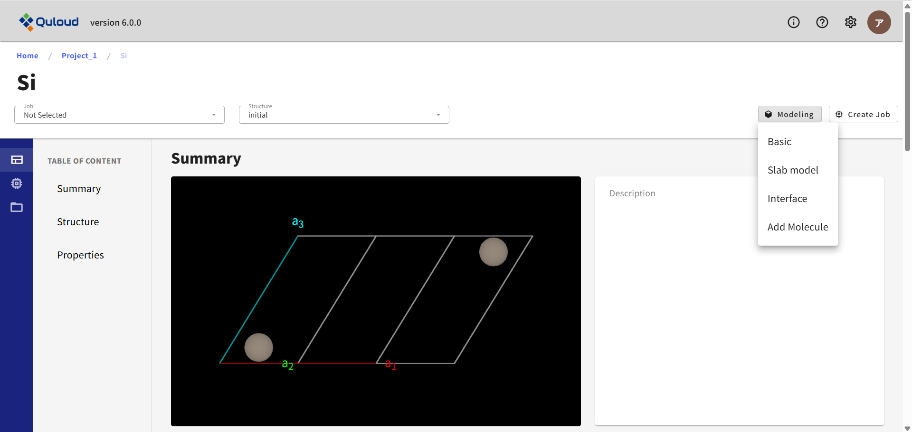
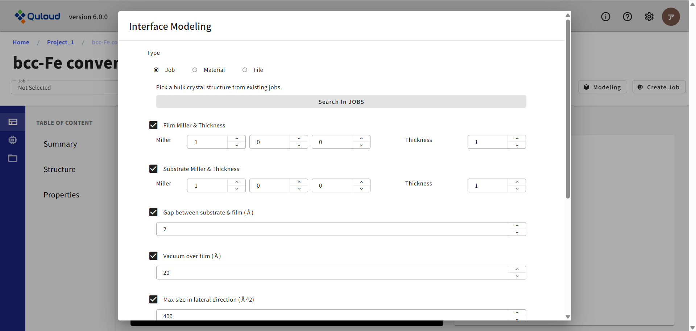
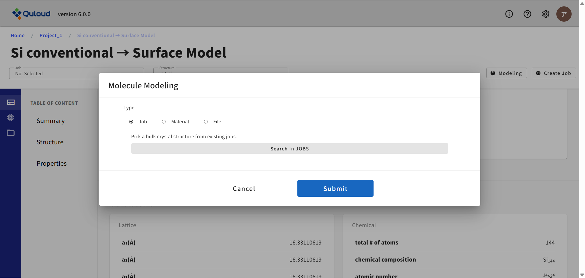
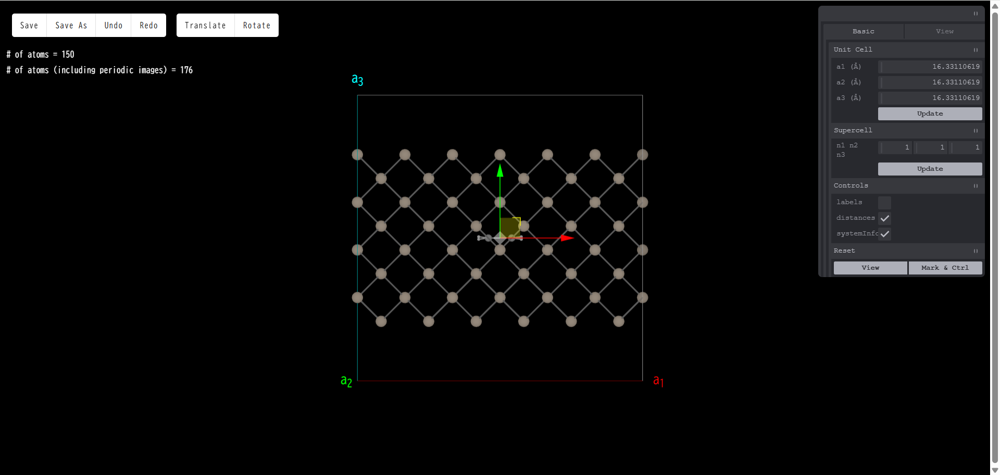

==============================
原子構造モデリング
==============================
右側のメニューの「Modeling」をクリックすると、モデリングのタイプを選択するメニューが現れます。
現在

-	Basic（セル変形、スーパーセル、原子削除、置換、移動）
-	Slab model（表面スラブモデル）
-	Interface（界面モデル）
-	Add Molecule（表面分子吸着）
-	Add Cell（孤立分子からスーパーセルモデルを作る）

というタイプのモデリングが可能です。以下で各モデリング機能の説明を行います。

------------------------------------
基本モデリング（Basic）
------------------------------------

下図はモデリングの基本画面です。

.. image:: images/screenshot_0014.png

こちらは Basic モデリングに限らず、他のモデリングでも基本的な操作は同様の画面で行います。
表示されている原子モデルは、以下のマウス操作で、回転、拡大・縮小、平行移動が可能です。

-	回転：　ドラッグ
-	拡大・縮小：　マウスホイール
-	平行移動：　「Ctrl」キーを押しながらドラッグ

また、ブラウザのリロードボタン（更新ボタン）をクリックすると、モデルを変更前の状態に戻すことができます。

右側にあるツール群を使って、原子の追加、削除、置換、スーパーセルの作成、表面スラブモデルの作成等を行い、
最後に左上にある「Save」ボタンを押すと、作成した原子モデルが一つの Material として登録されます。

以下で、画面右側にあるモデリングのツール群について説明します。ツールのメニューには３つのタブがあり、
それぞれ

-	Basic：　基本的な操作
-	Cell：　Primitive Cell ⇔ Conventional Cell の変換を行う
-	View：　原子球のボンドの太さなど、表示に関する設定

といった機能がまとめられています。
（モデリングの種類によっては、タブの種類が異なる場合があります。詳細は後ほど説明します。）
以下は全てのタブについての機能の説明となっています。

Unit Cell

単位胞の長さを変更できます。変更したい数値を入力した後「Update」ボタンを押すと新しい格子定数のモデルになります。
例として、格子ベクトル a3 の数値を大きくすると、以下のようになります。

.. image:: images/screenshot_0079.png

ここでの数値変更は、モデリング開始時点の単位胞の長さの変更であり、
スーパーセルモデルの単位胞の長さではないことに注意してください。

Supercell

モデリング開始時点の単位胞を基準にして、a1,a2,a3 方向の単位胞の数が
それぞれ n1,n2,n3 倍となるようなスーパーセルモデルを作成します。
n1,n2,n3 を指定した後「Update」ボタンを押すとスーパーセルが生成されます。
例として n3 を５とすると、以下のようになります。

.. image:: images/screenshot_0080.png

Controls

- labels：チェックを入れると、各原子に元素名＋通し番号のラベリングが施されます。

.. image:: images/screenshot_0081.png

- distances：原子をクリック（左クリック）すると、クリックした原子の色が変わりマーキングされます。チェックを入れた状態で、２個以上の原子をクリックすると、マーキングされた原子間の距離が表示されます。

.. image:: images/screenshot_0015.png

- systemInfo：モデルに含まれる原子数の表示/非表示を切り替えます。

.. image:: images/screenshot_0082.png

Cell Transform

Primitive Cell と Conventional Cell の切り替えを行います。「Conventional」を選択すると以下のようになります。

.. image:: images/screenshot_0084.png

View Setting

- AtomSphere：原子の球のサイズが変更できます。

.. image:: images/screenshot_0083.png

- BondThickness：ボンドの太さが変更できます。

.. image:: images/screenshot_0085.png

- show axis：座標軸の表示/非表示を切り替えます。

.. image:: images/screenshot_0086.png

Reset

- View：回転、拡大・縮小、平行移動されたモデルの見た目を初期値に戻します
- Mark & Ctrl：原子のマーキングを全て解除します

原子以外の場所で右クリックすると、原子を追加する「Add atom」メニューが現れます。

.. image:: images/screenshot_0087.png

「Add atom」をクリックすると、新しいウィンドウで元素周期表が現れます。ここで、どの元素の原子を追加するか選択します。

.. image:: images/screenshot_0088.png

例として「Zn」をクリックすると、本当に Zn 原子を追加するかどうかの確認画面が出ます。

.. image:: images/screenshot_0089.png

もう一度「Zn」をクリックすると、モデルに Zn 原子が追加されます。

.. image:: images/screenshot_0090.png

原子上で右クリックをした場合、次のようなメニューが現れます。

.. image:: images/screenshot_0016.png

「移動 (Move)」を選択すると、選択した原子の上に赤、青、緑の３本の矢印が表示されます。

いずれかの矢印をドラッグすると、その矢印の方向に原子を動かすことができます。

.. image:: images/screenshot_0091.png

また、原子をドラッグすると、方向に関係なく自由に原子を動かすことができます。

.. image:: images/screenshot_0092.png

「削除 (Remove)」を選択した場合は、その原子がモデルから消えます。

.. image:: images/screenshot_0093.png

「置換 (Substitute)」を選択した場合は、「Add atom」と同様に、新しいウィンドウで元素周期表が現れます。
ここで、どの元素の原子で置換するか選択します。

.. image:: images/screenshot_0094.png

例として「Fe」をクリックすると、本当に Fe 原子で置換するかどうかの確認画面が出ます。

.. image:: images/screenshot_0095.png

もう一度「Fe」をクリックすると、 Fe 原子で置換されます。

.. image:: images/screenshot_0096.png

さらに、初期スピン差、構造最適化時の原子移動の拘束条件
（動く方向を制限したり、完全に動かさないようにしたり）といった設定も可能です。
また表面スラブモデル作成（後述）で付加できる終端用の擬水素原子については、上記に加えて、
結合長と電荷の設定も可能になります。

**********
ボタン
**********

画面左上に「Save」「Undo」「Redo」の３つのボタンがあります。

「Save」は作成したモデルを Material として保存するボタンです。クリックすると、次のようなメニューが開きます。

.. image:: images/screenshot_0097.png

ここで、保存するモデルの名前を入力します。デフォルトでは、モデルは新規の Material として保存されますが、
「Overwrite」にチェックを入れると、既存のモデルに上書き保存されます。
（Interface モデリングには、「Overwrite」機能はありません。）

「Submit」をクリックすると、「Save this model ?」という確認画面が表示されます。

.. image:: images/screenshot_0098.png

「OK」をクリックすれば保存が完了し、新しく保存されたモデルの Material 詳細画面に移ります。

.. image:: images/screenshot_0099.png

Undo および Redo はモデリング途中の操作を戻したり、戻すのをやめたりするボタンです。
例えば、原子を 1 個追加したとき、Undo すると追加前の状態に戻ります。
追加前の状態に戻った後 Redo を押すと、再び原子が１個追加された状態になります。
Undo されていない状態で Redo を押した場合は何も起こりません。

------------------------------------
表面スラブモデル（Slab model）
------------------------------------

このモデリングモードでは、ツール群に「Cell」タブがなく、代わりに「Surface」タブが加わります。
これに切り替えると、表面スラブモデル作成のツールが現れます。

各種設定を行なったのち「Generate Slab」ボタンを押すと、
ミラー指数だけで一意に決まらない面の選択ができる他、指定したミラー指数に対応する、
スラブモデルの構成単位となるバルク構造のいずれか一つが選択できるようになっています。

.. image:: images/screenshot_0018.png

選択後、「select」ボタンを押すと、通常のモデリングに戻ります。

.. image:: images/screenshot_0110.png

制御可能なパラメータは以下の通りです。

Slab Generator

-	Miller index：真空領域に露出する表面のミラー指数を指定します。例えば、Si のコンベンショナルセルで表面スラブモデルを作成する際、ミラー指数を (001) とし、「Generate Slab」を押すと、スラブモデルの側面図は次のようになります。

 .. image:: images/screenshot_0100.png

 上面図は次のようになります。

 .. image:: images/screenshot_0101.png

 一方で、ミラー指数を (111) とし、「Generate Slab」を押すと、真空領域に露出する表面が変わり、側面図は次のようになります。

 .. image:: images/screenshot_0102.png

 上面図は次のようになります。 

 .. image:: images/screenshot_0103.png

-	slab size：スラブ層の厚さを指定します。元になるバルク構造のユニットセルを単位とします。例えば、スラブ層厚さを３とし、「Generate Slab」を押すと、次のようになります。

 .. image:: images/screenshot_0104.png

-	vacuum size：真空層の厚さを指定します。単位はスラブサイズと同じです。例えば、真空層厚さを３とし、「Generate Slab」を押すと、次のようになります。

 .. image:: images/screenshot_0105.png

-	orthogonal c slab：表面に垂直な軸を c 軸とするセルを取ります。
 
 **この機能では、ベクトル a3 が表面に対して厳密に垂直になるよう、強制的にセルを取り直すため、原子構造が変化してしまう場合がありますのでご注意ください。**
 
 例として、Si の Primitive セルをバルク構造とするスラブモデルでは、下図のように、格子ベクトル a3 は表面に対して垂直にはなりません。

 .. image:: images/screenshot_0106.png

 ここで「orthogonal c slab」にチェックを入れ、「Generate Slab」を押すと、表面に垂直になるよう、ベクトル a3 が取り直されます。

 .. image:: images/screenshot_0107.png

-	center slab：スラブ領域をセルの中央に配置します。もともとチェックが入っています。

 .. image:: images/screenshot_0108.png

 チェックを外し、「Generate Slab」を押すと、次のようになります。

 .. image:: images/screenshot_0109.png

-	pseudo H：終端用の擬水素原子を、表面の上部または下部に追加します。Z=1 以外の電荷を設定したり、表面原子との結合距離を設定することが可能です。

 .. image:: images/screenshot_0111.png
 .. image:: images/screenshot_0112.png

-	flip upside down：スラブモデルの上下を反転させます。例として、以下のようなモデルを作成します。

 .. image:: images/screenshot_0113.png

 ここで「flip upside down」にチェックを入れ、「Generate Slab」を押すと、次のようになります。

 .. image:: images/screenshot_0114.png

Detailed Settings

-	primitive：スラブモデルを primitive セルに変換します。例として、以下のようなモデルを作成します。

 .. image:: images/screenshot_0115.png

 上面図は以下の通りです。

 .. image:: images/screenshot_0116.png

 ここで「primitive」にチェックを入れ、「Generate Slab」を押すと、側面図は次のようになります。

 .. image:: images/screenshot_0117.png

 上面図を見ると、モデルが primitive セルに変換されていることが分かります。

 .. image:: images/screenshot_0118.png

-	lll_reduce：「orthogonal c slab」とは異なり、原子構造は変化させずに、ベクトル a3 を表面になるべく垂直にとる機能です。例として、以下のようなモデルを作成します。

 .. image:: images/screenshot_0119.png

 ここで「lll_reduce」にチェックを入れ、「Generate Slab」を押すと、ベクトル a3 が垂直に近づいています。

 .. image:: images/screenshot_0120.png

-	reorient：

その他にもいくつかのパラメータが設定可能ですが、それらはすべて pymatgen（https://pymatgen.org）の 
SlabGenerator の機能に準じていますので、詳しくは pymatgen のドキュメントをご参照ください。

-----------------------------------------
界面モデリング（Interface）
-----------------------------------------

モデリングタイプ「Interface」を選択すると、下図のような設定メニューが現れます。

.. image:: images/screenshot_0121.png

詳細画面で見ている物質を基板（Substrate）として、その上でフィルム（Film）となる物質の結晶構造を、
既存の Material から選択してモデルを作成します。
フィルム、基板表面の格子定数をなるべくマッチさせるように界面構造の候補を探すため、
探索範囲を面積で指定する必要もあります。設定メニューでは

-	フィルムを構成する結晶構造ファイルのアップロードまたは既存の Job/Material の選択
-	フィルムのミラー指数、および膜厚の指定（Film Miller & Thickness）
-	基板のミラー指数、および膜厚の指定（Substrate Miller & Thickness）
-	フィルム、基板間の初期ギャップ（Gap between substrate & film）
-	真空領域のサイズ（Vacuun over film）
-	界面構造の候補を探索する面積の範囲（Max size in lateral direction）
-	界面構造の候補を探索する際に、フィルムと基板の面積のずれをどこまで許容するかの範囲（Max area ratio tolerance）
-	界面構造の候補を探索する際に、フィルムと基板の格子ベクトル長さのずれをどこまで許容するかの範囲（Max length tolerance）
-	界面構造の候補を探索する際に、フィルムと基板の格子ベクトル間角度のずれをどこまで許容するかの範囲（Max angle tolerance）

といった設定が可能です。設定後「Submit」ボタンを押すと界面構造の候補が一覧表示されます
（サイズの小さいモデルから順に表示されます）。

.. image:: images/screenshot_0122.png

この中からターゲットとする構造を選択し（複数選択可）「Modeling」を押すと、
選択した界面構造のモデリング画面に遷移します。

.. image:: images/screenshot_0123.png

-----------------------------------------------------
分子挿入（Add Molecule）
-----------------------------------------------------

モデリングタイプ「Add Molecule」を選択すると、バルクやスラブといった周期構造に孤立分子を挿入したモデルを作成することが可能です。
「Add Molecule」を選択すると下図のようなメニューが現れます。

ここでは Quloud に登録されている孤立分子の構造から選択してモデルを作成します。分子構造を選択し「Add」を押すとモデリング画面に遷移します。
下図では、Siスラブモデルにエチレン分子を追加するモデリングの例を示します。

追加した分子には赤、青、緑の３本の矢印が表示されています。

.. image:: images/screenshot_0124.png

いずれかの矢印をドラッグすると、その矢印の方向に分子を平行移動させることができます。

.. image:: images/screenshot_0125.png

また、分子をドラッグすると、方向に関係なく自由に分子を平行移動させることができます。

.. image:: images/screenshot_0126.png

また画面左上の「Rotate」のボタンを押すと、今度は分子を回転させるモードになります。
赤、青、緑、黄の４つの円が表示されています。

.. image:: images/screenshot_0045.png

いずれかの円をドラッグすると、その円に沿って分子を回転移動させることができます。

.. image:: images/screenshot_0127.png

それ以外の場所をドラッグすると、方向に関係なく自由に回転移動させることができます。

.. image:: images/screenshot_0128.png

「Translate」を押すと再び平行移動モードに戻ります。

-----------------------------------------------------
孤立分子のスーパーセル（Add Cell）（未改訂）
-----------------------------------------------------

モデリングタイプ「Add Cell」を選択するとモデリング画面が開きます。
ここでは、例えばxyz形式のような、ユニットセルの情報を持たない孤立分子の構造に、
ユニットセルの情報を追加してスーパーセルモデルを作成することができます。スーパーセルモデルにすると、
周期系専用の第一原理計算ソフト等を用いて、分子に対する計算が可能になります。
