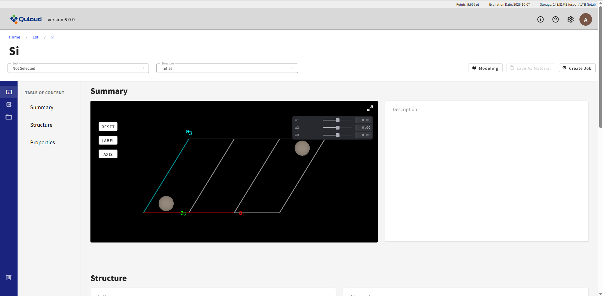
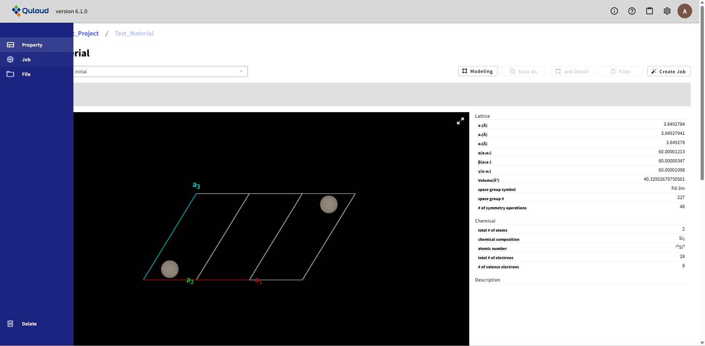
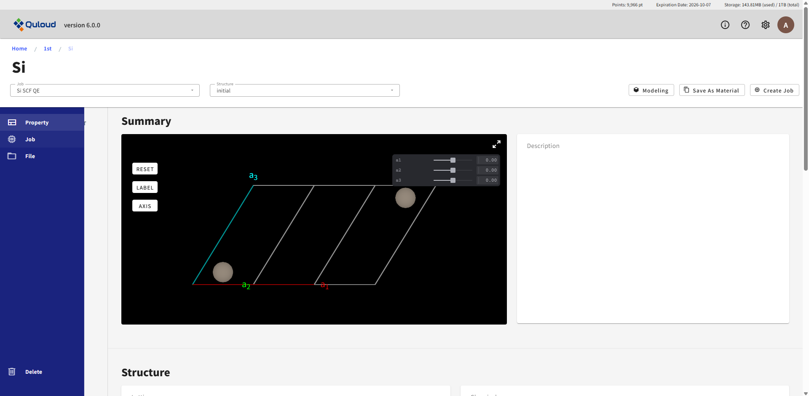
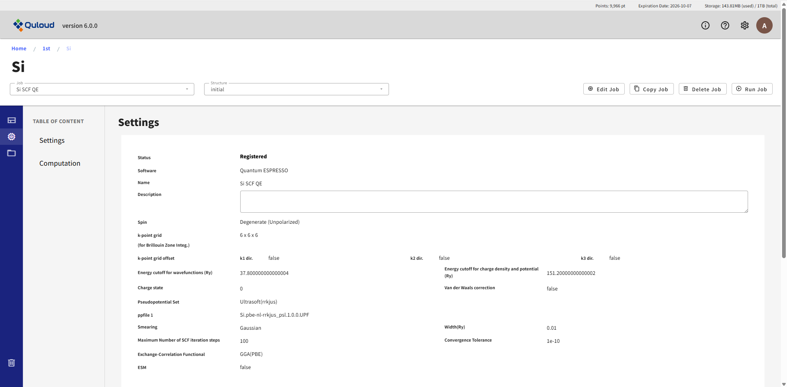
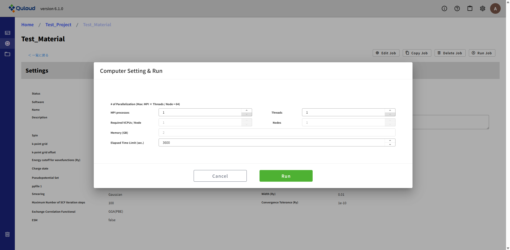
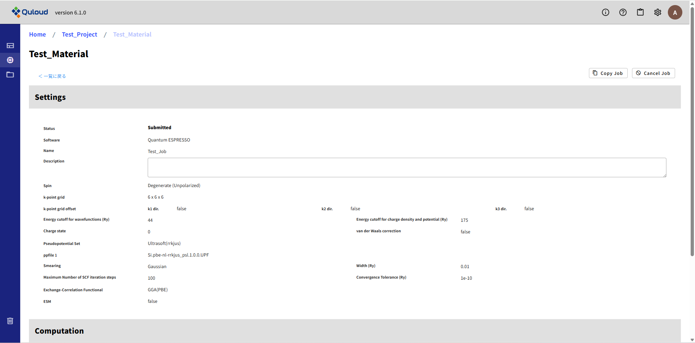
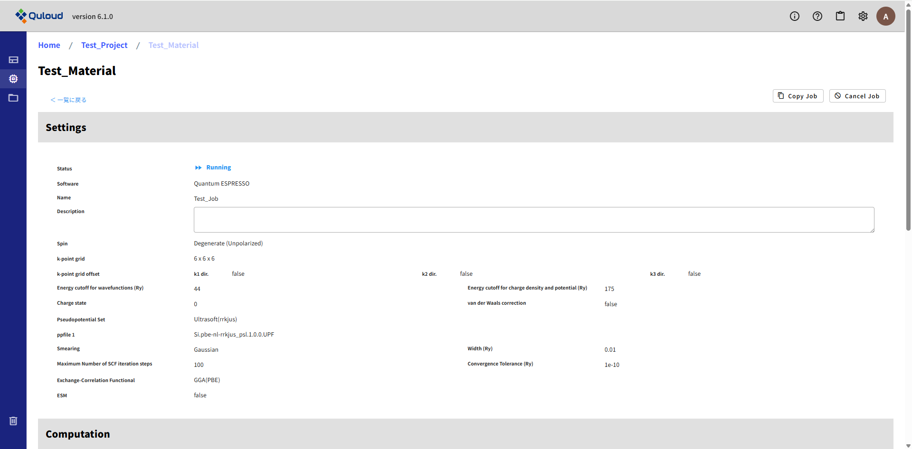
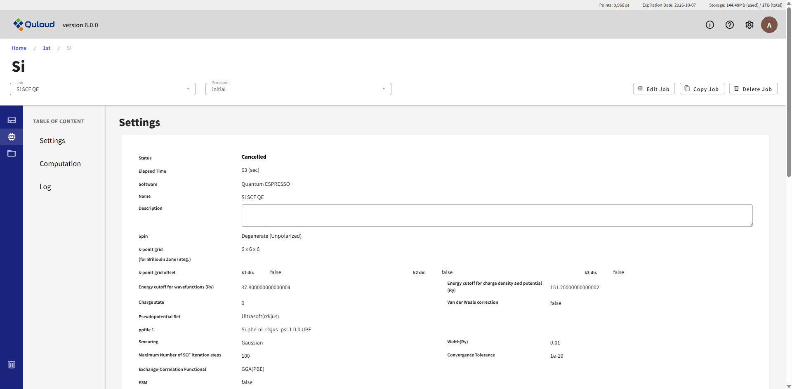
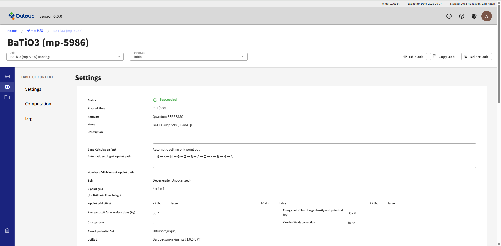

==============================
計算 Job の実行
==============================

------------------------------------------------------------------------
Job の実行とキャンセル
------------------------------------------------------------------------

前章で説明した方法で Job の登録を行うと、当該 Job が TOP 画面の Job 一覧に追加されます。

.. image:: images/screenshot_0146.png

登録直後は、Job の Status は Registered となっています。
Job の名前をクリックすると、関連する Material の詳細画面に移ります。

画面左上の「Job」タブで当該 Job を選択します。

左サイドメニューで「Job」を選択します。

すると、Job 登録時に設定した計算条件が表示されます。

Job を実行するには、右上の「Run Job」ボタンをクリックします。クリックすると、下図のようなダイアログが表示されます。

MPI 数、スレッド数、ノード数、計算時間の上限（Elapsed Time Limit (sec.)）を設定して「Submit」ボタンをクリックすると、Job が実行されます。
Job のデータが計算サーバに伝達されると、Status が「Submitted」になります。

計算が始まると、Job の Status が Running になります。

Job の実行をキャンセルする場合は、右上の「Cancel Job」ボタンをクリックします。
クリックすると、Status が Cancelled になります。

計算が終了し、Job が正常に完了した場合は Status が Succeeded になり、何らかの異常があった場合は Failed になります。

.. image:: images/screenshot_0155.png

------------------------------------------------------------------------
Job の実行によるポイント消費
------------------------------------------------------------------------

Job の実行では、以下の計算式に従ってポイントが消費されます。

**「消費ポイント」＝「Required VCPU size」×「計算時間 (h)」× 20**

「Required VCPU size」は、「Run Job」ボタンをクリックした後に表示されるダイアログで確認できます。

.. image:: images/screenshot_0156.png

「Required VCPU size」は、ここで設定する MPI 数、スレッド数、ノード数により変化します。

また、計算時間は単位が時間 (h) なので、例えば 6 分（360 秒）の場合は 0.1 となります。
計算に費やした時間は、下図の「Elapsed Time」に表示されます。

ここでは単位が秒 (sec) で表示されていますので、上の計算式に当てはめる際には、数値を 3600 で割って代入してください。

なお、「Submit」ボタンで Job の実行を開始してから、Status が Succeeded（または Failed）になるまでの時間には、
Job 情報を計算サーバに伝達したり、計算結果をサーバから取得したりする時間も含まれているため、
「Elapsed Time」で表示される実際の計算時間とは異なりますのでご注意ください。