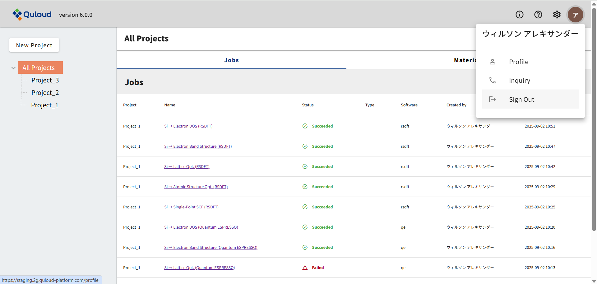

========================================
サインイン・サインアウト
========================================

サインアップ（１章参照）したアカウントでサインインするには、まず以下の URL にアクセスしてください。

https://2g.quloud-platform.com/sign_in

すると、以下の画面に移ります。

|
|

------------------------------
サインイン
------------------------------

上図の画面で、登録したメールアドレス、設定したパスワードを入力し、「Sign In」をクリックすると、トップ画面に移ります。

.. image:: images/screenshot_0001.png

|
|

------------------------------
パスワードを忘れたときは
------------------------------

サインイン画面下部にある「Forgot password?」をクリックすると、パスワード再設定申請画面に移ります。
ここに、登録済みのメールアドレスを入力し、「送信」ボタンを押すと、メールアドレス宛に再設定フォームが送信されます。
リンクをクリックして、パスワード再設定を行ってください。

.. image:: images/screenshot_0030.png

|
|

------------------------------
お問い合わせ
------------------------------

サインイン画面下部にある「Contact us」をクリックすると、お問い合わせフォームに移ります。
名前、メールアドレス、電話番号などを入力し、お問い合わせ内容を記入して「送信」ボタンを押せば完了です。
**サインイン後のお問い合わせフォーム（１２章参照）とは異なり、確認画面はなく、いきなり送信されますのでご注意ください。**

.. image:: images/screenshot_0032.png

|
|

------------------------------
サインアウト
------------------------------

トップ画面で、ヘッダー部のユーザーのアイコンをクリックし、「Sign Out」をクリックしてください。

