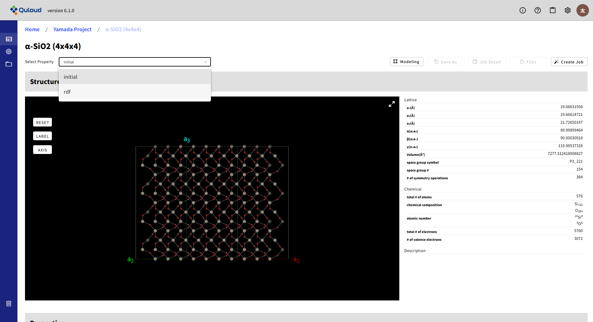
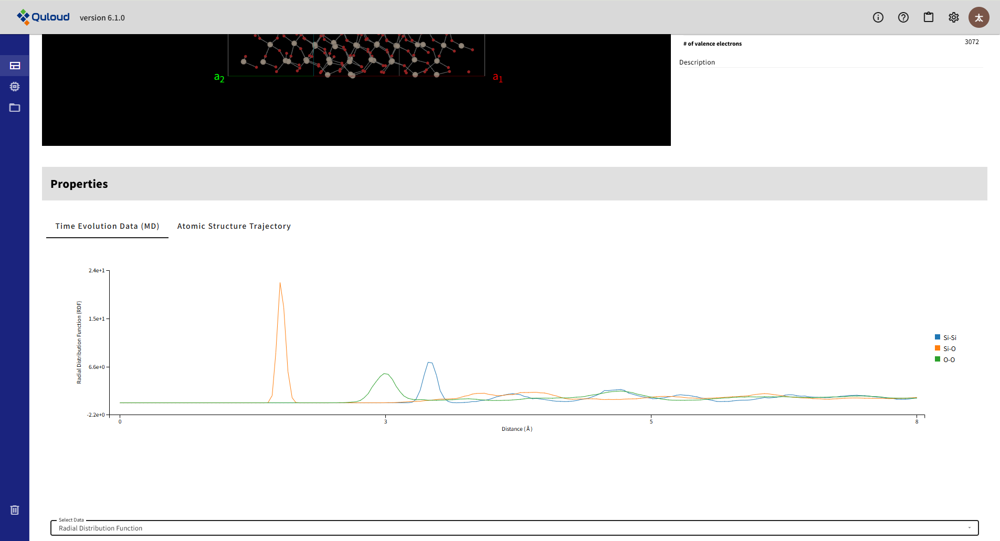

=============================================
計算結果の可視化
=============================================

計算結果は Material 詳細画面から確認できます。

.. image:: images/screenshot_0192.png

画面左上の「Job」タブで当該 Job を選択します。

次に、「Structure」タブで「final」が選択されていることを確認します。

.. image:: images/screenshot_0194.png

下にスクロールすると、計算結果が確認できます。

以下に、各 Job で取得できる計算結果をソフトウェアごとにまとめます。

|
|

------------------------------------------------------------------------
Quantum ESPRESSO
------------------------------------------------------------------------

-   Single-Point SCF

    -   Kohn-Sham Levels
    -   Brillouin Zone
    -   Total Energy Information

-   Atomic Structure Opt.

    -   Kohn-Sham Levels
    -   Brillouin Zone
    -   Total Energy Information

-   Lattice Opt.

    -   Kohn-Sham Levels
    -   Brillouin Zone
    -   Total Energy Information

-   Electron Band Structure

    -   Electron Band
    -   Effective Mass
    -   Effective Mass (Table)
    -   Kohn-Sham Levels
    -   Brillouin Zone
    -   Total Energy Information

-   Electron DOS

    -   Electron Density Of States
    -   Kohn-Sham Levels
    -   Brillouin Zone
    -   Total Energy Information

|
|

------------------------------------------------------------------------
OpenMX
------------------------------------------------------------------------

-   Single-Point SCF

    -   Total Electron Density
    -   Kohn-Sham Levels
    -   Brillouin Zone
    -   Total Energy Information

-   Atomic Structure Opt.

    -   Total Electron Density
    -   Kohn-Sham Levels
    -   Brillouin Zone
    -   Total Energy Information

-   Lattice Opt.

    -   Volume Vs Energy
    -   Total Electron Density
    -   Kohn-Sham Levels
    -   Brillouin Zone
    -   Total Energy Information

-   Electron Band Structure

    -   Electron Band
    -   Effective Mass
    -   Effective Mass (Table)
    -   Total Electron Density
    -   Kohn-Sham Levels
    -   Brillouin Zone
    -   Total Energy Information

-   Electron DOS

    -   Electron Density Of States
    -   Total Electron Density
    -   Kohn-Sham Levels
    -   Brillouin Zone
    -   Total Energy Information

-   Energy Barrier (NEB)

    -   Energy Barrier
    -   Atomic Structure Trajectory
    -   Brillouin Zone
    -   Total Electron Density

-   First-Principles MD

    -   Total Electron Density
    -   Kohn-Sham Levels
    -   Brillouin Zone
    -   Total Energy Information

-   Exchange Coupling Parameters

|
|

------------------------------------------------------------------------
RSDFT
------------------------------------------------------------------------

-   Single-Point SCF

    -   Total Electron Density
    -   Kohn-Sham Orbitals
    -   Kohn-Sham Levels
    -   Brillouin Zone
    -   Total Energy Information

-   Atomic Structure Opt.

    -   Total Electron Density
    -   Kohn-Sham Orbitals
    -   Kohn-Sham Levels
    -   Brillouin Zone
    -   Total Energy Information

-   Lattice Opt.

    -   Volume Vs Energy
    -   Total Electron Density
    -   Kohn-Sham Orbitals
    -   Kohn-Sham Levels
    -   Brillouin Zone
    -   Total Energy Information

-   Electron Band Structure

    -   Electron Band
    -   Total Electron Density
    -   Kohn-Sham Orbitals
    -   Kohn-Sham Levels
    -   Brillouin Zone
    -   Total Energy Information

-   Electron DOS

    -   Electron Density Of States
    -   Total Electron Density
    -   Kohn-Sham Orbitals
    -   Kohn-Sham Levels
    -   Brillouin Zone
    -   Total Energy Information

-   First-Principles MD

    -   Brillouin Zone
    -   Total Energy Information

|
|

------------------------------------------------------------------------
LAMMPS
------------------------------------------------------------------------

-   Atomic Structure Opt.

    -   Optimized Atomic Structure

-   Molecular Dynamics

    -   Time Evolution Data (MD)

        -   Temperature
        -   Total Energy
        -   Pressure
        -   Volume
        -   Density
        -   Uncertainty（FLARE ポテンシャル使用時のみ）
        -   Mean-Squared Displacement（Job 登録時に compute 選択欄で選択した場合のみ）
        -   Radial Distribution Function（Job 登録時に compute 選択欄で選択した場合のみ）

    -   Atomic Structure Trajectory

|
|

------------------------------------------------------------------------
FLARE
------------------------------------------------------------------------

-   On-the-Fly MD

    -   Time Evolution Data (MD)

        -   Temperature
        -   Potential Energy
        -   Pressure
        -   Volume
        -   Density
        -   Standard Deviation

    -   Atomic Structure Trajectory

|
|

------------------------------------------------------------------------
ASE-MD
------------------------------------------------------------------------

|
|

------------------------------------------------------------------------
SPRKKR
------------------------------------------------------------------------

-   First-Principles SCF

    -   Brillouin Zone
    -   Total Energy Information

-   Exchange Coupling Parameters

    -   Brillouin Zone
    -   Curie Temperature

|
|

------------------------------------------------------------------------
Quloud-Mag
------------------------------------------------------------------------

-   Monte Carlo

-   Micro-Magnetic Simulation